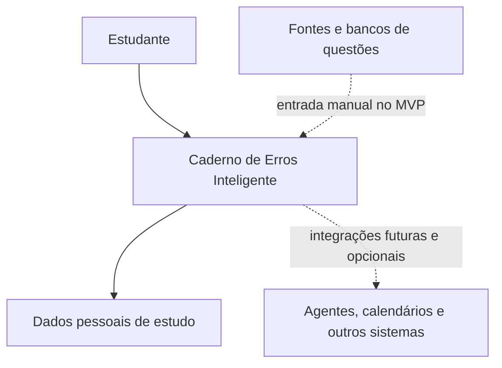

# Caderno de Erros Inteligente

## Etapa 2 — Escopo

| Campo | Valor |
|---|---|
| Documento | Escopo do Produto e do MVP |
| Projeto | Caderno de Erros Inteligente |
| Versão do documento | 1.0 — aprovada |
| Data | 30 de agosto de 2026 |
| Status | Aprovada e congelada |
| Aprovação | Aprovada integralmente pelo responsável pelo produto em 30 de agosto de 2026 |
| Documento anterior | Etapa 1 — Visão do Projeto, versão 1.0 aprovada |
| Próxima etapa após aprovação | Etapa 3 — Requisitos Funcionais |

---

## 1. Finalidade deste documento

Este documento define as fronteiras do **Caderno de Erros Inteligente**. Ele determina:

- o que pertence ao produto;
- o que deverá existir no Produto Mínimo Viável — MVP;
- o que poderá entrar entre o MVP e a V1.0;
- o que ficará para versões futuras;
- o que está explicitamente fora do escopo;
- as dependências e limitações conhecidas;
- as responsabilidades do sistema e do usuário;
- os critérios para impedir crescimento descontrolado.

O escopo traduz a visão aprovada em compromissos de produto, mas ainda não substitui:

- os requisitos funcionais detalhados;
- os requisitos não funcionais;
- as regras formais de revisão, domínio, edição ou exclusão;
- a arquitetura e a escolha de tecnologias;
- o modelo de dados;
- os fluxos completos de exceção;
- o cronograma de versões.

Quando este documento indicar que uma capacidade está no MVP, significa que ela deverá ser detalhada nas etapas posteriores e implementada antes que o MVP seja considerado completo. Quando indicar “Pós-MVP”, “V1” ou “futuro”, isso não autoriza sua inclusão antecipada.

---

## 2. Base congelada da Etapa 1

A Etapa 1 foi aprovada integralmente. Portanto, este escopo não altera as decisões `VIS-DEC-001` a `VIS-DEC-012`.

### 2.1 Decisões obrigatórias herdadas

| Origem | Decisão congelada | Consequência para o escopo |
|---|---|---|
| `VIS-DEC-001` | Nome provisório: Caderno de Erros Inteligente. | O nome será usado em toda a documentação até decisão explícita de renomeação. |
| `VIS-DEC-002` | Transformar erros em aprendizagem mensurável e revisável. | Toda funcionalidade do núcleo deverá fortalecer esse ciclo. |
| `VIS-DEC-003` | Questão e tentativa são conceitos distintos. | O MVP deverá armazenar e apresentar seus dados separadamente. |
| `VIS-DEC-004` | Toda revisão concluída gera tentativa. | Não existirá conclusão de revisão sem registro histórico correspondente. |
| `VIS-DEC-005` | Produto inicial individual e independente. | Colaboração, turmas e dependência de integrações ficam fora do MVP. |
| `VIS-DEC-006` | Marcos iniciais de 1, 7, 14 e 30 dias. | O MVP deverá operar com esse ciclo fixo. |
| `VIS-DEC-007` | Hierarquia disciplina → assunto → subassunto. | Cadastro, filtros e análises deverão respeitar essa organização. |
| `VIS-DEC-008` | Índice de Domínio multifatorial e explicável. | Uma fórmula simplista não será criada apenas para preencher o dashboard do MVP. |
| `VIS-DEC-009` | IA, adaptação avançada e integrações são posteriores. | Esses recursos não serão dependências nem critérios de conclusão do MVP. |
| `VIS-DEC-010` | O produto não é um superaplicativo. | Tarefas, calendário geral, cursos, turmas e produtividade ampla ficam fora. |
| `VIS-DEC-011` | Métricas devem informar origem e limitações. | O dashboard básico deverá separar conceitos e expor sua base de cálculo. |
| `VIS-DEC-012` | Sucesso não é apenas volume cadastrado. | O MVP deverá fechar o ciclo de revisão e histórico, não somente oferecer cadastro. |

### 2.2 Inconsistências encontradas

Não foi identificada incompatibilidade entre a visão aprovada e a definição de escopo apresentada neste documento.

Alguns pontos deixados em aberto na Etapa 1 são resolvidos parcialmente aqui; os que dependem de regras formais ou arquitetura permanecem registrados para as etapas adequadas.

---

## 3. Objetivo do escopo

### `ESC-OBJ-001` — Objetivo do produto inicial

Entregar uma aplicação individual na qual o estudante consiga registrar uma questão resolvida, registrar sua tentativa e seu erro, receber um ciclo fixo de revisões, concluir essas revisões com histórico preservado e acompanhar indicadores básicos de atividade e desempenho.

### `ESC-OBJ-002` — Objetivo do MVP

Validar o ciclo completo:

**registrar → compreender o erro → programar → revisar → preservar histórico → atualizar indicadores.**

O MVP não será considerado validado se apenas cadastrar questões ou exibir estatísticas sem permitir a execução real das revisões.

### `ESC-OBJ-003` — Objetivo da V1

Consolidar o núcleo validado com métricas hierárquicas, domínio explicável, maior controle sobre os dados e recursos suficientes para uso individual contínuo, sem depender de IA ou de plataformas externas.

---

## 4. Organização do escopo por horizonte

| Horizonte | Significado | Compromisso |
|---|---|---|
| MVP | Menor produto utilizável que fecha o ciclo central. | Obrigatório para validar a proposta de valor. |
| Pós-MVP até V1 | Capacidades de consolidação após o núcleo funcionar. | Candidatas comprometidas com a visão, mas deverão ser priorizadas no roadmap. |
| Pós-V1 | Evoluções de maior complexidade ou alcance. | Possibilidades condicionadas a validação; não são compromisso imediato. |
| Fora do escopo | Capacidades incompatíveis com o foco ou não autorizadas no horizonte atual. | Não devem consumir esforço do MVP ou da V1 sem revisão formal. |

---

## 5. Dentro do escopo geral do produto

Os itens desta seção pertencem ao domínio do Caderno de Erros Inteligente. A seção não afirma que todos entrarão no MVP.

### `ESC-IN-001` — Organização acadêmica individual

- disciplinas;
- assuntos vinculados a uma disciplina;
- subassuntos vinculados a um assunto;
- fontes de questões;
- bancas, provas ou concursos, quando aplicáveis;
- informações de contexto necessárias à recuperação e análise.

### `ESC-IN-002` — Registro estruturado de questões

- enunciado;
- alternativas, quando o formato da questão exigir;
- resposta correta;
- resposta originalmente dada pelo usuário;
- explicação ou regra curta;
- pegadinha;
- dificuldade;
- observações;
- classificação de erro;
- contexto acadêmico e origem.

A obrigatoriedade exata de cada campo será definida nos requisitos funcionais e nas regras de negócio.

### `ESC-IN-003` — Histórico de tentativas

- tentativa inicial;
- tentativas produzidas por revisões;
- resultado correto ou incorreto;
- resposta dada;
- data e hora;
- classificação do erro quando aplicável;
- ligação com a questão e com a revisão correspondente;
- preservação da sequência histórica.

### `ESC-IN-004` — Revisão espaçada

- criação de um ciclo de revisão;
- marcos fixos de 1, 7, 14 e 30 dias no primeiro modelo;
- consulta a revisões devidas, atrasadas e futuras;
- execução da revisão;
- registro do resultado;
- cálculo da etapa ou data seguinte conforme regras aprovadas posteriormente.

### `ESC-IN-005` — Análise e dashboard

- distinção entre questões, tentativas, acertos, erros e revisões;
- desempenho por disciplina, assunto e, progressivamente, subassunto;
- tipos de erro recorrentes;
- acompanhamento ao longo do tempo;
- identificação de itens em revisão;
- Índice de Domínio e confiança/suficiência de dados na fase apropriada;
- apresentação explicável das métricas.

### `ESC-IN-006` — Consulta e recuperação

- listagem de questões;
- busca por texto;
- filtros acadêmicos;
- filtros por resultado, erro e situação de revisão;
- acesso ao histórico de uma questão;
- acesso às informações usadas nos indicadores.

### `ESC-IN-007` — Controle dos próprios dados

- correção controlada de registros;
- tratamento explícito de exclusão e arquivamento;
- recálculo coerente de indicadores;
- exportação, backup e restauração em momento compatível com o roadmap;
- proteção contra perda ou alteração silenciosa.

---

## 6. Definição do MVP

### 6.1 Princípio de corte

Uma capacidade só pertence ao MVP quando é necessária para pelo menos uma das finalidades abaixo:

1. registrar uma questão e sua tentativa;
2. compreender e classificar um erro;
3. gerar ou executar uma revisão;
4. preservar o histórico;
5. informar ao estudante o que precisa de atenção;
6. garantir que o ciclo seja utilizável e verificável.

Funcionalidades que apenas tornam o produto mais sofisticado, social, automatizado ou integrado não pertencem ao MVP.

### 6.2 Perfil operacional do MVP — `ESC-MVP-001`

O MVP atenderá **um estudante por espaço de dados**, sem turmas, organizações, papéis administrativos ou compartilhamento colaborativo.

O mecanismo técnico de identidade dependerá da implantação:

- se a aplicação for estritamente local, poderá existir um único perfil sem login;
- se ficar acessível por rede ou internet, autenticação e isolamento de dados serão obrigatórios;
- em ambos os casos, o produto continuará conceitualmente individual.

Essa definição resolve o modelo de uso, mas não escolhe antecipadamente a arquitetura.

### 6.3 Plataforma de experiência do MVP — `ESC-MVP-002`

O escopo funcional será planejado para uma **interface web responsiva**, utilizável em computador e em tela móvel. A prioridade de projeto será o uso no computador, pois o cadastro de enunciados, alternativas e explicações pode exigir digitação extensa.

Ficam fora do MVP:

- aplicativos nativos para Android ou iOS;
- aplicativo desktop instalável específico;
- funcionamento offline garantido;
- instalação como PWA;
- sincronização avançada entre dispositivos.

A confirmação da tecnologia e da forma de implantação ocorrerá no SDD. Esta decisão define apenas a experiência-alvo e a fronteira do MVP.

---

## 7. Módulos incluídos no MVP

### 7.1 Configuração individual — `ESC-MVP-003`

Incluído:

- um perfil individual ou ambiente equivalente;
- configuração de data, hora e fuso horário relevantes para revisões;
- preferências mínimas indispensáveis ao funcionamento do ciclo;
- acesso aos próprios dados conforme a estratégia de implantação.

Não incluído:

- múltiplos perfis compartilhando o mesmo ambiente;
- papéis, permissões administrativas ou equipes;
- personalização visual extensa;
- assinatura, cobrança ou planos.

### 7.2 Estrutura acadêmica — `ESC-MVP-004`

Incluído:

- criar, consultar, editar e organizar disciplinas;
- criar assuntos vinculados a uma disciplina;
- criar subassuntos vinculados a um assunto;
- selecionar essa hierarquia ao registrar a questão;
- preservar relações válidas entre os três níveis.

O subassunto poderá ser omitido quando a classificação em dois níveis for suficiente. A obrigatoriedade de disciplina e assunto será formalizada nas regras de negócio.

Não incluído:

- hierarquias ilimitadas ou definidas livremente pelo usuário;
- o mesmo assunto pertencendo simultaneamente a várias disciplinas;
- mapas conceituais ou relações em rede;
- taxonomia pública compartilhada.

### 7.3 Cadastro de questão — `ESC-MVP-005`

Incluído:

- cadastro manual;
- enunciado textual;
- questão objetiva com alternativas e uma resposta correta;
- suporte ao formato certo/errado por meio de duas alternativas;
- disciplina, assunto e subassunto quando aplicável;
- fonte;
- banca, prova/concurso e ano quando aplicáveis;
- dificuldade da questão;
- explicação ou regra curta;
- pegadinha;
- observações;
- edição controlada;
- consulta individual e listagem.

Não incluído:

- questões discursivas com correção automática;
- questões com múltiplas respostas corretas;
- fórmulas matemáticas com editor visual especializado;
- anexos, imagens, áudio ou vídeo;
- OCR;
- captura automática de páginas;
- importação em massa;
- sincronização com bancos de questões.

Texto simples poderá aceitar notação digitada pelo usuário, mas a renderização técnica de fórmulas será avaliada no SDD.

### 7.4 Tentativa inicial — `ESC-MVP-006`

Incluído:

- registrar a resposta dada pelo estudante;
- comparar ou registrar seu resultado como correto/incorreto;
- registrar data e hora;
- vincular a tentativa à questão;
- distinguir a tentativa inicial das revisões;
- manter a tentativa no histórico.

Uma questão respondida corretamente poderá ser registrada e contribuir para estatísticas de atividade e desempenho. No MVP, porém, somente uma tentativa incorreta iniciará automaticamente o ciclo de revisão.

### 7.5 Classificação do erro — `ESC-MVP-007`

Incluído:

- uma classificação principal para cada tentativa incorreta;
- categorias padrão iniciais: conceitual, interpretação, cálculo, atenção, fórmula/regra, procedimento, pegadinha, falta de tempo, chute e outra;
- explicação curta da finalidade de cada categoria;
- observação complementar quando a categoria não for suficiente;
- correção controlada da classificação.

Não incluído no MVP:

- várias classificações principais na mesma tentativa;
- árvore de categorias;
- categorias compartilhadas entre usuários;
- relatórios comparativos entre pessoas;
- automação por IA.

A possibilidade de categorias personalizadas será avaliada para a V1 sem comprometer a comparabilidade histórica.

### 7.6 Registro do aprendizado — `ESC-MVP-008`

Incluído:

- resposta correta;
- explicação ou regra curta;
- pegadinha, quando existente;
- observações;
- possibilidade de complementar o registro após o cadastro inicial.

O MVP deverá permitir um fluxo de **cadastro rápido e enriquecimento posterior**, mas quais campos poderão ser adiados serão definidos na Etapa 3.

### 7.7 Geração de revisões — `ESC-MVP-009`

Incluído:

- geração automática do ciclo após uma tentativa inicial incorreta;
- etapas correspondentes a 1, 7, 14 e 30 dias;
- armazenamento da data originalmente prevista;
- estados suficientes para distinguir revisão futura, devida, atrasada e concluída;
- ligação entre revisão, questão e tentativa que a concluiu;
- atualização do ciclo após a revisão segundo regra determinística.

As regras para erro durante revisão, atraso, reinício, avanço ou retorno de etapa serão comparadas e aprovadas na Etapa 5. O escopo exige que esses casos sejam tratados; não define ainda qual alternativa será aplicada.

### 7.8 Lista de revisões — `ESC-MVP-010`

Incluído:

- revisões devidas hoje;
- revisões atrasadas;
- próximas revisões;
- ordenação básica por situação e data;
- acesso da lista à questão;
- início de uma revisão a partir da lista;
- atualização da lista após conclusão.

Não incluído:

- planejamento automático de sessões por duração disponível;
- balanceamento inteligente entre disciplinas;
- notificações externas;
- agenda geral de estudos.

### 7.9 Execução da revisão — `ESC-MVP-011`

Incluído:

- apresentação da questão para nova resposta;
- registro da resposta dada;
- resultado correto/incorreto;
- data real da revisão;
- classificação de novo erro, quando aplicável;
- nova tentativa histórica;
- indicação da etapa seguinte produzida pela regra de revisão;
- retorno à lista de revisões.

O sistema não deverá mostrar a resposta correta antes de o estudante registrar sua resposta, salvo em ação explícita cuja consequência seja definida posteriormente.

### 7.10 Histórico — `ESC-MVP-012`

Incluído:

- linha do tempo por questão;
- identificação da tentativa inicial e das tentativas de revisão;
- data planejada e data realizada quando houver revisão;
- resposta dada e resultado;
- classificação do erro correspondente;
- preservação de tentativas anteriores;
- visualização do estado atual do ciclo.

O MVP não terá edição livre que reescreva silenciosamente tentativas passadas. O mecanismo exato de correção, anulação ou exclusão será definido nas regras de negócio.

### 7.11 Dashboard básico — `ESC-MVP-013`

Incluído:

- total de questões cadastradas;
- total de tentativas realizadas;
- tentativas iniciais e tentativas de revisão apresentadas separadamente quando necessário;
- total de acertos e erros;
- taxa de acerto com indicação do denominador;
- questões ou revisões realizadas hoje;
- revisões devidas hoje;
- revisões atrasadas;
- próximas revisões;
- questões sem ciclo, em revisão e com ciclo concluído;
- desempenho básico por disciplina e assunto;
- tipos de erro mais frequentes;
- período analisado visível.

O dashboard do MVP não apresentará uma pontuação artificial de domínio somente para preencher a interface. Até a fórmula multifatorial ser aprovada, utilizará desempenho descritivo e situação do ciclo.

### 7.12 Lista, busca e filtros básicos — `ESC-MVP-014`

Incluído:

- lista de questões;
- busca textual no enunciado e, quando viável, na explicação;
- filtro por disciplina;
- filtro por assunto e subassunto;
- filtro por situação de revisão;
- filtro por resultado da tentativa inicial;
- filtro por classificação de erro;
- acesso ao detalhe e ao histórico.

Não incluído:

- linguagem de consulta avançada;
- filtros salvos;
- relatórios personalizados;
- pesquisa semântica;
- busca por IA.

### 7.13 Integridade operacional mínima — `ESC-MVP-015`

Incluído no produto, ainda que detalhado nos RNFs:

- persistência das questões, tentativas e revisões entre sessões;
- consistência dos vínculos entre registros;
- cálculo de datas com base no fuso do usuário;
- prevenção de conclusão duplicada da mesma revisão;
- mensagens compreensíveis quando uma operação falhar;
- procedimento técnico de backup e restauração disponível durante a fase de validação.

Exportação e restauração diretamente pela interface serão priorizadas para a V1, salvo se a arquitetura escolhida exigir sua antecipação para proteger os dados.

---

## 8. Fluxo mínimo ponta a ponta

O MVP deverá permitir, sem etapas externas obrigatórias:

1. O estudante cria ou seleciona disciplina, assunto e, opcionalmente, subassunto.
2. Registra uma questão objetiva e sua resposta correta.
3. Registra a resposta que deu na resolução inicial.
4. O sistema cria uma tentativa inicial distinta da questão.
5. Se a tentativa estiver incorreta, o estudante classifica o erro e registra o aprendizado relevante.
6. O sistema inicia o ciclo de revisão de 1, 7, 14 e 30 dias.
7. A revisão aparece como futura, devida ou atrasada conforme a data.
8. O estudante abre a revisão e responde novamente.
9. O sistema cria uma nova tentativa vinculada à revisão.
10. O sistema aplica a regra de avanço, retorno ou reinício que será definida na Etapa 5.
11. Histórico, lista de revisões e dashboard são atualizados de forma coerente.
12. O estudante consegue verificar os eventos que produziram os indicadores exibidos.

Se qualquer etapa essencial depender de planilha, calendário externo ou correção manual no banco de dados, o ciclo do MVP não estará completo.

---

## 9. Dados mínimos contemplados pelo escopo do MVP

Esta seção define grupos de informação, não tipos de banco ou obrigatoriedade final.

| Grupo | Informações contempladas |
|---|---|
| Organização | Disciplina, assunto e subassunto opcional. |
| Origem | Fonte, banca, prova/concurso, ano e referência externa textual quando aplicável. |
| Questão | Enunciado, alternativas, resposta correta, dificuldade, explicação/regra, pegadinha e observações. |
| Tentativa | Tipo, resposta dada, resultado, data/hora e vínculo com questão. |
| Erro | Classificação principal e observação complementar. |
| Revisão | Etapa, data prevista, situação, data realizada e tentativa de conclusão. |
| Indicadores | Período, contagens, denominadores, agrupamentos e data de atualização quando relevante. |
| Configuração | Fuso horário e preferências indispensáveis ao ciclo. |

Elementos como tags, anexos, múltiplas classificações e dados de compartilhamento não pertencem ao conjunto mínimo.

---

## 10. Critérios de conclusão do MVP

O MVP somente poderá ser declarado concluído quando todos os critérios abaixo forem atendidos.

| ID | Critério de conclusão |
|---|---|
| `ESC-MVP-CC-001` | O ciclo ponta a ponta da seção 8 funciona com dados persistidos. |
| `ESC-MVP-CC-002` | Questões e tentativas existem separadamente e podem ser consultadas. |
| `ESC-MVP-CC-003` | Toda revisão concluída cria exatamente uma tentativa histórica correspondente. |
| `ESC-MVP-CC-004` | Uma tentativa inicial incorreta gera o ciclo previsto de 1, 7, 14 e 30 dias. |
| `ESC-MVP-CC-005` | Revisões futuras, devidas, atrasadas e concluídas são distinguíveis. |
| `ESC-MVP-CC-006` | O usuário consegue registrar pelo menos as categorias padrão de erro. |
| `ESC-MVP-CC-007` | O dashboard separa questões, tentativas e revisões, sem apresentar contagens ambíguas. |
| `ESC-MVP-CC-008` | As métricas básicas informam período e denominador relevante. |
| `ESC-MVP-CC-009` | O histórico não é sobrescrito ao realizar nova revisão. |
| `ESC-MVP-CC-010` | Busca e filtros básicos permitem recuperar questões e revisões. |
| `ESC-MVP-CC-011` | Datas são calculadas de forma coerente no fuso configurado. |
| `ESC-MVP-CC-012` | O núcleo funciona sem IA, agentes, bancos externos de questões ou outros aplicativos. |
| `ESC-MVP-CC-013` | Existe procedimento verificado para recuperar os dados do ambiente de validação. |
| `ESC-MVP-CC-014` | Os casos críticos possuem testes suficientes para iniciar uso real controlado. |

---

## 11. Funcionalidades posteriores ao MVP e previstas para consolidação até a V1

A ordem interna será determinada no Roadmap. A presença nesta seção não significa que tudo entrará imediatamente após o MVP.

### `ESC-V1-001` — Índice de Domínio explicável

- fórmula multifatorial aprovada e versionada;
- consideração de desempenho recente, revisões, recorrência e quantidade de evidências;
- indicação separada de suficiência ou confiança dos dados;
- cálculo por disciplina, assunto e subassunto;
- explicação dos componentes e limitações;
- recálculo consistente após alterações válidas.

### `ESC-V1-002` — Estado de domínio reversível

- critério formal de questão dominada;
- distinção entre ciclo concluído e domínio estimado;
- reabertura após novo erro, perda de evidência recente ou ação válida do usuário;
- histórico da mudança de estado.

### `ESC-V1-003` — Dashboard analítico

- evolução ao longo do tempo;
- desempenho por subassunto;
- matérias e assuntos mais fortes ou fracos;
- assuntos com maior concentração de erros;
- recorrência de erros;
- filtros de período e contexto;
- detalhamento dos dados que originam cada indicador.

### `ESC-V1-004` — Priorização determinística

- lista de assuntos prioritários baseada em critérios explícitos;
- consideração de revisão atrasada, baixo domínio, recorrência e volume de evidências;
- justificativa visível para cada prioridade;
- possibilidade de o estudante ignorar ou reorganizar a indicação.

Essa priorização não utilizará obrigatoriamente IA.

### `ESC-V1-005` — Controle ampliado de revisões

- inclusão manual de uma questão correta em ciclo de revisão;
- reagendamento controlado com registro do motivo;
- tratamento mais flexível de atrasos;
- eventual personalização dos intervalos fixos;
- revisão em lote ou sessão, desde que cada item gere sua própria tentativa.

Revisão adaptativa baseada em algoritmo permanece Pós-V1.

### `ESC-V1-006` — Taxonomia de erros controlável

- criação ou desativação de categorias pessoais;
- manutenção das categorias padrão;
- tratamento de renomeação e consolidação sem corromper o histórico;
- relatórios que distingam categorias comparáveis de categorias pessoais.

### `ESC-V1-007` — Gestão de dados pelo usuário

- exportação em formato documentado;
- backup iniciado pelo usuário;
- restauração validada;
- arquivamento de questões;
- exclusão com confirmação e consequência informada;
- tratamento auditável de correções em tentativas;
- possível desfazer quando tecnicamente seguro.

### `ESC-V1-008` — Recuperação e organização aprimoradas

- filtros combinados;
- ordenação avançada;
- filtros salvos, se validados;
- tags pessoais;
- sinalização de possíveis duplicidades;
- visão consolidada por fonte, banca ou prova.

### `ESC-V1-009` — Melhorias de experiência

- atalhos para cadastro repetitivo;
- modelos de preenchimento;
- acessibilidade e navegação aprimoradas;
- ajustes derivados de testes de usabilidade;
- experiência móvel responsiva refinada.

---

## 12. Funcionalidades candidatas para Pós-V1

Estas capacidades fazem parte da visão de evolução, mas dependem de validação, custo e riscos.

| ID | Capacidade candidata | Condição mínima para avaliação |
|---|---|---|
| `ESC-FUT-001` | Revisão adaptativa. | Histórico confiável e regras fixas validadas. |
| `ESC-FUT-002` | Recomendação avançada “O que estudar agora?”. | Índice de Domínio e critérios de prioridade validados. |
| `ESC-FUT-003` | Sugestão de classificação de erro por IA. | Consentimento, privacidade, possibilidade de correção e benefício demonstrado. |
| `ESC-FUT-004` | Geração ou revisão de explicações por IA. | Fontes, aviso de incerteza, controle do usuário e prevenção de respostas incorretas. |
| `ESC-FUT-005` | Importação em massa. | Formato de dados estável, validação e tratamento de duplicidade. |
| `ESC-FUT-006` | Imagens, anexos, OCR e conteúdo rico. | Estratégia de armazenamento, direitos autorais e segurança definidos. |
| `ESC-FUT-007` | Aplicativos nativos ou PWA offline. | Necessidade real de uso e estratégia de sincronização comprovadas. |
| `ESC-FUT-008` | Acompanhamento por mentor ou professor. | Papéis, consentimento e privacidade formalizados. |
| `ESC-FUT-009` | Compartilhamento entre usuários. | Controle de acesso, propriedade intelectual e moderação definidos. |
| `ESC-FUT-010` | Banco colaborativo de questões. | Modelo legal, moderação, atribuição e escala definidos. |
| `ESC-FUT-011` | API pública ou ecossistema de extensões. | Núcleo estabilizado, autenticação e limites de uso definidos. |
| `ESC-FUT-012` | Notificações externas. | Preferências, canais, consentimento e controle de frequência definidos. |

---

## 13. Integrações futuras

### 13.1 Integrações previstas como possibilidade

| ID | Integração | Valor potencial | Status |
|---|---|---|---|
| `ESC-INT-001` | Agente de revisão diária/semanal | Resumir pendências e preparar sessões. | Pós-V1; não comprometida. |
| `ESC-INT-002` | Painel central de organização | Exibir indicadores junto a outros projetos pessoais. | Pós-V1; não comprometida. |
| `ESC-INT-003` | Segundo cérebro | Relacionar regras e aprendizados a notas externas. | Pós-V1; não comprometida. |
| `ESC-INT-004` | Calendário ou lembretes | Alertar sobre revisões sem transformar o sistema em agenda. | Pós-V1; não comprometida. |
| `ESC-INT-005` | Plataformas de questões | Reduzir digitação por importação autorizada. | Pós-V1 e sujeita a API/licença. |
| `ESC-INT-006` | Exportadores de dados | Facilitar portabilidade e análise pessoal. | V1 ou Pós-V1, conforme formato. |

### 13.2 Regras de fronteira para integrações

Qualquer integração futura deverá:

- ser opcional;
- possuir finalidade compatível com a visão;
- não impedir o funcionamento do núcleo quando indisponível;
- respeitar consentimento, privacidade e propriedade dos dados;
- apresentar claramente dados importados, transformados ou enviados;
- lidar com falhas sem corromper o histórico;
- ser aprovada por alteração de escopo e roadmap.

---

## 14. Fora do escopo do MVP

Os itens abaixo não poderão ser incluídos sob o argumento de “aproveitar o desenvolvimento”.

| ID | Item excluído do MVP | Destino possível |
|---|---|---|
| `ESC-OUT-MVP-001` | Inteligência artificial. | Pós-V1. |
| `ESC-OUT-MVP-002` | Revisão adaptativa. | Pós-V1. |
| `ESC-OUT-MVP-003` | Recomendação avançada “O que estudar agora?”. | V1 determinística; Pós-V1 para versões avançadas. |
| `ESC-OUT-MVP-004` | Índice de Domínio definitivo. | V1 após definição nas regras de negócio. |
| `ESC-OUT-MVP-005` | Integrações externas. | Pós-V1, salvo exportação simples prevista no roadmap. |
| `ESC-OUT-MVP-006` | Importação automática ou em massa. | Pós-V1. |
| `ESC-OUT-MVP-007` | OCR, anexos, imagens, áudio e vídeo. | Pós-V1. |
| `ESC-OUT-MVP-008` | Questões discursivas ou com múltiplas respostas corretas. | Avaliação Pós-V1. |
| `ESC-OUT-MVP-009` | Apps nativos e offline garantido. | Pós-V1. |
| `ESC-OUT-MVP-010` | Notificações por e-mail, push ou mensageria. | Pós-V1. |
| `ESC-OUT-MVP-011` | Colaboração, compartilhamento e acompanhamento por terceiros. | Pós-V1. |
| `ESC-OUT-MVP-012` | Gamificação, ranking, pontos ou recompensas. | Somente após validação explícita; não prioritário. |
| `ESC-OUT-MVP-013` | Relatórios configuráveis e construtor de dashboards. | Pós-V1. |
| `ESC-OUT-MVP-014` | Gestão completa de categorias personalizadas. | V1. |
| `ESC-OUT-MVP-015` | Vários perfis no mesmo espaço de dados. | Pós-V1 ou nunca, conforme produto. |

---

## 15. Fora do escopo geral atual

Estes itens não pertencem ao produto planejado até que a própria visão seja revista.

| ID | Exclusão | Motivo |
|---|---|---|
| `ESC-OUT-001` | Plataforma completa de cursos, videoaulas ou apostilas. | Desvia do ciclo de erros e revisões. |
| `ESC-OUT-002` | Agenda geral, lista de tarefas ou gerenciador de projetos. | Transformaria o produto em superaplicativo. |
| `ESC-OUT-003` | Gestão acadêmica institucional. | Exigiria outro público, modelo de dados e operação. |
| `ESC-OUT-004` | Marketplace ou venda de questões. | Introduz comércio, licenciamento e moderação alheios ao núcleo. |
| `ESC-OUT-005` | Rede social, feed, ranking entre estudantes ou competição. | Não contribui diretamente para diagnóstico individual e pode incentivar métricas ruins. |
| `ESC-OUT-006` | Promessa de aprovação ou certificação automática de conhecimento. | Os indicadores são evidências do histórico, não garantia pedagógica. |
| `ESC-OUT-007` | Reprodução não autorizada de bancos de questões. | O usuário e futuras integrações deverão respeitar direitos e termos das fontes. |
| `ESC-OUT-008` | Correção automática confiável de qualquer resposta discursiva. | Problema distinto e incompatível com a confiabilidade exigida no núcleo atual. |
| `ESC-OUT-009` | Substituição de professor, curso ou material de estudo. | O produto organiza aprendizagem baseada em questões; não fornece currículo completo. |

---

## 16. Fronteiras do sistema

### 16.1 Visão de fronteira

O núcleo inclui registro, tentativas, erros, revisões, histórico, busca e indicadores. Fontes externas fornecem conteúdo ao usuário, mas não fazem parte do sistema. Agentes e outras ferramentas permanecem fora da fronteira inicial.

### 16.2 Responsabilidades do sistema — `ESC-FRO-001`

O sistema será responsável por:

- armazenar os dados registrados;
- preservar os vínculos e o histórico;
- calcular datas de revisão pelas regras vigentes;
- apresentar revisões por situação;
- registrar cada tentativa;
- recalcular métricas de forma coerente;
- informar critérios e limitações relevantes;
- fornecer mecanismos adequados de recuperação de dados na fase correspondente.

### 16.3 Responsabilidades do estudante — `ESC-FRO-002`

O estudante será responsável por:

- inserir o enunciado e os metadados de forma lícita;
- informar a resposta correta quando ela não vier de fonte integrada;
- registrar honestamente a resposta dada;
- classificar o erro com base em sua análise;
- revisar e corrigir explicações pessoais;
- realizar as revisões;
- interpretar indicadores como apoio, não como garantia absoluta.

### 16.4 Responsabilidades que o sistema não assumirá — `ESC-FRO-003`

O sistema não será responsável por:

- garantir que uma resposta informada pelo usuário esteja correta;
- verificar automaticamente a qualidade pedagógica de toda explicação;
- possuir ou licenciar o conteúdo de fontes externas;
- garantir aprovação em concurso, exame ou disciplina;
- decidir sozinho todo o plano de estudo;
- substituir backup externo do usuário além dos mecanismos documentados;
- manter integrações que não tenham sido formalmente incorporadas.

---

## 17. Dependências

### 17.1 Dependências de decisão

| ID | Dependência | Etapa responsável | Impacto |
|---|---|---|---|
| `ESC-DEP-001` | Campos obrigatórios e opcionais. | Requisitos funcionais e regras de negócio. | Define velocidade e validade do cadastro. |
| `ESC-DEP-002` | Regra após acerto ou erro em revisão. | Regras de negócio. | Define avanço, retorno e datas seguintes. |
| `ESC-DEP-003` | Tratamento de revisão atrasada. | Regras de negócio. | Define prioridade e reagendamento. |
| `ESC-DEP-004` | Critério de questão dominada. | Regras de negócio. | Necessário para V1, não para o primeiro dashboard do MVP. |
| `ESC-DEP-005` | Fórmula e confiança do Índice de Domínio. | Regras de negócio. | Necessária para análises da V1. |
| `ESC-DEP-006` | Política de edição, anulação e exclusão. | Regras de negócio e RNFs. | Protege histórico e métricas. |
| `ESC-DEP-007` | Estratégia de identidade e implantação. | RNFs e SDD. | Determina autenticação e isolamento. |
| `ESC-DEP-008` | Tecnologia e persistência. | SDD. | Determina implementação, backup e portabilidade. |
| `ESC-DEP-009` | Metas de desempenho e usabilidade. | RNFs, roadmap e testes. | Permite aceite objetivo. |

### 17.2 Dependências operacionais

| ID | Dependência | Consequência |
|---|---|---|
| `ESC-DEP-010` | Relógio, data e fuso horário confiáveis. | Revisões poderão ser apresentadas na data errada se essa base estiver incorreta. |
| `ESC-DEP-011` | Persistência íntegra. | Sem ela, histórico, revisões e métricas perdem confiabilidade. |
| `ESC-DEP-012` | Dados fornecidos pelo estudante. | Classificações e indicadores refletirão erros de entrada que o sistema não consegue verificar sozinho. |
| `ESC-DEP-013` | Navegador compatível, caso a opção web seja confirmada. | Define a experiência e os testes de compatibilidade. |
| `ESC-DEP-014` | Procedimento de recuperação testado. | Necessário antes de confiar dados reais ao MVP. |

O MVP não terá dependência operacional de IA, calendário externo, banco comercial de questões ou serviço de terceiros não essencial.

---

## 18. Limitações conhecidas do MVP

| ID | Limitação | Efeito esperado | Tratamento futuro |
|---|---|---|---|
| `ESC-LIM-001` | Entrada predominantemente manual. | Cadastro pode consumir tempo. | Atalhos na V1; importação/OCR Pós-V1. |
| `ESC-LIM-002` | Questões objetivas com uma única resposta correta. | Outros formatos exigirão adaptação manual ou ficarão de fora. | Avaliar Pós-V1. |
| `ESC-LIM-003` | Conteúdo textual, sem anexos. | Questões dependentes de imagem poderão ficar incompletas. | Conteúdo rico Pós-V1. |
| `ESC-LIM-004` | Ciclo fixo de 1, 7, 14 e 30 dias. | O intervalo não se ajustará individualmente no MVP. | Revisão adaptativa Pós-V1. |
| `ESC-LIM-005` | Revisão automática iniciada por erro. | Questões corretas não entrarão no ciclo automaticamente. | Inclusão manual prevista para V1. |
| `ESC-LIM-006` | Um perfil individual por espaço de dados. | Não haverá colaboração ou visão de mentor. | Avaliar Pós-V1. |
| `ESC-LIM-007` | Sem Índice de Domínio definitivo no MVP. | Dashboard inicial mostrará desempenho e situação do ciclo. | Índice multifatorial na V1. |
| `ESC-LIM-008` | Taxonomia fixa de erros no MVP. | Casos específicos usarão “outra” e observação. | Categorias pessoais na V1. |
| `ESC-LIM-009` | Hierarquia de três níveis. | Conteúdos transversais poderão não ser representados perfeitamente. | Tags e relações adicionais na V1/Pós-V1. |
| `ESC-LIM-010` | Sem validação automática da resposta correta. | Métricas podem refletir dado informado incorretamente. | Correção controlada; fontes/IA futuras não eliminam responsabilidade. |
| `ESC-LIM-011` | Sem funcionamento offline garantido. | Uso dependerá do ambiente de implantação. | Avaliar PWA ou app após validação. |
| `ESC-LIM-012` | Sem notificações externas. | O estudante deverá abrir o sistema para ver pendências. | Avaliar Pós-V1. |
| `ESC-LIM-013` | Projetado inicialmente para volume pessoal. | Escala institucional não será critério do MVP. | Reavaliar apenas se o público mudar. |
| `ESC-LIM-014` | Exportação pela interface pode não existir no primeiro incremento. | Portabilidade inicial poderá depender de procedimento técnico. | Interface de exportação até a V1. |

---

## 19. Critérios de priorização

Toda funcionalidade proposta deverá receber avaliação segundo os critérios abaixo, nesta ordem:

1. **Essencialidade para o ciclo:** sem ela, registrar–revisar–medir deixa de funcionar?
2. **Proteção do histórico:** ela evita perda, ambiguidade ou corrupção dos dados?
3. **Valor observável:** muda uma decisão ou reduz esforço real do estudante?
4. **Dependência:** é pré-requisito de outra capacidade já aprovada?
5. **Risco:** reduz um risco relevante de uso, privacidade ou confiabilidade?
6. **Custo e complexidade:** pode ser entregue sem atrasar a validação do núcleo?
7. **Evidência:** existe uso real ou hipótese testável que justifique sua entrada?

Uma funcionalidade interessante, mas não essencial, não deverá deslocar um requisito do ciclo central.

---

## 20. Controle de mudança de escopo

### `ESC-CTRL-001` — Solicitação de mudança

Qualquer nova funcionalidade deverá registrar:

- problema que resolve;
- público beneficiado;
- horizonte proposto;
- dependências;
- impacto no MVP, regras, arquitetura, dados e testes;
- risco de desvio da visão;
- funcionalidade que será adiada caso haja capacidade limitada.

### `ESC-CTRL-002` — Critério de entrada no MVP

Uma mudança somente poderá entrar no MVP quando:

- for indispensável ao ciclo central ou à segurança dos dados;
- não violar decisão congelada;
- possuir critério de aceitação verificável;
- tiver impactos conhecidos;
- for aprovada explicitamente.

### `ESC-CTRL-003` — Registro de decisão

Mudanças aprovadas deverão atualizar este documento e todos os artefatos afetados. Não será permitido alterar silenciosamente uma regra ou tratar protótipo exploratório como novo compromisso de produto.

---

## 21. Rastreabilidade entre visão e escopo

| Elemento da visão | Implementação no escopo |
|---|---|
| `VIS-OBJ-P-001` — registro estruturado | `ESC-MVP-004`, `ESC-MVP-005` e `ESC-MVP-008` |
| `VIS-OBJ-P-002` — trajetória completa | `ESC-MVP-006`, `ESC-MVP-011` e `ESC-MVP-012` |
| `VIS-OBJ-P-003` — erro acionável | `ESC-MVP-007` e `ESC-MVP-008` |
| `VIS-OBJ-P-004` — revisão confiável | `ESC-MVP-009`, `ESC-MVP-010` e `ESC-MVP-011` |
| `VIS-OBJ-P-005` — desempenho e domínio | `ESC-MVP-013`, `ESC-V1-001`, `ESC-V1-002` e `ESC-V1-003` |
| `VIS-OBJ-P-006` — priorização | `ESC-MVP-010` e `ESC-V1-004` |
| `VIS-OBJ-P-007` — foco evolutivo | Seções 11 a 15 e `ESC-CTRL-001` a `ESC-CTRL-003` |
| `VIS-PRI-003` — questão não é tentativa | `ESC-MVP-005`, `ESC-MVP-006` e `ESC-MVP-012` |
| `VIS-PRI-004` — revisão gera histórico | `ESC-MVP-011` e `ESC-MVP-CC-003` |
| `VIS-PRI-005` — métrica com contexto | `ESC-MVP-013` e `ESC-MVP-CC-008` |
| `VIS-PRI-006` — valor sem IA | `ESC-MVP-CC-012` e `ESC-OUT-MVP-001` |
| `VIS-PRI-008` — profundidade com baixo atrito | `ESC-MVP-008` e cadastro em duas velocidades |
| `VIS-PRI-011` — privacidade | `ESC-MVP-001`, `ESC-IN-007` e dependências de RNF/SDD |

---

## 22. Decisões propostas nesta etapa

Estas decisões deverão ser congeladas após aprovação da Etapa 2.

| ID | Decisão proposta |
|---|---|
| `ESC-DEC-001` | O MVP fechará o ciclo registrar → compreender → programar → revisar → preservar → medir. |
| `ESC-DEC-002` | O uso inicial será individual, com um estudante por espaço de dados. |
| `ESC-DEC-003` | A experiência-alvo será web responsiva, prioritariamente em computador; tecnologia será decidida no SDD. |
| `ESC-DEC-004` | O MVP aceitará cadastro manual de questões objetivas textuais com uma única resposta correta. |
| `ESC-DEC-005` | Uma tentativa inicial incorreta iniciará automaticamente o ciclo de revisão; uma correta será registrada, mas não iniciará ciclo automático. |
| `ESC-DEC-006` | Cada tentativa incorreta terá uma classificação principal de erro no MVP. |
| `ESC-DEC-007` | O MVP utilizará categorias padrão e “outra”; personalização completa ficará para a V1. |
| `ESC-DEC-008` | O MVP usará o ciclo fixo de 1, 7, 14 e 30 dias, sem algoritmo adaptativo. |
| `ESC-DEC-009` | O dashboard do MVP separará questões, tentativas e revisões e não usará um falso Índice de Domínio simplificado. |
| `ESC-DEC-010` | O Índice de Domínio multifatorial, o estado dominado e a confiança dos dados serão consolidados até a V1. |
| `ESC-DEC-011` | Cadastro rápido e enriquecimento posterior farão parte do escopo, com campos definidos na Etapa 3. |
| `ESC-DEC-012` | Busca e filtros básicos pertencem ao MVP por serem necessários para recuperar o histórico. |
| `ESC-DEC-013` | O MVP não dependerá de IA, integrações, notificações externas ou bancos de questões. |
| `ESC-DEC-014` | Exportação e restauração pela interface serão previstas até a V1; o MVP terá ao menos procedimento técnico verificado de recuperação. |
| `ESC-DEC-015` | Reagendamento controlado, categorias pessoais e inclusão manual de questões corretas em revisão ficarão para a consolidação até a V1. |

---

## 23. Pontos ainda em aberto

| ID | Ponto | Alternativas | Recomendação | Etapa de decisão |
|---|---|---|---|---|
| `ESC-ABR-001` | Campos obrigatórios no cadastro rápido. | Núcleo muito pequeno; conjunto intermediário; formulário completo. | Exigir apenas o necessário para identificar questão, resposta, resultado e contexto mínimo; completar aprendizagem depois. | Etapa 3 e Etapa 5 |
| `ESC-ABR-002` | Questão pode existir sem tentativa inicial? | Sempre juntas; questão em rascunho; ambas. | Permitir rascunho, mas não contar como “questão realizada” antes da tentativa. | Etapa 3 e Etapa 5 |
| `ESC-ABR-003` | Resultado calculado ou informado. | Comparação automática; marcação manual; modelo híbrido. | Comparar automaticamente em questões objetivas e permitir correção controlada de entrada equivocada. | Etapa 3 e Etapa 5 |
| `ESC-ABR-004` | Tratamento de erro na revisão. | Reiniciar ciclo; voltar uma etapa; intervalo curto; regra por dificuldade. | Comparar com cenários antes de aprovar; manter regra determinística no MVP. | Etapa 5 |
| `ESC-ABR-005` | Tratamento de revisão atrasada. | Manter etapa; recalcular a partir da execução; reagendar; fila de recuperação. | Preservar data prevista e registrar data real; definir avanço sem apagar o atraso. | Etapa 5 |
| `ESC-ABR-006` | Correção de tentativa histórica. | Bloquear; editar; anular e substituir. | Preferir anulação/correção auditável. | Etapa 5 e RNFs |
| `ESC-ABR-007` | Definição de questão dominada. | Ciclo concluído; sequência; domínio; combinação. | Manter separado de “ciclo concluído” e usar critério reversível na V1. | Etapa 5 |
| `ESC-ABR-008` | Fórmula do Índice de Domínio. | Ponderação; evidência; modelo de memória. | Fórmula determinística, versionada e explicável, acompanhada de suficiência dos dados. | Etapa 5 |
| `ESC-ABR-009` | Login no primeiro ambiente. | Sem login local; conta autenticada; implantação híbrida. | Tornar obrigatório apenas quando houver acesso por rede; confirmar no SDD. | RNFs e SDD |
| `ESC-ABR-010` | Linguagem para fórmulas no enunciado. | Texto simples; Markdown/LaTeX; editor visual. | Avaliar Markdown com notação matemática antes de considerar editor visual. | SDD |
| `ESC-ABR-011` | Escala inicial de dificuldade. | Três níveis; cinco níveis; valor livre. | Preferir escala curta e definida para análise consistente. | Etapa 3 e Etapa 5 |
| `ESC-ABR-012` | Percepção de facilidade na revisão. | Não registrar; escala simples; tempo mais escala. | Registrar escala simples se o custo de interface for baixo, mesmo sem adaptação no MVP. | Etapa 3 |

---

## 24. Riscos do escopo

| ID | Risco | Probabilidade | Impacto | Resposta |
|---|---|---:|---:|---|
| `ESC-RIS-001` | O MVP ainda conter recursos demais. | Média/alta | Alto | Usar o fluxo ponta a ponta e os critérios de conclusão como corte; detalhar incrementos no roadmap. |
| `ESC-RIS-002` | Adiar o Índice de Domínio gerar percepção de dashboard incompleto. | Média | Médio | Explicar que desempenho e situação do ciclo são honestos; implementar domínio apenas após regra confiável. |
| `ESC-RIS-003` | Questões textuais limitarem casos reais com gráficos e imagens. | Alta | Médio/alto | Validar primeiro com questões textuais; medir demanda antes de assumir custo de anexos. |
| `ESC-RIS-004` | Entrada manual causar abandono. | Alta | Alto | Cadastro rápido, padrões de preenchimento e futura importação condicionada à validação. |
| `ESC-RIS-005` | Ciclo automático apenas para erros ignorar acertos inseguros. | Média | Médio | Prever inclusão manual na V1 e avaliar facilidade percebida no MVP. |
| `ESC-RIS-006` | Usuário confundir ciclo concluído com domínio. | Alta | Alto | Usar nomes distintos no dashboard e explicar que domínio será calculado separadamente. |
| `ESC-RIS-007` | Procedimento técnico de backup ser insuficiente para usuário comum. | Média | Alto | Antecipar exportação/backup na interface se testes revelarem risco ou dificuldade. |
| `ESC-RIS-008` | Decisão de interface web ser confundida com escolha de stack. | Média | Médio | Manter tecnologia aberta até o SDD e documentar requisitos antes da seleção. |
| `ESC-RIS-009` | Categorias personalizadas fragmentarem estatísticas. | Média | Médio | Adiar personalização e definir regras de consolidação na V1. |
| `ESC-RIS-010` | Reagendamento ser usado para esconder revisões atrasadas. | Média | Alto | Preservar data original e exigir histórico/motivo quando o recurso entrar. |
| `ESC-RIS-011` | Fonte de questão ter restrição de reprodução. | Média | Alto | Tratar conteúdo como dado privado inserido pelo usuário e não criar distribuição pública. |
| `ESC-RIS-012` | Requisitos futuros entrarem informalmente no MVP. | Alta | Alto | Aplicar controle de mudança e manter backlog por horizonte. |

---

## 25. Sugestões de melhoria

### 25.1 Usar “ciclo concluído” no MVP, não “dominado”

Isso evita afirmar conhecimento consolidado antes de existir uma fórmula de domínio. Na V1, ambos poderão coexistir: uma questão pode ter concluído o ciclo, mas possuir domínio insuficiente ou desatualizado.

### 25.2 Registrar data prevista e data realizada

As duas datas permitem medir atraso sem perder a informação original. Essa distinção também será necessária para regras de reagendamento e para métricas honestas.

### 25.3 Preparar o dado de facilidade sem ativar adaptação

Se testes de usabilidade mostrarem baixo atrito, uma escala simples de facilidade na revisão poderá ser registrada desde o MVP. Ela não alteraria o calendário inicial, mas formaria uma base real para avaliar a futura revisão adaptativa.

### 25.4 Separar questão cadastrada de questão realizada

Caso rascunhos sejam permitidos, o dashboard deverá distinguir:

- questão cadastrada;
- questão com tentativa inicial;
- questão em revisão;
- questão com ciclo concluído.

Isso impede que rascunhos aumentem artificialmente a quantidade de questões resolvidas.

### 25.5 Antecipar backup se houver uso com dados reais

Embora a interface completa de portabilidade esteja prevista para a V1, qualquer piloto com dados valiosos deverá possuir recuperação verificada. O roadmap poderá antecipar uma exportação simples se o procedimento técnico não for adequado ao usuário.

---

## 26. Itens que precisam de aprovação

Para congelar a Etapa 2, o responsável pelo produto deverá aprovar ou ajustar:

1. O **MVP como ciclo completo**, e não apenas cadastro e dashboard.
2. O **uso individual**, com um estudante por espaço de dados.
3. A **experiência web responsiva**, prioritariamente em computador, sem escolha antecipada de tecnologia.
4. O suporte inicial a **questões objetivas textuais com uma resposta correta**.
5. A geração automática de revisão somente após **tentativa inicial incorreta**.
6. Uma **classificação principal de erro** por tentativa incorreta no MVP.
7. As categorias padrão e o uso de **“outra”**, deixando categorias pessoais para a V1.
8. O ciclo fixo de **1, 7, 14 e 30 dias**.
9. O dashboard básico sem um Índice de Domínio artificial.
10. O Índice de Domínio multifatorial, confiança dos dados e estado dominado para consolidação até a V1.
11. Busca e filtros básicos dentro do MVP.
12. Cadastro rápido com enriquecimento posterior.
13. Procedimento técnico de recuperação no MVP e interface de exportação/backup até a V1.
14. As exclusões expressas do MVP e do escopo geral.
15. As decisões `ESC-DEC-001` a `ESC-DEC-015`.
16. A manutenção dos pontos `ESC-ABR-001` a `ESC-ABR-012` para as etapas indicadas.

---

## 27. Critério de encerramento da Etapa 2

A Etapa 2 será considerada concluída quando:

- o conteúdo do MVP estiver aprovado;
- as capacidades da V1 estiverem separadas do MVP;
- as possibilidades Pós-V1 não forem tratadas como compromissos imediatos;
- os itens fora do escopo estiverem aceitos;
- fronteiras, responsabilidades, dependências e limitações estiverem claras;
- os critérios de conclusão do MVP puderem orientar requisitos e roadmap;
- as decisões da Etapa 1 permanecerem preservadas;
- as decisões aprovadas da Etapa 2 puderem ser usadas como base congelada na Etapa 3 — Requisitos Funcionais.

A etapa foi aprovada integralmente em 30 de agosto de 2026. As decisões `ESC-DEC-001` a `ESC-DEC-015` passam a ser consideradas congeladas e somente poderão ser alteradas mediante registro explícito e análise de impacto.
