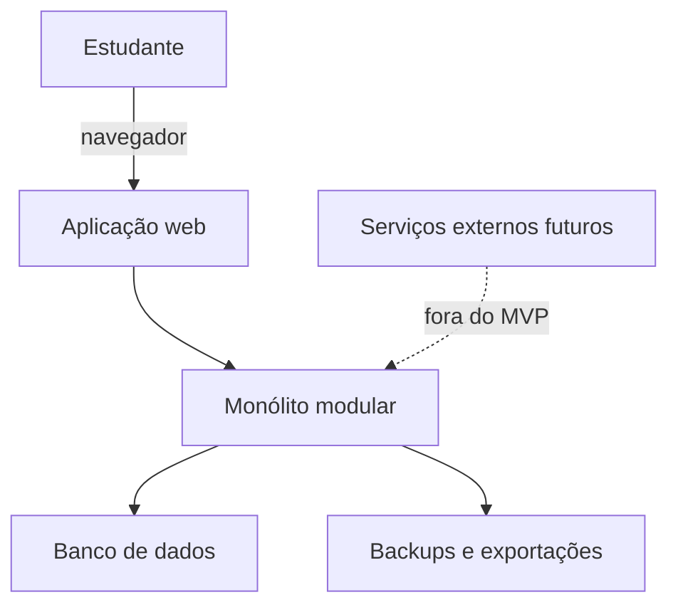
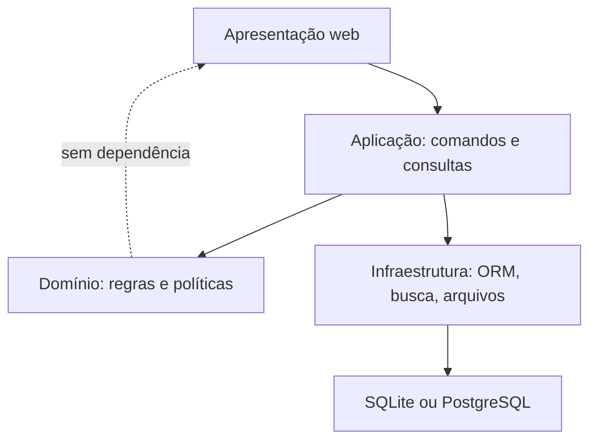
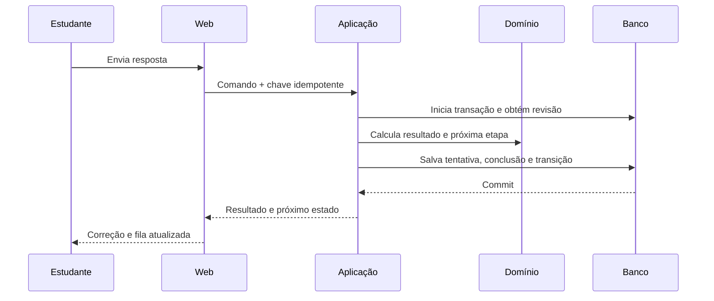
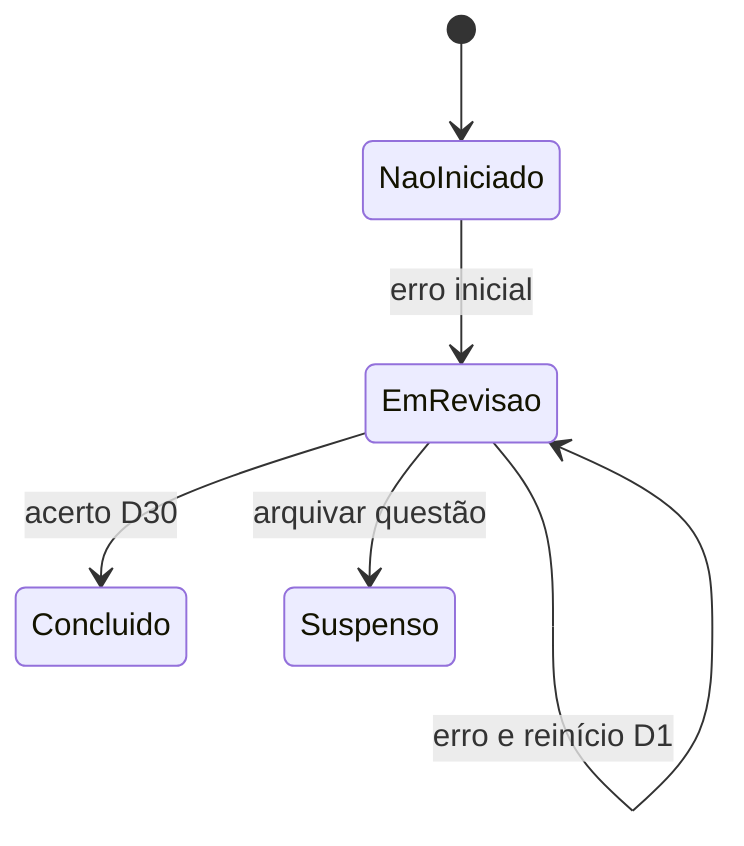
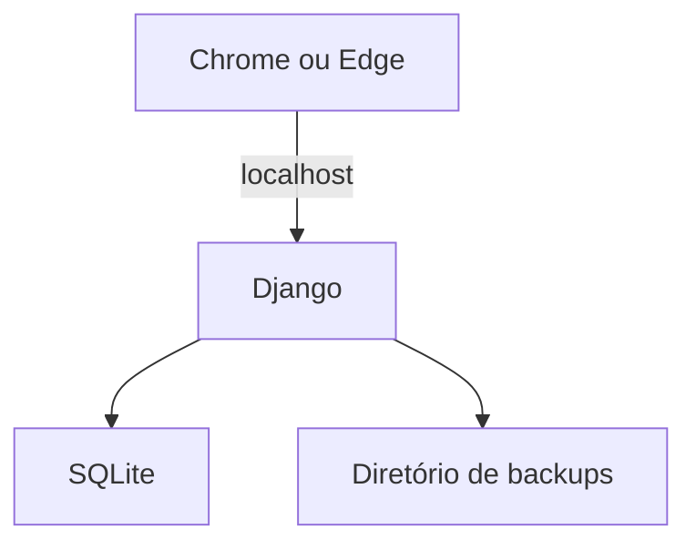
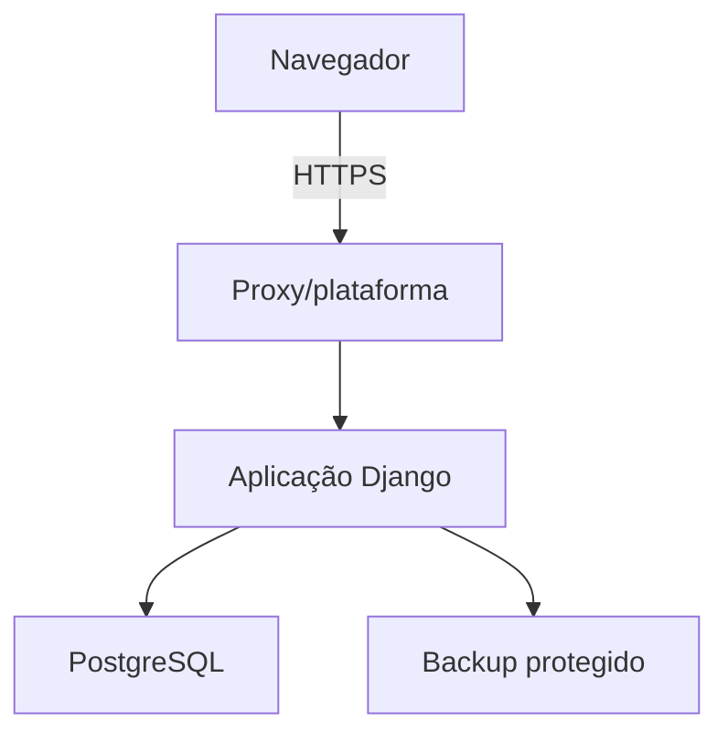

# Caderno de Erros Inteligente

## Etapa 6 — SDD — Software Design Description

| Campo | Valor |
|---|---|
| Documento | Descrição do Projeto de Software — SDD |
| Projeto | Caderno de Erros Inteligente |
| Versão | 1.0 — aprovada |
| Data | 30 de agosto de 2026 |
| Status | Aprovada e congelada |
| Aprovação | Aprovada integralmente pelo responsável pelo produto em 30 de agosto de 2026 |
| Base congelada | Visão 1.0; Escopo 1.0; RFs 1.0; RNFs 1.0; Regras de Negócio 1.0 |
| Próxima etapa após aprovação | Etapa 7 — Modelo de Dados |

---

## 1. Finalidade e alcance

Este documento descreve a arquitetura recomendada para implementar o Caderno de Erros Inteligente. Ele define:

- estilo arquitetural;
- módulos e responsabilidades;
- camadas e dependências;
- comunicação entre componentes;
- estratégia de persistência;
- desenho dos serviços de revisão, estatísticas e domínio;
- interface web;
- tratamento de erros;
- segurança, configuração, logging e observabilidade;
- implantação local e possibilidade de hospedagem futura;
- estratégia de API;
- decisões arquiteturais e riscos.

O SDD não substitui o modelo lógico de dados da Etapa 7 nem os fluxos detalhados da Etapa 8. Nomes de entidades e endpoints aqui são contratos arquiteturais preliminares e poderão receber refinamentos sem violar as decisões aprovadas.

---

## 2. Drivers arquiteturais

### 2.1 Drivers funcionais

| ID | Driver |
|---|---|
| `SDD-DRV-001` | Questão e tentativa são entidades distintas. |
| `SDD-DRV-002` | Toda revisão concluída cria exatamente uma tentativa. |
| `SDD-DRV-003` | Ciclo fixo `REV-FIXA-1.0` deve ser determinístico e versionado. |
| `SDD-DRV-004` | Dashboard precisa separar questões, tentativas e revisões. |
| `SDD-DRV-005` | Domínio `DOM-HEUR-1.0` e prioridade `PRI-HEUR-1.0` precisam ser explicáveis. |
| `SDD-DRV-006` | Busca e filtros devem operar sobre anos de histórico individual. |
| `SDD-DRV-007` | MVP deve funcionar sem IA ou integração externa. |

### 2.2 Drivers de qualidade

| ID | Driver |
|---|---|
| `SDD-DRV-008` | Operações críticas atômicas e idempotentes. |
| `SDD-DRV-009` | Baseline `BCR-1`: 10 mil questões e 100 mil tentativas/revisões. |
| `SDD-DRV-010` | Interface responsiva, acessível e prioritariamente desktop. |
| `SDD-DRV-011` | Privacidade: conteúdo fora de logs e de terceiros. |
| `SDD-DRV-012` | Backup restaurável e migrações seguras. |
| `SDD-DRV-013` | Regras testáveis com relógio controlado. |
| `SDD-DRV-014` | Baixa complexidade operacional para desenvolvimento no Windows. |

### 2.3 Restrições

- produto individual no MVP;
- aplicação web responsiva;
- ambiente principal de desenvolvimento Windows 11;
- conhecimento atual concentrado em Python e fundamentos de HTML/CSS/JavaScript;
- escala institucional, apps nativos e offline garantido fora do MVP;
- tecnologias devem ser fixadas por versão no início da implementação.

---

## 3. Alternativas de stack

### 3.1 Comparação

| Critério | A — Django + Templates/HTMX | B — FastAPI + React/TypeScript | C — Next.js full-stack |
|---|---|---|---|
| Complexidade inicial | Baixa/média; um projeto e uma linguagem principal. | Alta; backend e frontend separados. | Média; uma linguagem, mas ecossistema full-stack mais dinâmico. |
| CRUD, formulários e autenticação | Recursos maduros integrados. | Precisam ser compostos por várias bibliotecas. | Bons recursos, mas decisões de servidor/cliente exigem disciplina. |
| Regras de domínio em Python | Direto. | Direto e muito isolável. | Exigiria portar tudo para TypeScript. |
| Dashboard interativo | Suficiente com HTMX e JavaScript pontual. | Excelente, maior custo. | Excelente. |
| API futura | Pode ser adicionada de forma versionada. | API já é o centro. | API possível, com acoplamento ao framework. |
| Segurança padrão | Auth, sessão, CSRF, formulários e ORM integrados. | Mais decisões e configuração manual. | Bons padrões, mas maior superfície JavaScript. |
| Migração SQLite→PostgreSQL | Natural pelo ORM, com cuidados. | Natural com ORM/migrações escolhidos. | Depende do ORM escolhido. |
| Adequação ao nível atual e Windows | Alta. | Média; curva de React/TypeScript e duas toolchains. | Média; exige foco maior em Node/TypeScript. |
| Risco de sobrearquitetura | Baixo se serviços forem bem separados. | Médio/alto para um produto individual. | Médio. |

### 3.2 Recomendação

**Stack recomendada para o MVP:**

- Python;
- Django em versão estável suportada e fixada no início do desenvolvimento;
- templates HTML renderizados no servidor;
- HTMX ou JavaScript progressivo para atualizações parciais;
- CSS responsivo com componentes acessíveis;
- SQLite no MVP local;
- PostgreSQL se o produto for hospedado ou ganhar múltiplos espaços remotos;
- biblioteca de gráficos leve apenas quando o dashboard precisar de gráficos;
- testes nativos do framework mais pytest se a equipe preferir sua ergonomia.

### 3.3 Justificativa

Django reduz decisões acidentais de autenticação, sessão, CSRF, formulários, migrações e administração. O sistema é dominado por cadastro, consistência relacional, regras temporais e relatórios; não exige uma SPA no MVP. HTMX/JavaScript progressivo oferece interação suficiente para filtros, formulários dependentes e fila de revisão sem manter dois aplicativos.

A recomendação não coloca regras nos modelos ou nas views. Revisão, métricas e domínio serão serviços testáveis, permitindo adicionar API ou trocar a camada de apresentação no futuro.

### 3.4 Gatilhos para reconsiderar a stack

Reavaliar frontend separado somente se:

- experiência offline virar requisito;
- o produto exigir interação rica impossível de manter progressivamente;
- aplicativo móvel compartilhar a mesma API;
- integrações externas se tornarem parte central;
- equipe crescer e separar frontend/backend trouxer ganho real.

---

## 4. Estilo arquitetural

### `SDD-ADR-001` — Monólito modular

O MVP será um **monólito modular**, executado como uma aplicação, com módulos de negócio separados por contratos internos.

Motivos:

- transações abrangendo tentativa, revisão e métricas são mais simples;
- implantação e backup são mais fáceis;
- não existe necessidade de escala independente;
- reduz falhas distribuídas e custo operacional;
- módulos podem ser extraídos depois se houver evidência.

Microserviços ficam rejeitados no MVP.

### `SDD-ADR-002` — Organização orientada a módulos

O código será organizado por capacidade de negócio, não apenas por tipo técnico global. Cada módulo poderá conter modelos, serviços, consultas, formulários, views e testes próprios.

### `SDD-ADR-003` — Serviços de domínio puros para regras críticas

Regras de revisão, tempo, domínio, confiança e prioridade serão funções/classes Python sem dependência de HTTP, templates ou relógio global.

### `SDD-ADR-004` — Escrita por comandos; leitura por consultas

Não será implementado CQRS distribuído. A separação será lógica:

- **comandos/serviços:** alteram estado e controlam transações;
- **selectors/queries:** leem dados e produzem DTOs para tela/API.

Isso evita lógica de escrita dentro de consultas e views.

---

## 5. Visão de contexto



O estudante é o único ator do MVP. A aplicação web é o único canal funcional. Banco e backups pertencem à fronteira técnica; serviços externos não participam do fluxo central.

---

## 6. Visão em camadas



### 6.1 Apresentação

Responsável por:

- rotas e views;
- templates e componentes;
- formulários e serialização futura;
- autenticação/sessão;
- feedback ao usuário;
- proteção contra CSRF e validações superficiais;
- acessibilidade e responsividade.

Não pode calcular regra de revisão, domínio ou métrica autoritativa.

### 6.2 Aplicação

Responsável por:

- coordenar casos de uso;
- iniciar transações;
- verificar autorização e estado;
- chamar domínio e repositórios;
- registrar idempotência;
- converter exceções em resultados de aplicação;
- disparar atualização derivada após confirmação.

### 6.3 Domínio

Responsável por:

- validações de estado;
- políticas `REV-FIXA-1.0`, `DOM-HEUR-1.0` e `PRI-HEUR-1.0`;
- cálculo de datas com `Clock` e `Calendar` injetáveis;
- fórmulas e classificações;
- invariantes entre questão, tentativa e revisão;
- decisões que independem de banco e interface.

### 6.4 Infraestrutura

Responsável por:

- ORM e repositórios;
- migrações;
- busca textual;
- geração de exportação/backup;
- logging e métricas técnicas;
- adaptadores de relógio, armazenamento e autenticação;
- futura API/integradores.

---

## 7. Catálogo de módulos

| ID | Módulo | Responsabilidades | Não deve fazer |
|---|---|---|---|
| `SDD-MOD-001` | Accounts/Workspace | Espaço individual, sessão, fuso e autorização. | Calcular revisões ou métricas. |
| `SDD-MOD-002` | Taxonomy | Disciplinas, assuntos, subassuntos e arquivamento. | Alterar tentativas diretamente. |
| `SDD-MOD-003` | Questions | Rascunhos, ativação, conteúdo, alternativas, origem e versões. | Registrar resultado sem Attempts. |
| `SDD-MOD-004` | Attempts | Tentativa inicial/revisão, resposta, resultado e anulação futura. | Agendar diretamente sem ReviewService. |
| `SDD-MOD-005` | Errors | Categorias padrão/pessoais e diagnóstico. | Tratar categoria como resultado da questão. |
| `SDD-MOD-006` | Reviews | Ciclos, etapas, pendências, atraso, conclusão e reagendamento futuro. | Renderizar telas ou calcular domínio. |
| `SDD-MOD-007` | Analytics | Contagens, taxas, agrupamentos e explicações. | Ser fonte autoritativa dos eventos. |
| `SDD-MOD-008` | Mastery | Domínio, confiança, estado dominado e prioridade V1. | Alterar tentativas para melhorar pontuação. |
| `SDD-MOD-009` | Search | Busca, filtros, paginação e projeções de lista. | Modificar entidades. |
| `SDD-MOD-010` | DataManagement | Exportação, backup/restauração e exclusão transacional. | Ignorar versionamento de esquema. |
| `SDD-MOD-011` | Audit/Operations | Eventos sensíveis, logs e diagnóstico. | Armazenar conteúdo integral de estudo em logs. |

### 7.1 Dependências permitidas

- Accounts pode ser usado por todos para escopo/autorização.
- Attempts depende de Questions e pode referenciar Errors.
- Reviews coordena Attempts, mas a criação da tentativa ocorre por serviço de aplicação único.
- Analytics e Mastery leem projeções dos demais; não escrevem na fonte histórica.
- Search lê Questions/Taxonomy/Reviews por selectors.
- DataManagement conhece todos apenas para exportar/restaurar/excluir de forma coordenada.
- Audit recebe eventos técnicos/funcionais mínimos.

Dependência circular entre módulos será proibida. Quando dois módulos precisarem colaborar, um serviço de aplicação orquestrará o caso de uso.

---

## 8. Estrutura recomendada do repositório

```text
project/
  manage.py
  pyproject.toml
  README.md
  src/
    config/
      settings/
      urls.py
      wsgi.py
      asgi.py
    modules/
      accounts/
      taxonomy/
      questions/
      attempts/
      errors/
      reviews/
      analytics/
      mastery/
      search/
      data_management/
      audit/
    shared/
      domain/
      application/
      infrastructure/
      web/
    templates/
    static/
  tests/
    integration/
    end_to_end/
    performance/
  scripts/
    backup/
    restore/
    seed/
  docs/
```

Dentro de cada módulo:

```text
models.py        # persistência do módulo
services.py      # comandos/casos de uso
selectors.py     # consultas e projeções
policies.py      # regras puras específicas
forms.py         # entrada web
views.py         # apresentação/orquestração fina
urls.py
exceptions.py
tests/
```

Módulos complexos poderão substituir arquivos por pacotes, sem criar camadas vazias prematuramente.

---

## 9. Serviços de aplicação e domínio

### 9.1 Serviços principais

| ID | Serviço | Entrada | Saída/efeito |
|---|---|---|---|
| `SDD-SVC-001` | `QuestionCommandService` | Dados de rascunho/ativação/edição | Questão validada e persistida. |
| `SDD-SVC-002` | `AttemptService` | Questão, resposta, contexto | Tentativa e resultado calculado. |
| `SDD-SVC-003` | `ReviewCycleService` | Tentativa inicial incorreta | Ciclo e primeira pendência. |
| `SDD-SVC-004` | `CompleteReviewService` | Revisão, resposta, erro/facilidade, idempotency key | Tentativa, conclusão e próxima etapa atômicas. |
| `SDD-SVC-005` | `ReviewSchedulePolicy` | Data-base, resultado, estágio, regra | Próximo estágio/data ou ciclo concluído. |
| `SDD-SVC-006` | `ReviewStatusPolicy` | Data prevista e data local atual | Futura, devida, atrasada ou concluída. |
| `SDD-SVC-007` | `StatisticsQueryService` | Espaço, período e filtros | DTOs de contagens/taxas e origem. |
| `SDD-SVC-008` | `MasteryCalculator` | Tentativas elegíveis e regra | `M_q`, componentes e versão. |
| `SDD-SVC-009` | `ConfidenceCalculator` | Evidências, datas e cobertura | `C_q`/`C_h` e explicação. |
| `SDD-SVC-010` | `PriorityCalculator` | Domínio, atraso, recorrência e queda | Ranking e motivos. |
| `SDD-SVC-011` | `CorrectionService` | Registro, motivo e substituição | Anulação/reconstrução V1. |
| `SDD-SVC-012` | `DataExportService` | Espaço e versão do esquema | Pacote exportável V1. |

### 9.2 Objetos de valor

O domínio deverá usar objetos ou tipos explícitos para evitar strings/números soltos:

- `WorkspaceId`;
- `QuestionId`, `AttemptId`, `ReviewId`;
- `LocalDate` e `Instant`;
- `TimeZoneId`;
- `ReviewStage` (`D1`, `D7`, `D14`, `D30`);
- `AttemptResult`;
- `QuestionDifficulty`;
- `ReviewEase`;
- `ErrorCategoryCode`;
- `RuleVersion`;
- `Percentage` com faixa 0–100;
- `IdempotencyKey`.

O modelo físico poderá usar tipos primitivos, mas os serviços deverão validar conversões na fronteira.

### 9.3 Fonte de tempo

Interface arquitetural:

```text
Clock.now() -> Instant
Calendar.today(time_zone_id) -> LocalDate
Calendar.add_days(local_date, days) -> LocalDate
```

Produção usa relógio real; testes usam relógio fixo ou avançável. Nenhum serviço crítico chamará diretamente função global de “agora”.

---

## 10. Casos de uso e limites transacionais

### 10.1 Registrar tentativa inicial incorreta

Uma transação deverá:

1. validar espaço e questão ativa;
2. confirmar ausência de tentativa inicial válida;
3. calcular o resultado pelo gabarito;
4. validar classificação de erro;
5. criar tentativa inicial;
6. criar ciclo `REV-FIXA-1.0`;
7. criar/ativar revisão D1;
8. confirmar tudo;
9. somente depois atualizar a resposta visual.

Se qualquer etapa falhar, nenhuma alteração parcial será confirmada.

### 10.2 Concluir revisão



Invariantes:

- mesma chave idempotente retorna o mesmo resultado lógico;
- revisão concluída não aceita segunda tentativa válida;
- falha antes do commit não conclui nada;
- atualização de dashboard ocorre após confirmação.

### 10.3 Recalcular derivados

Ordem:

1. persistir fonte histórica;
2. confirmar transação;
3. invalidar cache/projeção afetada;
4. recalcular estatísticas necessárias;
5. na V1, recalcular domínio e prioridade afetados;
6. registrar falha de derivação para nova tentativa técnica.

Dados derivados não podem impedir a gravação histórica quando puderem ser reconstruídos, mas a interface deverá indicar se uma métrica está temporariamente desatualizada.

---

## 11. Estratégia de persistência

### `SDD-ADR-005` — ORM e migrações

O ORM do framework será a camada principal de persistência. Toda mudança de esquema utilizará migração versionada e testada.

SQL direto será permitido apenas quando:

- consulta mensurada não atingir o RNF;
- estiver encapsulado em selector/repositório;
- possuir testes equivalentes para o banco suportado;
- não duplicar regra de negócio.

### `SDD-ADR-006` — SQLite no MVP local

SQLite é recomendado para o MVP local porque:

- não exige serviço separado;
- facilita onboarding e backup;
- suporta transações e integridade necessárias ao uso individual;
- atende o `BCR-1` se índices e consultas forem adequados;
- é compatível com desenvolvimento no Windows.

Configurações obrigatórias:

- chaves estrangeiras ativadas;
- modo de journal adequado, preferencialmente WAL após teste;
- transações explícitas nas operações críticas;
- timeout e tratamento de banco ocupado;
- backup usando mecanismo consistente, nunca cópia arbitrária durante escrita.

### `SDD-ADR-007` — Gatilho para PostgreSQL

PostgreSQL será recomendado antes da primeira implantação remota com múltiplos espaços ou quando ocorrer:

- concorrência de escrita relevante;
- necessidade de alta disponibilidade;
- busca/relatórios que ultrapassem limites após otimização;
- operação centralizada de backups;
- múltiplos processos de aplicação escrevendo simultaneamente.

A migração deverá acontecer antes de acumular dependências específicas difíceis de portar.

### 11.1 Repositórios e selectors

Não será criada abstração genérica de repositório para cada tabela. Interfaces serão usadas onde houver valor:

- `AttemptRepository` para persistência atômica e testes;
- `ReviewRepository` para obter pendência ativa e controlar concorrência;
- `StatisticsDataSource` para consultas agregadas;
- `SearchBackend` para permitir SQLite/FTS e PostgreSQL no futuro;
- `ExportStorage` para arquivos.

CRUD simples poderá usar ORM dentro do módulo, mantendo a view fina.

### 11.2 Índices conceituais esperados

O modelo da Etapa 7 deverá prever índices para:

- espaço + estado da questão;
- espaço + disciplina/assunto/subassunto;
- questão + instante da tentativa;
- ciclo + revisão ativa;
- revisão + data prevista + estado;
- tentativa + resultado/classificação;
- texto de busca conforme backend;
- chaves de idempotência únicas no escopo da operação.

### 11.3 Concorrência

- formulários incluirão versão ou timestamp de atualização para detectar conflito;
- conclusão de revisão verificará novamente o estado dentro da transação;
- PostgreSQL poderá usar bloqueio de linha;
- SQLite usará transação curta, restrição única e idempotência;
- conflitos retornarão resposta funcional, nunca sobrescrita silenciosa.

---

## 12. Serviço de revisão

### 12.1 Estado do ciclo



### 12.2 Política `REV-FIXA-1.0`

Entrada mínima:

- estágio atual;
- resultado;
- data local real;
- versão da política.

Saída:

- próximo estágio;
- próxima data civil;
- estado do ciclo;
- justificativa/código da transição.

Tabela:

| Situação | Saída |
|---|---|
| Erro em qualquer estágio | D1 na data real + 1 dia; progressão reiniciada. |
| Acerto D1 | D7 na data real + 7 dias. |
| Acerto D7 | D14 na data real + 14 dias. |
| Acerto D14 | D30 na data real + 30 dias. |
| Acerto D30 | Ciclo concluído; sem pendência. |

### 12.3 Estado temporal derivado

Futura/devida/atrasada poderá ser derivada de data prevista, hoje e estado persistido. Não é necessário atualizar todas as linhas à meia-noite.

Persistir apenas estados estruturais, por exemplo:

- pendente;
- concluída;
- suspensa;
- substituída por reagendamento.

A situação temporal será calculada na consulta.

### 12.4 Agendamento sem tarefas externas

O MVP não precisa de job diário para “mover” revisões. A lista consulta pendências com data `<= hoje` e as classifica. Isso reduz complexidade e impede dependência de scheduler.

### 12.5 Execução antecipada

As regras aprovadas não definem se revisão futura pode ser concluída antes da data. A arquitetura manterá a validação em uma política substituível. Até decisão formal, a interface não oferecerá ação de concluir revisão futura; permitirá apenas consultar sua data/detalhe.

Isso é uma contenção conservadora, registrada como ponto aberto, não uma alteração silenciosa das regras.

---

## 13. Estatísticas, domínio e prioridade

### 13.1 Estatísticas do MVP

`StatisticsQueryService` deverá produzir DTOs explícitos:

```text
MetricValue
  key
  value
  numerator?
  denominator?
  period_start?
  period_end?
  scope_filters
  calculated_at
  definition_version
```

Os valores serão calculados diretamente da fonte histórica no início. Cache somente será adicionado se medição mostrar necessidade.

### 13.2 Consultas e drill-down

Cada agregado importante deverá possuir consulta correspondente para os registros que o compõem. A interface poderá abrir:

- tentativas consideradas na taxa;
- revisões consideradas atrasadas;
- questões de um assunto;
- erros de uma categoria.

### 13.3 `MasteryCalculator`

Será serviço puro que recebe uma projeção de evidências já autorizada e retorna:

```text
QuestionMasteryResult
  score
  confidence
  recent_accuracy
  spaced_progress
  fluency
  recurrence_control
  recovery_cap
  label
  evidence_status
  rule_version = DOM-HEUR-1.0
```

O serviço não consulta banco diretamente. Um selector carrega tentativas válidas e normaliza a ordem.

### 13.4 Agregação hierárquica

`HierarchyMasteryService` recebe resultados por questão, agrupa pela hierarquia atual e retorna score, confiança, quantidade, cobertura e explicação.

### 13.5 Snapshots

Recomendação para a V1:

- cálculo atual sob demanda ou após evento;
- snapshot periódico apenas para gráficos de evolução;
- snapshot inclui versão da regra e data;
- snapshot nunca substitui tentativas como fonte autoritativa.

### 13.6 `PriorityCalculator`

Recebe fatores normalizados e retorna ranking com contribuições. Assuntos com confiança insuficiente vão para lista separada de coleta de evidências.

---

## 14. Busca

### 14.1 MVP

- busca por enunciado e explicação;
- filtros relacionais pelo ORM;
- paginação;
- normalização compatível com `RN-008` quando aplicável;
- isolamento por espaço aplicado antes da busca.

### 14.2 Evolução

Se consultas simples violarem `RNF-002`:

1. revisar índices e plano de consulta;
2. considerar FTS do SQLite encapsulado em `SearchBackend`;
3. ao migrar para PostgreSQL, adaptar para busca textual nativa;
4. pesquisa semântica permanece fora do MVP.

---

## 15. Interface web

### 15.1 Estratégia de renderização

- HTML renderizado no servidor para conteúdo inicial e navegação;
- HTMX/JavaScript progressivo para formulários dependentes, filtros, atualização de cartões e fila;
- respostas completas continuam possíveis sem criar estado duplicado complexo no cliente;
- gráficos recebem tabela/descrição acessível equivalente;
- CSS responsivo entre 360 e 1920 px.

### 15.2 Mapa inicial de telas

| Rota conceitual | Finalidade |
|---|---|
| `/` | Dashboard. |
| `/questoes/` | Lista, busca e filtros. |
| `/questoes/nova/` | Cadastro rápido/rascunho. |
| `/questoes/{id}/` | Detalhe, estado e histórico. |
| `/questoes/{id}/editar/` | Edição permitida. |
| `/revisoes/` | Hoje, atrasadas e próximas. |
| `/revisoes/{id}/responder/` | Execução protegida da revisão. |
| `/disciplinas/` | Hierarquia acadêmica. |
| `/estatisticas/` | Análises do MVP/V1. |
| `/dominio/` | Domínio e confiança V1. |
| `/configuracoes/` | Fuso, perfil e dados. |

Rotas reais deverão usar nomes estáveis no framework, evitando links codificados manualmente.

### 15.3 Formulários

- validação cliente melhora feedback, mas servidor/domínio é autoridade;
- erros aparecem junto ao campo e em resumo acessível;
- campos não são perdidos após validação;
- saída de formulário com mudança não salva gera aviso ou rascunho;
- resposta de revisão usa token/chave idempotente;
- gabarito não é incluído no HTML antes da submissão quando isso permitir exposição acidental.

### 15.4 Componentes de interface

- seletor hierárquico disciplina→assunto→subassunto;
- editor de alternativas com uma correta;
- cartão de métrica com definição e drill-down;
- lista de revisões por situação;
- linha do tempo de tentativas;
- indicador separado de domínio e confiança;
- feedback de sucesso/erro;
- confirmação reforçada para ações destrutivas.

### 15.5 Acessibilidade

O design system deverá definir:

- foco visível;
- contraste mínimo;
- rótulos persistentes;
- estados não dependentes apenas de cor;
- regiões de mensagem anunciáveis;
- navegação por teclado;
- componentes de modal com foco controlado;
- alternativas textuais de gráficos.

---

## 16. API interna e futura

### `SDD-ADR-008` — Casos de uso independentes de HTTP

Mesmo com views server-rendered, casos de uso receberão comandos/DTOs e retornarão resultados. Assim, uma API futura reutiliza aplicação/domínio, não as views.

### 16.1 Endpoints futuros candidatos

```text
/api/v1/questions
/api/v1/questions/{id}
/api/v1/questions/{id}/attempts
/api/v1/reviews/due
/api/v1/reviews/{id}/complete
/api/v1/statistics/summary
/api/v1/mastery
/api/v1/export
```

### 16.2 Regras da API

- prefixo de versão obrigatório;
- autenticação e autorização por espaço;
- mesma camada de aplicação das views;
- idempotência em criação/conclusão crítica;
- erros em formato estável;
- paginação e filtros documentados;
- limites de taxa se exposta publicamente;
- nenhuma API pública no MVP.

### 16.3 Eventos internos

Eventos de domínio poderão ser objetos em memória processados após o comando, por exemplo:

- `InitialAttemptRecorded`;
- `ReviewCycleStarted`;
- `ReviewCompleted`;
- `ReviewCycleReset`;
- `QuestionArchived`;
- `AttemptAnnulled`;
- `RuleVersionChanged`.

No MVP, não haverá broker de mensagens. Eventos serão processados dentro da aplicação ou após commit por mecanismos simples. Fila externa só será considerada com necessidade comprovada.

---

## 17. Segurança

### 17.1 Local estrito

Quando executada apenas em `localhost`:

- perfil único pode dispensar login;
- servidor deve escutar somente interface local por padrão;
- modo de depuração não pode ser usado em exposição externa;
- banco e backups herdam proteção da conta do sistema operacional;
- documentação deve alertar que mudar o endereço de escuta altera o risco.

### 17.2 Implantação remota

Obrigatório antes da exposição:

- autenticação;
- autorização por espaço em cada consulta/comando;
- HTTPS;
- cookies seguros, HTTP-only e política adequada de SameSite;
- CSRF para sessão baseada em cookie;
- política de sessão e expiração;
- proteção contra força bruta no login;
- configuração de hosts e cabeçalhos de segurança;
- banco PostgreSQL recomendado;
- segredos em variáveis/serviço apropriado;
- backup criptografado e monitorado.

### 17.3 Validação e saída

- ORM parametrizado para consultas;
- escape padrão de templates mantido;
- conteúdo HTML/Markdown futuro sanitizado por allowlist;
- upload fica fora do MVP;
- mensagens de erro não expõem stack trace em produção;
- identificadores do cliente nunca substituem autorização do servidor.

### 17.4 Conteúdo privado

Logs e telemetria usarão IDs, contagens e códigos, não enunciados, alternativas, respostas ou explicações integrais.

---

## 18. Tratamento de erros

### 18.1 Taxonomia de erros de aplicação

| Código | Categoria | Exemplo | Resposta |
|---|---|---|---|
| `VALIDATION_ERROR` | Entrada inválida | Questão sem gabarito. | Manter formulário e apontar campos. |
| `STATE_CONFLICT` | Estado incompatível | Revisão já concluída. | Recarregar estado atual. |
| `CONCURRENCY_CONFLICT` | Versão mudou | Duas abas editam questão. | Não sobrescrever; oferecer revisão. |
| `NOT_FOUND` | Objeto ausente no espaço | ID inexistente. | Resposta neutra sem vazar existência alheia. |
| `FORBIDDEN` | Sem autorização | Outro espaço. | Negar e registrar evento mínimo. |
| `IDEMPOTENT_REPLAY` | Repetição conhecida | Clique duplo. | Retornar resultado anterior. |
| `PERSISTENCE_FAILURE` | Banco indisponível | Falha no commit. | Não confirmar sucesso; permitir retry seguro. |
| `DERIVED_DATA_STALE` | Métrica atrasada | Falha após evento. | Preservar fonte e indicar atualização. |
| `RULE_VERSION_UNSUPPORTED` | Regra desconhecida | Backup futuro. | Bloquear operação incompatível. |

### 18.2 Exceções

- domínio lança exceções específicas de regra;
- aplicação converte em resultado previsível;
- apresentação escolhe mensagem e código HTTP apropriado;
- infraestrutura encapsula exceções técnicas sem ocultar causa nos logs internos;
- `except` genérico somente na fronteira, com correlação e resposta segura.

### 18.3 Recuperação

- validação: corrigir sem perder campos;
- conflito: recarregar e reaplicar conscientemente;
- falha transitória: retry idempotente;
- falha de derivado: recomputar;
- corrupção/incompatibilidade: interromper escrita e iniciar procedimento de recuperação.

---

## 19. Logging e observabilidade

### 19.1 Campos de log

```text
timestamp
level
event_code
correlation_id
workspace_id_hash_or_internal_id
entity_type
entity_id
operation
outcome
duration_ms
rule_version?
error_code?
```

### 19.2 Eventos mínimos do MVP

- inicialização e versão;
- migração aplicada/falhou;
- tentativa criada/falhou;
- ciclo iniciado/reiniciado/concluído;
- revisão concluída/replay/conflito;
- backup iniciado/concluído/falhou;
- restauração validada/falhou;
- violação de autorização;
- falha de cálculo ou reconciliação.

### 19.3 Níveis

- `DEBUG`: somente desenvolvimento, sem conteúdo privado;
- `INFO`: eventos operacionais normais relevantes;
- `WARNING`: conflito recuperável, atraso de derivado, retry;
- `ERROR`: operação falhou;
- `CRITICAL`: risco de integridade, backup/restauração ou indisponibilidade ampla.

### 19.4 Saúde futura

Implantação remota V1 terá health/readiness sem detalhes sensíveis e métricas de latência, erro, gravação, backup e recursos.

---

## 20. Configuração

### 20.1 Perfis

- desenvolvimento;
- teste;
- produção local;
- produção hospedada futura.

### 20.2 Configurações externas

- modo de depuração;
- chave secreta;
- hosts permitidos;
- URL/conexão do banco;
- caminho/armazenamento de backup;
- nível/formato de logging;
- fuso padrão apenas para criação inicial;
- flags de recursos V1;
- parâmetros operacionais, não pesos de regras congeladas.

### 20.3 Regras versionadas não são preferências livres

Intervalos, pesos e limiares aprovados ficarão em código/configuração versionada com identificador. Não poderão ser alterados por variável de ambiente sem nova versão de regra.

---

## 21. Estratégia de backup, restauração e exportação

### 21.1 MVP SQLite

- usar API/mecanismo de backup consistente do SQLite;
- pausar ou coordenar escrita quando necessário;
- produzir manifesto com versão, horário, tamanho e checksum;
- manter cópia fora do arquivo principal;
- validar restauração em diretório/ambiente separado;
- aplicar retenção aprovada.

### 21.2 PostgreSQL futuro

- backup lógico ou físico conforme implantação;
- credenciais separadas;
- criptografia fora do ambiente principal;
- testes regulares;
- monitoramento do sucesso;
- estratégia de point-in-time recovery somente se custo/necessidade justificarem.

### 21.3 Exportação V1

Formato recomendado:

```text
export.zip
  manifest.json
  workspace.json
  taxonomy.json
  questions.json
  attempts.json
  review_cycles.json
  reviews.json
  error_categories.json
  audit_events.json        # apenas eventos exportáveis
  README.txt
```

O formato final será definido após o modelo de dados. CSVs auxiliares poderão ser incluídos para leitura humana.

### 21.4 Restauração

Fases:

1. receber arquivo em área temporária;
2. validar formato, versão, checksum e estrutura;
3. validar pertencimento/política;
4. simular contagens e conflitos;
5. mostrar impacto;
6. criar backup pré-restauração;
7. aplicar transação/importação controlada;
8. reconciliar invariantes;
9. confirmar ou reverter;
10. emitir relatório.

---

## 22. Implantação

### 22.1 Topologia local recomendada



Características:

- processo único inicialmente;
- arquivos estáticos locais;
- banco fora do repositório Git;
- backups fora do diretório do banco principal;
- comando de inicialização documentado;
- não expor porta para rede por padrão.

### 22.2 Topologia hospedada futura



Antes de migrar:

- executar suite no PostgreSQL;
- revisar tipos, constraints e busca;
- testar migração de dados SQLite;
- habilitar autenticação e isolamento;
- configurar observabilidade e backup;
- validar RNFs de segurança remota.

### 22.3 Empacotamento local

No primeiro incremento, execução por ambiente Python é aceitável. Instalador desktop ou container obrigatório não pertencem ao MVP. Um script documentado poderá:

- criar ambiente virtual;
- instalar dependências fixadas;
- aplicar migrações;
- criar perfil local;
- iniciar servidor em localhost.

---

## 23. Estratégia de testes arquiteturais

### 23.1 Pirâmide

- muitos testes unitários de políticas e cálculos;
- testes de integração de ORM/transações;
- testes funcionais de views/formulários;
- poucos testes ponta a ponta do ciclo crítico;
- testes de carga com `BCR-1`;
- testes operacionais de backup/restauração.

### 23.2 Suites obrigatórias

| Suite | Cobertura |
|---|---|
| `review_policy` | Todas as transições, atraso, reinício e datas. |
| `attempt_integrity` | Uma inicial, uma por revisão, anulação futura. |
| `metrics` | Numeradores, denominadores, períodos e sem dados. |
| `mastery` | Componentes, tetos, confiança, arredondamento e versões. |
| `authorization` | Isolamento de todos os módulos. |
| `idempotency` | Clique duplo, retry e concorrência. |
| `migrations` | Versão anterior→atual e rollback/restauração. |
| `backup_restore` | Integridade e reconciliação. |
| `accessibility` | Teclado, rótulos, contraste e checks automáticos. |

### 23.3 Testes com dois bancos

Enquanto SQLite for único banco suportado, toda suite roda nele. Antes de declarar PostgreSQL suportado, a suite de domínio/integração deverá rodar em ambos; diferenças não serão corrigidas com condicionais espalhadas.

---

## 24. Dependências externas

### 24.1 Princípios

- usar biblioteca somente quando reduzir risco/custo real;
- preferir dependências maduras e mantidas;
- fixar versões;
- registrar licença;
- evitar duas bibliotecas para a mesma finalidade;
- atualizar intencionalmente com testes;
- remover dependência abandonada ou vulnerável.

### 24.2 Categorias previstas

| Categoria | Necessidade |
|---|---|
| Framework web/ORM | Django. |
| Interação progressiva | HTMX ou JavaScript pequeno. |
| Testes | Framework nativo/pytest e ferramentas de navegador. |
| Qualidade | Formatter, linter, type checker conforme stack. |
| Gráficos | Biblioteca acessível e leve, somente quando necessária. |
| Backup/checksum | Biblioteca padrão ou ferramenta compatível. |
| Segurança | Análise de dependências e segredos. |

Não será incluído serviço de IA, fila, cache distribuído, broker, Elasticsearch ou data warehouse no MVP.

---

## 25. ADRs consolidados

| ID | Decisão | Status proposto |
|---|---|---|
| `SDD-ADR-001` | Monólito modular. | Aceitar. |
| `SDD-ADR-002` | Organização por módulos de negócio. | Aceitar. |
| `SDD-ADR-003` | Políticas críticas em domínio Python puro. | Aceitar. |
| `SDD-ADR-004` | Separação lógica entre comandos e consultas. | Aceitar. |
| `SDD-ADR-005` | ORM do framework e migrações versionadas. | Aceitar. |
| `SDD-ADR-006` | SQLite no MVP local. | Aceitar condicionalmente ao teste `BCR-1`. |
| `SDD-ADR-007` | PostgreSQL ao hospedar/multi-espaço. | Aceitar como gatilho. |
| `SDD-ADR-008` | Casos de uso independentes de HTTP. | Aceitar. |
| `SDD-ADR-009` | Templates/HTMX no MVP, sem SPA. | Aceitar. |
| `SDD-ADR-010` | Sem job diário para classificar vencimentos. | Aceitar. |
| `SDD-ADR-011` | Sem broker, microserviços ou cache distribuído no MVP. | Aceitar. |
| `SDD-ADR-012` | API pública somente após V1 e escopo formal. | Aceitar. |

---

## 26. Rastreabilidade

| Decisão/requisito | Elemento arquitetural |
|---|---|
| `RF-021` a `RF-046`, `RN-033` a `RN-055` | Attempts, Reviews, serviços transacionais e política de revisão. |
| `RNF-025`, `RNF-026` | `CompleteReviewService`, transação e idempotência. |
| `RF-047` a `RF-056` | Analytics, DTOs de métrica e drill-down. |
| `RN-068` a `RN-084` | Mastery/Confidence/Priority calculators versionados. |
| `RNF-001` a `RNF-005` | Paginação, selectors, índices e testes `BCR-1`. |
| `RNF-012` a `RNF-024` | Accounts, autorização, HTTPS remoto e política de logs. |
| `RNF-034` a `RNF-043` | DataManagement, backup consistente e formato versionado. |
| `RNF-044` a `RNF-050` | Componentes acessíveis e testes de interface. |
| `RNF-068` a `RNF-073` | Audit/Operations, logs, métricas e health futuro. |
| `RNF-074` a `RNF-080` | Clock injetável, domínio puro e suites obrigatórias. |

---

## 27. Pontos em aberto

| ID | Ponto | Tratamento proposto |
|---|---|---|
| `SDD-ABR-001` | Versões exatas de Python, Django, HTMX e ferramentas. | Fixar no início da V0.1 após teste de compatibilidade. |
| `SDD-ABR-002` | Biblioteca/estratégia de CSS. | Comparar CSS próprio, utilitário ou componentes com acessibilidade. |
| `SDD-ABR-003` | Execução antecipada de revisão futura. | Voltar às regras/fluxos antes de implementar a ação. |
| `SDD-ABR-004` | Autenticação da implantação remota. | Decidir antes de qualquer exposição; usar recursos maduros do framework. |
| `SDD-ABR-005` | Busca simples versus FTS5. | Medir no `BCR-1`; adotar FTS apenas se necessário. |
| `SDD-ABR-006` | Estratégia de snapshots de métricas/domínio. | Implementar sob demanda primeiro; medir. |
| `SDD-ABR-007` | Formato definitivo de exportação. | Fechar após Modelo de Dados. |
| `SDD-ABR-008` | Reativação de questão/ciclo suspenso. | Definir em regras/fluxos da V1. |
| `SDD-ABR-009` | Hospedagem e disponibilidade. | Fora do MVP local; decidir no roadmap. |
| `SDD-ABR-010` | Renderização de Markdown/LaTeX. | Prototipar sanitização e acessibilidade; não bloquear texto simples. |

---

## 28. Riscos arquiteturais

| ID | Risco | Mitigação |
|---|---|---|
| `SDD-RIS-001` | Lógica de negócio migrar para views/models gordos. | Serviços/policies, revisão e testes isolados. |
| `SDD-RIS-002` | SQLite apresentar bloqueio em várias abas. | Transações curtas, WAL, idempotência e teste de concorrência; gatilho PostgreSQL. |
| `SDD-RIS-003` | HTMX criar fluxos difíceis de rastrear. | URLs/casos de uso estáveis, respostas completas possíveis e testes funcionais. |
| `SDD-RIS-004` | Métricas agregadas ficarem lentas. | Índices, selectors, medição, depois cache/snapshot dirigido por evidência. |
| `SDD-RIS-005` | Cache divergir da fonte. | Não adotar antes de necessário; invalidar por evento e reconciliar. |
| `SDD-RIS-006` | Migrar para PostgreSQL tarde demais. | Manter ORM portátil e executar teste de migração antes de hospedagem. |
| `SDD-RIS-007` | Backup SQLite inconsistente. | Usar mecanismo de backup apropriado e restauração testada. |
| `SDD-RIS-008` | Logs exporem conteúdo. | Schema de logs, testes e proibição explícita. |
| `SDD-RIS-009` | Fórmulas duplicadas entre Python, template e SQL. | Uma implementação autoritativa em domínio; consultas apenas fornecem dados. |
| `SDD-RIS-010` | API futura contornar regras. | Reutilizar a camada de aplicação, nunca escrever diretamente no ORM. |

---

## 29. Sugestões de melhoria

### 29.1 Construir primeiro um vertical slice

O primeiro incremento técnico deverá atravessar questão → tentativa errada → revisão D1 → tentativa de revisão → próxima data. Isso valida arquitetura, transação e tempo antes de expandir o CRUD.

### 29.2 Criar políticas em Python puro antes das telas

Implementar e testar `REV-FIXA-1.0` e `DOM-HEUR-1.0` como módulos independentes reduz retrabalho quando interface e banco evoluírem.

### 29.3 Testar SQLite com carga e concorrência cedo

O banco é adequado ao objetivo, mas a decisão deve ser confirmada pelo `BCR-1` e por testes com duas abas concluindo a mesma revisão.

### 29.4 Adiar gráficos até as métricas estarem corretas

Cartões e tabelas reconciliáveis devem vir antes de visualizações sofisticadas. Gráficos amplificam erros se a definição da métrica estiver errada.

### 29.5 Preparar migração sem criar abstrações artificiais

Usar ORM, tipos portáveis e testes nos pontos críticos é suficiente. Uma camada genérica para cada tabela aumentaria código sem garantir portabilidade.

---

## 30. Itens que precisam de aprovação

1. Stack recomendada: Django + templates/HTMX + SQLite no MVP local.
2. Monólito modular em vez de microserviços ou SPA separada.
3. Organização por módulos de negócio e serviços/policies testáveis.
4. Limites transacionais para tentativa inicial e conclusão de revisão.
5. Uso de SQLite condicionado ao `BCR-1` e migração para PostgreSQL antes de hospedagem relevante.
6. Estado temporal de revisão derivado por consulta, sem job diário.
7. Serviços de estatística, domínio, confiança e prioridade separados da apresentação.
8. Interface server-rendered e progressivamente aprimorada.
9. Estratégia de segurança local versus remota.
10. Estratégia de backup, restauração e exportação.
11. Possibilidade de API futura reutilizando a camada de aplicação.
12. ADRs `SDD-ADR-001` a `SDD-ADR-012`.
13. Manutenção dos pontos `SDD-ABR-001` a `SDD-ABR-010`.

---

## 31. Critério de encerramento

A Etapa 6 será concluída quando:

- o estilo arquitetural e a stack estiverem aprovados;
- módulos, camadas e dependências estiverem claros;
- transações críticas tiverem fronteiras definidas;
- revisão, estatísticas e domínio possuírem serviços próprios;
- persistência e gatilho de migração estiverem aprovados;
- interface, erros, segurança, logging, configuração e implantação estiverem descritos;
- a arquitetura puder orientar o Modelo de Dados sem antecipá-lo indevidamente.

A etapa foi aprovada integralmente em 30 de agosto de 2026. As decisões arquiteturais `SDD-ADR-001` a `SDD-ADR-012` passam a ser consideradas congeladas e somente poderão ser alteradas mediante registro explícito, nova versão quando aplicável e análise de impacto.
