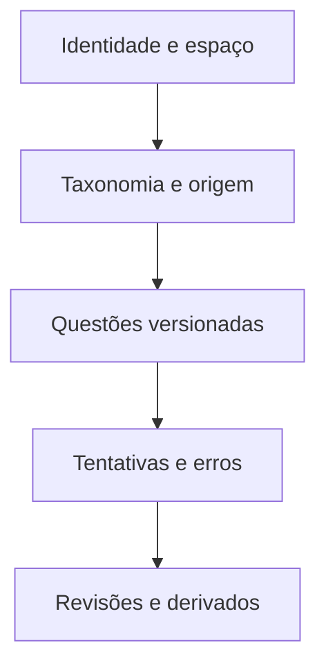
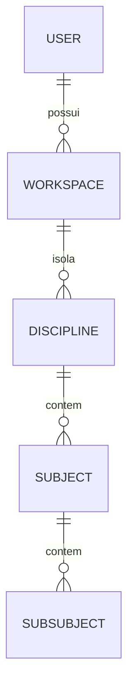
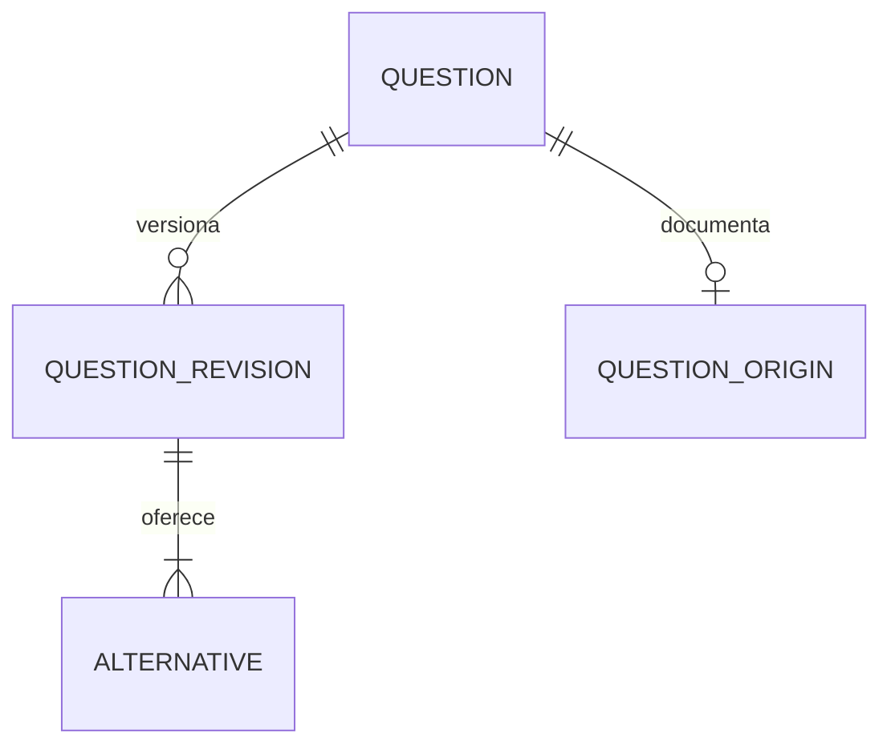
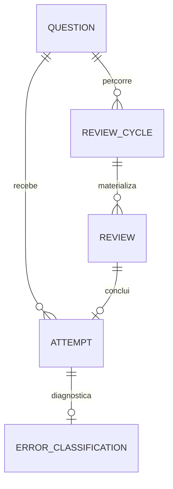

# Caderno de Erros Inteligente

## Etapa 7 — Modelo de Dados

| Campo | Valor |
|---|---|
| Documento | Modelo Conceitual e Lógico de Dados |
| Projeto | Caderno de Erros Inteligente |
| Versão | 1.0 — aprovada |
| Data | 30 de agosto de 2026 |
| Status | Aprovada e congelada |
| Aprovação | Aprovada integralmente pelo responsável pelo produto em 30 de agosto de 2026 |
| Base congelada | Visão 1.0; Escopo 1.0; RFs 1.0; RNFs 1.0; Regras de Negócio 1.0; SDD 1.0 |
| Próxima etapa após aprovação | Etapa 8 — Fluxos Principais |

---

## 1. Finalidade e alcance

Este documento transforma os requisitos, regras e decisões arquiteturais aprovados em um modelo de dados implementável. Define entidades, atributos, tipos conceituais, obrigatoriedade, relacionamentos, cardinalidades, restrições, índices, histórico, exclusão e exportação.

O modelo é independente do SQL físico, mas compatível com Django ORM, SQLite no MVP local e PostgreSQL após o gatilho arquitetural aprovado. Migrações executáveis, telas, autenticação remota e revisão adaptativa não são definidos nesta etapa.

Princípios obrigatórios:

- `Question` e `Attempt` são entidades distintas;
- fatos históricos não são reescritos silenciosamente;
- toda tentativa referencia a versão da questão utilizada;
- cada dado do estudante pertence a exatamente um `Workspace`;
- arquivamento precede exclusão destrutiva;
- métricas são reproduzíveis a partir dos fatos;
- projeções de busca, domínio e prioridade nunca substituem a fonte de verdade;
- o núcleo permanece portátil entre SQLite e PostgreSQL.

---

## 2. Alternativas analisadas

### 2.1 Identificadores

| Alternativa | Vantagem | Limitação |
|---|---|---|
| Inteiro incremental | Compacto e simples. | Colisões em importação, sequência exposta e sincronização futura difícil. |
| UUID | Identidade independente do banco, exportação e restauração seguras. | Índices maiores. |
| Nome como chave | Legível. | Nome muda e não deve ser identidade. |

**Recomendação:** UUID para entidades de negócio. Códigos estáveis continuam textuais.

### 2.2 Hierarquia acadêmica

| Alternativa | Avaliação |
|---|---|
| `AcademicNode` genérico | Flexível, mas permite profundidade e combinações inválidas. |
| `Discipline`, `Subject`, `Subsubject` explícitas | Representa exatamente os três níveis aprovados e permite FKs claras. |

**Recomendação:** tabelas explícitas.

### 2.3 Conteúdo da questão

| Alternativa | Avaliação |
|---|---|
| Somente estado atual | Não reconstrói o gabarito usado em tentativas antigas. |
| Copiar conteúdo em cada tentativa | Reconstrói, mas duplica muito texto. |
| Questão estável + versões | Preserva identidade, histórico e evita cópia por tentativa. |

**Recomendação:** `Question` + `QuestionRevision` + `Alternative`; `Attempt` aponta para a revisão usada.

### 2.4 Diagnóstico de erro

| Alternativa | Avaliação |
|---|---|
| Sobrescrever | Simples, porém perde a correção anterior. |
| Somente eventos | Histórico puro, mas consultas atuais ficam mais complexas. |
| Projeção atual + revisões imutáveis | Consulta simples e trilha completa. |

**Recomendação:** `ErrorClassification` atual acompanhada de `ErrorClassificationRevision`, atualizadas na mesma transação.

### 2.5 Reagendamento

Reagendar não é uma nova etapa de aprendizagem. A mesma `Review` manterá `first_due_date`, atualizará `current_due_date` e receberá um `ReviewScheduleChange` imutável.

### 2.6 Métricas e domínio

O MVP calculará dos fatos. `MasterySnapshot` e `PrioritySnapshot` serão projeções V1 condicionadas a benchmark e reconciliação.

---

## 3. Convenções de dados

### 3.1 Tipos conceituais

| Tipo | Uso |
|---|---|
| `UUID` | PKs e FKs de negócio. |
| `VARCHAR(n)` | Texto curto limitado. |
| `TEXT` | Conteúdo longo com validator. |
| `ENUM/CHECK` | Conjunto pequeno e estável. |
| `TIMESTAMP_TZ` | Instante UTC. |
| `DATE` | Data civil sem horário. |
| `INTEGER` | Versões, ordem e pontos-base. |
| `JSON` | Somente projeções ou metadados com schema fechado. |
| `HASH` | Fingerprint/checksum; não substitui o dado. |

### 3.2 Tempo

Tentativas armazenam `occurred_at` em UTC, `timezone_name` IANA e `local_date`. Revisões vencem por `DATE`. Mudança de fuso não reescreve esses valores históricos.

### 3.3 Percentuais

Quando persistidos, usam pontos-base inteiros: 0–10.000. Assim, 8.500 representa 85,00%, evitando diferenças de ponto flutuante.

### 3.4 Normalização

`name_key` remove espaços externos, reduz espaços repetidos, normaliza Unicode e ignora maiúsculas/minúsculas, preservando acentos conforme `RN-008`.

### 3.5 Ausência

`NULL` significa não informado/não aplicável. String vazia e zero não substituem ausência. Métrica sem evidência retorna estado explícito, nunca 0% fictício.

### 3.6 Limites propostos

| Dado | Limite |
|---|---:|
| Nomes, tags e filtros | 120 caracteres |
| Título provisório | 200 |
| Enunciado | 20.000 |
| Alternativa | 4.000 |
| Explicação/regra | 10.000 |
| Pegadinha | 5.000 |
| Observações | 10.000 |
| Referência | 1.000 |
| Descrição de “outra” | 500 |
| Motivos sensíveis | 1.000 |
| URL | 2.048 |

Ano: entre 1900 e `ano corrente + 2`. Esta proposta resolve `RN-ABR-001` se aprovada.

### 3.7 Campos comuns

Entidades mutáveis possuem `created_at`, `updated_at` e `lock_version`. Eventos imutáveis possuem apenas o instante pertinente. Registros operacionais consultados isoladamente repetem `workspace_id` de forma controlada para autorização e índices; todas as relações devem manter o mesmo espaço.

---

## 4. Visão conceitual



### 4.1 Catálogo de entidades

| Grupo | Entidades | Fase |
|---|---|---|
| Identidade | `User`, `Workspace` | MVP |
| Taxonomia | `Discipline`, `Subject`, `Subsubject` | MVP |
| Origem | `Board`, `Exam`, `Source`, `QuestionOrigin` | MVP |
| Questões | `Question`, `QuestionRevision`, `Alternative`, `Tag`, `QuestionTag` | MVP |
| Aprendizagem | `Attempt`, `ErrorCategory`, `ErrorClassification`, `ErrorClassificationRevision` | MVP |
| Revisões | `ReviewCycle`, `Review`; `ReviewScheduleChange` | MVP; reagendamento V1 |
| Confiabilidade | `OperationReceipt`, `AuditEvent` | MVP/V1 |
| Preferências | `SavedFilter` | V1 |
| Derivados | `MasterySnapshot`, `MasteryStateEvent`, `PrioritySnapshot` | V1/condicional |

Total: 27 entidades.

### 4.2 Fonte de verdade

| Classe | Entidades |
|---|---|
| Fatos | Questões e versões, tentativas, classificações, ciclos, revisões e históricos. |
| Referências | Taxonomia, origem, tags e categorias. |
| Proteção | Recibos e auditoria. |
| Reconstruíveis | Snapshots, agregados de dashboard e índice de busca. |

---

## 5. Identidade e taxonomia

### 5.1 `User`

**Função:** identidade autenticável; local no MVP e real em hospedagem futura.

| Campo | Tipo | Obrigatório | Regra |
|---|---|---:|---|
| `id` | UUID | Sim | PK. |
| `display_name` | VARCHAR(120) | Não | Apresentação. |
| `email` | VARCHAR(254) | Não no local | Único quando informado. |
| `status` | ENUM | Sim | `ACTIVE`, `DISABLED`. |
| `created_at`, `updated_at` | TIMESTAMP_TZ | Sim | Controle. |

Credenciais ficam no mecanismo seguro do framework. Relação `User 1:N Workspace`; no MVP haverá usuário e espaço padrão.

### 5.2 `Workspace`

| Campo | Tipo | Obrigatório | Regra |
|---|---|---:|---|
| `id` | UUID | Sim | PK. |
| `owner_user_id` | UUID | Sim | FK `User`; `PROTECT`. |
| `name` | VARCHAR(120) | Sim | Apresentação. |
| `timezone_name` | VARCHAR(64) | Sim | IANA válido. |
| `locale` | VARCHAR(16) | Sim | Inicial `pt-BR`. |
| campos comuns | — | Sim | Datas e lock. |

Pai de todo dado do estudante. Índice em `owner_user_id`. Mudar o fuso afeta somente “hoje” e cálculos futuros.

### 5.3 `Discipline`

Campos: `id UUID PK`; `workspace_id UUID FK`; `name VARCHAR(120)`; `name_key VARCHAR(120)`; `status ACTIVE|ARCHIVED`; `sort_order INTEGER?`; `archived_at TIMESTAMP?`; campos comuns.

Relações: `1:N Subject` e `1:N Question`. Restrição: nome ativo único por espaço. Índices: `uq_discipline_active_name(workspace_id,name_key) WHERE ACTIVE`; `(workspace_id,status)`.

### 5.4 `Subject`

Campos: os de `Discipline` mais `discipline_id UUID` obrigatório. Relações: `N:1 Discipline`, `1:N Subsubject`, `1:N Question`. Mesmo espaço do pai; nome ativo único dentro da disciplina. Índice `(workspace_id,discipline_id,status)`.

### 5.5 `Subsubject`

Campos: os da taxonomia mais `subject_id UUID` obrigatório. Relações: `N:1 Subject`, `1:N Question`. Mesmo espaço do pai; nome ativo único dentro do assunto. Índice `(workspace_id,subject_id,status)`.

Itens arquivados permanecem nas relações históricas, mas não aceitam novos vínculos.

---

## 6. Origem e questões

### 6.1 `Board`

Campos: `id UUID`; `workspace_id`; `name VARCHAR(120)`; `name_key`; `website_url VARCHAR(2048)?`; `status ACTIVE|ARCHIVED`; datas.

Relações: `1:N Exam`; associação opcional a `QuestionOrigin`. Nome ativo único por espaço. Referenciada: `PROTECT` e arquivamento. Índices `(workspace_id,status,name_key)`.

### 6.2 `Exam`

Campos: `id`; `workspace_id`; `board_id?`; `name/name_key`; `year SMALLINT?`; `status`; datas.

Relações: `N:0..1 Board`, `1:N QuestionOrigin`. Ano segue a faixa aprovada. Unicidade lógica por `(workspace,board,name_key,year)`. Índice `(workspace_id,board_id,year)`.

### 6.3 `Source`

Campos: `id`; `workspace_id`; `source_type BOOK|PDF|WEBSITE|COURSE|QUESTION_BANK|OTHER`; `name/name_key`; `locator_url?`; `notes TEXT?`; `status`; datas.

Relação `1:N QuestionOrigin`; fonte vinculada é arquivada. Índices `(workspace_id,source_type,status)` e `(workspace_id,name_key)`.

### 6.4 `Question`

**Função:** identidade estável, estado e classificação acadêmica atual.

| Campo | Tipo | Obrigatório | Regra |
|---|---|---:|---|
| `id` | UUID | Sim | PK. |
| `workspace_id` | UUID | Sim | Escopo. |
| `discipline_id` | UUID | Se ativa | FK `Discipline`. |
| `subject_id` | UUID | Se ativa | FK `Subject`. |
| `subsubject_id` | UUID | Não | FK `Subsubject`. |
| `question_type` | ENUM | Sim | MVP `OBJECTIVE_SINGLE`. |
| `status` | ENUM | Sim | `DRAFT`, `ACTIVE`, `ARCHIVED`. |
| `difficulty` | ENUM | Não | `EASY`, `MEDIUM`, `HARD`. |
| `draft_title` | VARCHAR(200) | Condicional | Identifica rascunho incompleto. |
| `activated_at`, `archived_at` | TIMESTAMP_TZ | Não | Coerentes com estado. |
| campos comuns | — | Sim | Datas e lock. |

Restrições:

- assunto pertence à disciplina;
- subassunto pertence ao assunto;
- questão ativa utiliza taxonomia ativa no momento do vínculo;
- questão ativa possui revisão corrente válida, enunciado, duas ou mais alternativas e gabarito;
- arquivar suspende ciclo/revisão na mesma transação;
- não há múltiplos subassuntos.

Índices: `(workspace_id,status,updated_at)`, `(workspace_id,discipline_id,subject_id,subsubject_id,status)`, `(workspace_id,difficulty,status)`.

### 6.5 `QuestionOrigin`

| Campo | Tipo | Obrigatório | Regra |
|---|---|---:|---|
| `id`, `workspace_id` | UUID | Sim | PK e escopo. |
| `question_id` | UUID | Sim | FK única → `Question`. |
| `source_id`, `exam_id`, `board_id` | UUID | Não | Referências opcionais. |
| `reference_year` | SMALLINT | Não | Apenas se não vier da prova. |
| `reference_text` | VARCHAR(1000) | Não | Página/caderno/número. |
| campos comuns | — | Sim | Datas e lock. |

Cardinalidade `Question 1:0..1 QuestionOrigin`. `exam_id` e `board_id` não coexistem; com prova, banca deriva de `Exam`. A entidade não existe se nenhum dado de origem foi informado. Todas as FKs pertencem ao mesmo espaço. Índices por fonte, prova e banca.

### 6.6 `QuestionRevision`

**Função:** versão imutável do conteúdo e gabarito.

| Campo | Tipo | Obrigatório | Regra |
|---|---|---:|---|
| `id`, `workspace_id`, `question_id` | UUID | Sim | PK, escopo e pai. |
| `version_number` | INTEGER | Sim | Crescente por questão, iniciado em 1. |
| `is_current` | BOOLEAN | Sim | Uma corrente por questão. |
| `stem` | TEXT | Para ativação | Até 20.000. |
| `explanation` | TEXT | Não | Até 10.000. |
| `trap_note` | TEXT | Não | Até 5.000. |
| `notes` | TEXT | Não | Até 10.000. |
| `correct_alternative_id` | UUID | Para ativação | Alternativa da própria revisão. |
| `change_kind` | ENUM | Sim | `INITIAL`, `ENRICHMENT`, `NON_CRITICAL_EDIT`, `CRITICAL_CORRECTION`. |
| `change_reason` | VARCHAR(1000) | Condicional | Obrigatório na correção crítica. |
| `created_at` | TIMESTAMP_TZ | Sim | Instante da versão. |

Relações: `Question 1:N QuestionRevision`; `QuestionRevision 1:N Alternative`; `1:N Attempt`.

Regras: versão publicada é imutável; editar cria nova versão e troca `is_current` atomicamente; número único; somente uma corrente; gabarito pertence à mesma versão. No MVP, mudança crítica após tentativa é bloqueada, mas a estrutura suporta o fluxo auditável V1.

Índices: únicos `(question_id,version_number)` e `(question_id) WHERE is_current`; `(workspace_id,question_id,created_at)`.

### 6.7 `Alternative`

Campos: `id`; `workspace_id`; `question_revision_id`; `position SMALLINT`; `label VARCHAR(10)?`; `text TEXT`; `text_key TEXT`; `created_at`.

Relação `QuestionRevision 1:2..N Alternative`. Posição e texto normalizado são únicos por revisão. O gabarito é o ponteiro único de `QuestionRevision`; não existe `Alternative.is_correct`. A alternativa se torna imutável ao publicar a versão. Índices únicos por posição e texto.

### 6.8 `Tag` e `QuestionTag`

`Tag`: `id`, `workspace_id`, `name/name_key`, `status`, datas. Nome ativo único por espaço.

`QuestionTag`: `id`, `workspace_id`, `question_id`, `tag_id`, `created_at`. Par questão/tag único; mesmo espaço. Relação N:N e índice `(workspace_id,tag_id,question_id)`.

---

## 7. Tentativas e erros

### 7.1 `Attempt`

**Função:** evento finalizado de resposta inicial ou de revisão.

| Campo | Tipo | Obrigatório | Regra |
|---|---|---:|---|
| `id`, `workspace_id`, `question_id` | UUID | Sim | Identidade, escopo e questão. |
| `question_revision_id` | UUID | Sim | Conteúdo/gabarito usado. |
| `review_id` | UUID | Se revisão | Nulo na inicial. |
| `attempt_type` | ENUM | Sim | `INITIAL`, `REVIEW`. |
| `selected_alternative_id` | UUID | Sim no MVP | Alternativa da revisão usada. |
| `is_correct` | BOOLEAN | Sim | Calculado. |
| `perceived_ease` | ENUM | Não | `EASY`, `MEDIUM`, `HARD`. |
| `occurred_at` | TIMESTAMP_TZ | Sim | Instante UTC. |
| `timezone_name` | VARCHAR(64) | Sim | Fuso IANA do evento. |
| `local_date` | DATE | Sim | Data civil histórica. |
| `status` | ENUM | Sim | `VALID`, `VOIDED` (V1). |
| `replaces_attempt_id` | UUID | Não | Substituição V1. |
| `voided_at`, `void_reason` | TIMESTAMP/VARCHAR | Se anulada | Auditoria V1. |
| `idempotency_key` | UUID | Sim | Chave do envio. |
| `created_at` | TIMESTAMP_TZ | Sim | Persistência. |

`question_id` é redundância controlada para autorização, unicidade e linha do tempo; deve coincidir com a questão da versão.

Restrições:

- uma tentativa inicial válida por questão;
- uma tentativa válida por revisão;
- `INITIAL` implica revisão nula; `REVIEW` exige revisão;
- alternativa e gabarito pertencem à revisão indicada;
- resultado equivale à comparação determinística;
- fatos finalizados são imutáveis;
- anulada não participa de métricas/transições;
- substituta aponta para anulada da mesma questão/espaço;
- correta não possui diagnóstico; incorreta possui exatamente um.

Índices: chave idempotente única; inicial válida parcial única; revisão válida parcial única; substituição única; `(workspace_id,question_id,occurred_at DESC)`; `(workspace_id,status,is_correct,local_date)`; `(workspace_id,attempt_type,local_date)`.

### 7.2 `ErrorCategory`

Campos: `id`; `workspace_id`; `code VARCHAR(64)` imutável; `display_name VARCHAR(120)`; `name_key`; `description VARCHAR(500)`; `category_kind STANDARD|CUSTOM`; `status ACTIVE|ARCHIVED|MERGED`; `merged_into_id?`; datas.

Códigos padrão: `CONCEPTUAL`, `INTERPRETATION`, `CALCULATION`, `ATTENTION`, `FORMULA_RULE`, `PROCEDURE`, `TRAP`, `TIME_SHORTAGE`, `GUESS`, `OTHER`.

Código único por espaço. Padrões não são excluídos/consolidados. Categoria pessoal vinculada é arquivada ou consolidada sem ciclos. Índices por código, tipo e estado.

### 7.3 `ErrorClassification`

Campos: `id`; `workspace_id`; `attempt_id` único; `category_id`; `other_description VARCHAR(500)?`; datas; `lock_version`.

É a projeção atual. Existe apenas para tentativa incorreta; categoria `OTHER` exige descrição. Tentativa, categoria e classificação pertencem ao mesmo espaço. Índices em `attempt_id` único e `(workspace_id,category_id,updated_at)`.

### 7.4 `ErrorClassificationRevision`

Campos: `id`; `workspace_id`; `error_classification_id`; `revision_number`; `category_id`; `other_description?`; `change_reason?`; `created_at`.

Append-only. A revisão 1 registra o original. Par classificação/número único. Atualizar a projeção e inserir a nova revisão é uma transação; não altera resposta, resultado, data ou ciclo.

---

## 8. Ciclos e revisões

### 8.1 `ReviewCycle`

| Campo | Tipo | Obrigatório | Regra |
|---|---|---:|---|
| `id`, `workspace_id`, `question_id` | UUID | Sim | Identidade e pai. |
| `origin_attempt_id` | UUID | Sim | Tentativa de origem. |
| `origin_kind` | ENUM | Sim | MVP `INITIAL_ERROR`; V1 `MANUAL`. |
| `policy_code` | VARCHAR(64) | Sim | MVP `REV-FIXA-1.0`. |
| `state` | ENUM | Sim | `ACTIVE`, `COMPLETED`, `SUSPENDED`. |
| `started_at` | TIMESTAMP_TZ | Sim | Início. |
| `completed_at`, `suspended_at` | TIMESTAMP_TZ | Condicional | Coerentes com estado. |
| `suspension_reason` | VARCHAR(1000) | Não | Motivo/código. |
| campos comuns | — | Sim | Datas e lock. |

No máximo um ciclo ativo por questão. Origem automática exige tentativa inicial incorreta válida. Conclusão exige acerto D30. A política registrada nunca é trocada silenciosamente. Índice parcial único por questão ativa; origem automática única.

### 8.2 `Review`

| Campo | Tipo | Obrigatório | Regra |
|---|---|---:|---|
| `id`, `workspace_id`, `review_cycle_id`, `question_id` | UUID | Sim | Identidade, escopo e pais. |
| `sequence_number` | INTEGER | Sim | Crescente no ciclo, inclusive reinícios. |
| `stage_code` | ENUM | Sim | `D1`, `D7`, `D14`, `D30`. |
| `state` | ENUM | Sim | `PENDING`, `COMPLETED`, `SUSPENDED`, `CANCELLED`. |
| `first_due_date` | DATE | Sim | Original e imutável. |
| `current_due_date` | DATE | Sim | Operacional. |
| `scheduled_from_attempt_id` | UUID | Sim | Âncora. |
| `transition_code` | VARCHAR(64) | Sim | Justificativa. |
| `policy_code` | VARCHAR(64) | Sim | Política aplicada. |
| `completed_at`, `suspended_at` | TIMESTAMP_TZ | Condicional | Coerentes. |
| campos comuns | — | Sim | Datas e lock. |

Regras:

- questão coincide com a do ciclo;
- uma `PENDING` por ciclo;
- situação futura/devida/atrasada é derivada, não persistida;
- concluída possui uma tentativa `REVIEW` válida;
- abrir não cria tentativa;
- erro cria nova D1 com sequência nova, preservando anteriores;
- conclusão antecipada continua indisponível até decisão formal.

Índices: únicos `(review_cycle_id,sequence_number)` e pendente parcial; fila `(workspace_id,state,current_due_date,created_at)`; `(workspace_id,question_id,state)`.

### 8.3 `ReviewScheduleChange`

Campos: `id`; `workspace_id`; `review_id`; `sequence_number`; `previous_due_date`; `new_due_date`; `reason VARCHAR(1000)`; `changed_at`; `timezone_name`.

V1, append-only. Revisão deve estar pendente; nova data é hoje ou futura no instante da ação. Inserção e atualização de `current_due_date` são atômicas; `first_due_date` nunca muda. Sequência única por revisão.

### 8.4 Situação temporal

Para revisão pendente: futura se `current_due_date > hoje`; devida se igual; atrasada se menor. Estados `COMPLETED`, `SUSPENDED` e `CANCELLED` prevalecem. Não existe job diário.

---

## 9. Confiabilidade, auditoria e projeções

### 9.1 `OperationReceipt`

Campos: `id`; `workspace_id`; `operation_kind VARCHAR(64)`; `idempotency_key UUID`; `request_hash`; `result_entity_type`; `result_entity_id`; `created_at`.

Par `(workspace,operation_kind,idempotency_key)` único. Chave repetida com o mesmo hash retorna o resultado existente; hash diferente gera conflito. Recibo e efeito são gravados na mesma transação.

### 9.2 `AuditEvent`

Campos: `id`; `workspace_id`; `actor_user_id?`; `event_type`; `entity_type`; `entity_id?`; `occurred_at`; `correlation_id`; `reason?`; `before_hash?`; `after_hash?`; `metadata JSON?`.

É append-only e sanitizado. Registra mudança de fuso, arquivamento, correção crítica, correção de diagnóstico, anulação, reagendamento, exclusão, exportação, backup e restauração. Não copia enunciado ou resposta para logs. Índices por tempo, entidade e correlação.

### 9.3 `SavedFilter`

V1. Campos: `id`; `workspace_id`; `owner_user_id`; `name/name_key`; `context_code`; `criteria JSON`; `schema_version`; datas.

Nome único por usuário/contexto. JSON usa schema fechado e apenas operadores permitidos; IDs dos critérios pertencem ao espaço.

### 9.4 `MasterySnapshot`

V1 condicional. Campos:

- `id`, `workspace_id`;
- exatamente um alvo: `question_id`, `discipline_id`, `subject_id` ou `subsubject_id`;
- `mastery_score_bp?`, `confidence_score_bp`;
- `evidence_state NO_DATA|INSUFFICIENT|LOW|MODERATE|HIGH`;
- `label_code?`, `formula_code`, `as_of_date`, `calculated_at`;
- `components JSON`, `input_fingerprint`, `is_current`.

Pontuações ficam em 0–10.000. Componentes explicam `Aq`, `Pq`, `Fq`, `Eq`, tetos e denominadores. Snapshot divergente é obsoleto e nunca substitui tentativas. Índice/unicidade corrente por alvo e fórmula.

### 9.5 `MasteryStateEvent`

V1. Campos: `id`; `workspace_id`; `question_id`; `event_type DOMINATED|AUTO_REOPENED|MANUAL_REOPENED`; pontuações; `formula_code`; `trigger_attempt_id?`; `reason?`; `occurred_at`.

Append-only. Reabertura manual exige motivo. O estado dominado não será um booleano autoritativo em `Question`.

### 9.6 `PrioritySnapshot`

V1 condicional. Campos: `id`; `workspace_id`; exatamente um alvo entre disciplina/assunto/subassunto; `priority_score_bp`; `formula_code PRI-HEUR-1.0`; `reason_codes JSON`; `as_of_date`; `calculated_at`; `input_fingerprint`; `is_current`.

Recomendação inelegível não recebe pontuação fictícia. Snapshot explica fatores e não altera automaticamente questões ou revisões.

---

## 10. ERD textual

### 10.1 Identidade e hierarquia



### 10.2 Questão e conteúdo



### 10.3 Aprendizagem



### 10.4 Cardinalidades completas

| Origem | Cardinalidade | Destino | Regra |
|---|---:|---|---|
| `User` | 1:N | `Workspace` | Sem compartilhamento no escopo. |
| `Workspace` | 1:N | dados do estudante | Nenhum vínculo cruzado. |
| `Discipline` | 1:N | `Subject` | Pai obrigatório. |
| `Subject` | 1:N | `Subsubject` | Pai obrigatório. |
| Hierarquia | 1:N | `Question` | Disciplina/assunto obrigatórios quando ativa; subassunto opcional. |
| `Board` | 1:N | `Exam` | Banca opcional na prova. |
| `Question` | 1:0..1 | `QuestionOrigin` | Origem inteira opcional. |
| `Question` | 1:N | `QuestionRevision` | Uma corrente. |
| `QuestionRevision` | 1:2..N | `Alternative` | Quando ativada. |
| `Question` | N:N | `Tag` | Por `QuestionTag`. |
| `Question` | 1:N | `Attempt` | Máximo uma inicial válida. |
| `QuestionRevision` | 1:N | `Attempt` | Versão usada. |
| `Review` | 1:0..1 | `Attempt` | Uma válida quando concluída. |
| `Attempt` incorreta | 1:1 | `ErrorClassification` | Obrigatória. |
| `ErrorClassification` | 1:N | revisões | Primeira registra o original. |
| `ErrorCategory` | 1:N | classificações | FK protegida. |
| `Question` | 1:N | `ReviewCycle` | Máximo um ativo. |
| `ReviewCycle` | 1:N | `Review` | Máximo uma pendente. |
| `Review` | 1:N | reagendamentos | V1. |
| `Question` | 1:N | eventos de domínio | V1. |

---

## 11. Invariantes e transações

### 11.1 Proteção direta do banco

- PKs/FKs e faixas numéricas;
- nomes normalizados únicos no escopo;
- uma revisão corrente por questão;
- uma tentativa inicial válida por questão;
- uma tentativa válida por revisão;
- um ciclo ativo por questão;
- uma revisão pendente por ciclo;
- pares N:N, versões e sequências únicas;
- chaves idempotentes únicas.

Índices parciais centrais são suportados por SQLite e PostgreSQL.

### 11.2 Invariantes entre tabelas

Serviços transacionais e testes garantem:

- coerência disciplina → assunto → subassunto;
- versão pertencente à questão da tentativa;
- alternativa e gabarito pertencentes à versão;
- mesmo espaço em todas as referências;
- diagnóstico somente em erro;
- ativação somente com conteúdo válido;
- ciclo concluído somente por acerto D30;
- data operacional igual ao último reagendamento.

Constraints compostas reforçarão essas regras quando portáveis. Triggers não serão a única implementação da política.

### 11.3 Imutabilidade

Imutáveis: versão publicada, suas alternativas, fatos da tentativa, revisões de diagnóstico, reagendamentos, eventos de domínio e auditoria. No MVP, caminhos de escrita exclusivos e testes reforçam isso; PostgreSQL poderá adicionar proteção física depois.

### 11.4 Transação de erro inicial

Valida questão/versão → cria tentativa incorreta → diagnóstico e revisão 1 → ciclo → revisão D1 → recibo/auditoria → commit único.

### 11.5 Transação de conclusão

Valida idempotência e revisão → cria tentativa/diagnóstico → conclui revisão → aplica `REV-FIXA-1.0` → cria próxima revisão ou conclui ciclo → recibo/auditoria → commit único.

---

## 12. Índices e consultas

### 12.1 Fila

Índice `(workspace_id,state,current_due_date,created_at)`. Não existem colunas `is_due` ou `is_overdue`, pois ficariam obsoletas.

### 12.2 Linha do tempo

Índice `(workspace_id,question_id,occurred_at DESC)` em tentativa; revisão usada resolve o conteúdo histórico.

### 12.3 Dashboard

Tentativas válidas são agrupadas por data, tipo e resultado. Desempenho acadêmico junta `Attempt.question_id` à classificação atual de `Question`, conforme `RN-010`.

### 12.4 Erros

Frequência atual usa `ErrorClassification`; histórico usa suas revisões sem contar ambas simultaneamente.

### 12.5 Busca

Filtros estruturados e busca simples primeiro. Após `BCR-1`, se necessário, projeção reconstruível SQLite FTS5; PostgreSQL usa backend equivalente medido. A projeção indexa apenas a versão corrente e aponta para `Question.id`.

### 12.6 Evitar inicialmente

Índices isolados em booleanos, um índice para cada campo opcional, snapshots não usados e agregados prematuros.

---

## 13. Arquivamento e exclusão

| Entidade | Padrão | Exclusão física |
|---|---|---|
| Taxonomia, origem, tags, categorias | Arquivar/`PROTECT`. | Somente sem vínculos ou após migração. |
| Questão com histórico | Arquivar e suspender ciclo. | V1, agregado completo. |
| Rascunho sem dependência | Excluir. | MVP, confirmação simples. |
| Tentativa | Nunca isoladamente. | Somente com questão/espaço. |
| Ciclo, revisão e diagnóstico | Preservar. | Somente com pai. |
| Snapshot | Reconstruir. | Livre após invalidar/recalcular. |
| Auditoria | Política controlada. | Depende de `RN-ABR-005`. |

Exclusão V1 da questão apresenta contagens e remove, em uma operação: projeções/associações → reagendamentos → diagnósticos → tentativas → revisões/ciclos → origem/tags → alternativas/versões → questão → reconciliação. Não depende de um `CASCADE` opaco para explicar impacto.

Excluir `Workspace` é operação própria, com confirmação reforçada, exportação opcional e prova de que outro espaço não será afetado.

---

## 14. Concorrência e idempotência

Formulários mutáveis enviam `lock_version`; updates só acontecem se a versão continua atual. Conflito nunca sobrescreve silenciosamente.

Aplicável a espaço, catálogos, questão, origem, diagnóstico, ciclo e revisão. `OperationReceipt` mais índices únicos protegem comandos críticos.

No SQLite: transações curtas, WAL após teste, timeout de banco ocupado e nenhum cálculo demorado durante escrita. No PostgreSQL: bloqueio de linha pode proteger revisão/ciclo sem mudar a semântica.

---

## 15. Métricas e explicabilidade

| Métrica | Fonte | Regra |
|---|---|---|
| Questões cadastradas | `Question` | Sem contar versões. |
| Questões realizadas | `Attempt` | Questões distintas com inicial válida. |
| Tentativas | `Attempt` | Somente `VALID`, separando tipo. |
| Acertos/erros | `Attempt` | `is_correct`, somente válidas. |
| Revisões hoje | `Attempt` | Tipo revisão e `local_date=hoje`. |
| Devidas/atrasadas | `Review` | Pendentes comparadas à data local. |
| Frequência de erro | classificação + tentativa | Diagnóstico atual de erro válido. |

Todo resultado de métrica informa valor, numerador, denominador, período, filtros, instante e suficiência.

`MasteryCalculator` lê fatos. Snapshot, se introduzido, contém componentes e fingerprint para reconciliação. Estado dominado deriva de `RN-079`, confiança, fatos válidos e reabertura manual; não existe `Question.is_dominated` autoritativo.

---

## 16. Exportação e restauração

### 16.1 `CEI-EXPORT-1.0`

```text
cei-export-AAAA-MM-DD.zip
  manifest.json
  workspace.json
  taxonomy.json
  origins.json
  questions.json
  question_revisions.json
  alternatives.json
  tags.json
  attempts.json
  error_categories.json
  error_classifications.json
  review_cycles.json
  reviews.json
  review_schedule_changes.json
  mastery_events.json
  audit_events.json
  README.txt
```

Regras: UTF-8; datas `YYYY-MM-DD`; instantes ISO 8601 UTC; fuso histórico separado; UUIDs e códigos preservados; ausências como `null`; manifesto com versão, contagens, tamanhos e SHA-256.

Snapshots podem ser omitidos. `OperationReceipt` não é exportado por padrão. Auditoria exportável é sanitizada. Isso fecha `SDD-ABR-007` como proposta.

### 16.2 Restauração

Validar manifesto/checksums → carregar em área temporária → importar referências → questões/versões → tentativas/erros → ciclos/revisões → eventos → verificar invariantes/contagens → reconstruir busca/métricas → trocar somente após sucesso.

Restauração completa substitui um espaço após confirmação e backup. Mesclagem parcial fica fora do MVP/V1.

---

## 17. Mapeamento Django e bancos

| Conceito | Django |
|---|---|
| UUID | `UUIDField(primary_key=True)`. |
| Enum | `TextChoices` + `CheckConstraint`. |
| Instante/data | `DateTimeField` / `DateField`. |
| Texto | `CharField` / `TextField` + validators. |
| Pontos-base | inteiro + faixa 0–10.000. |
| Concorrência | inteiro positivo `lock_version`. |
| JSON | `JSONField` com schema validado. |

Um usuário customizado UUID será criado na primeira migração. Constraints e índices terão nomes explícitos e curtos.

| Tema | SQLite | PostgreSQL | Decisão |
|---|---|---|---|
| Comprimento | Nem sempre reforça `VARCHAR`. | Reforça. | Validator, teste e `CHECK` portátil. |
| Concorrência | Escrita mais serializada. | Bloqueio de linha. | Transação curta + idempotência. |
| Busca | FTS5 opcional. | Busca nativa. | Backend substituível. |
| JSON | Texto/funções JSON. | `jsonb`. | Somente metadados/projeções. |
| Índice parcial | Suportado. | Suportado. | Unicidades críticas. |

Seed idempotente cria usuário/espaço local, dez categorias padrão e locale. O fuso é escolhido no primeiro uso, nunca presumido pelo servidor. Não cria disciplinas ou fontes fictícias.

---

## 18. Exemplos normativos

### 18.1 Erro inicial

`Q1` v1 recebe `A1` inicial incorreta. A transação cria diagnóstico, ciclo `C1`, somente uma revisão D1 e recibo. Não cria D7/D14/D30 antecipadamente.

### 18.2 Erro em D7

Após acerto D1, erro D7 preserva as etapas concluídas, registra novo diagnóstico, mantém o ciclo e cria nova D1 com sequência seguinte.

### 18.3 Enriquecimento

Editar explicação cria v2 corrente. Tentativas antigas continuam em v1; próxima revisão usa v2, sem reinterpretar resultados.

### 18.4 Correção de diagnóstico

Trocar `ATTENTION` por `INTERPRETATION` atualiza a projeção e cria revisão histórica; tentativa e ciclo não mudam.

### 18.5 Atraso

Revisão prevista em 10/09 e concluída em 14/09 preserva ambas as datas. Próximo intervalo parte de 14/09.

### 18.6 Reagendamento V1

Revisão 10/09 → 15/09 recebe evento, mantém `first_due_date=10/09` e passa `current_due_date=15/09`. Pontualidade histórica continua usando 10/09.

---

## 19. Matriz de fase

| Capacidade | MVP | V1 | Futuro |
|---|:---:|:---:|:---:|
| Espaço, fuso e taxonomia | ✓ | ✓ | Multiusuário condicionado. |
| Questão/versionamento/alternativas | ✓ | ✓ | Outros tipos de questão. |
| Tentativas e diagnóstico | ✓ | ✓ | Classificação auxiliada sem decisão automática. |
| Ciclo fixo | ✓ | ✓ | Revisão adaptativa versionada. |
| Anulação/substituição | Estrutura pronta | ✓ | — |
| Reagendamento | Estrutura definida | ✓ | — |
| Categorias pessoais e filtros salvos | — | ✓ | — |
| Domínio/prioridade | — | ✓ | Calibração futura. |
| Snapshots e FTS | Por benchmark | Por benchmark | Escala maior. |
| Exportação `CEI-EXPORT-1.0` | Backup técnico | ✓ | Versões compatíveis. |

---

## 20. Rastreabilidade

| Entidades | Requisitos/regras | SDD |
|---|---|---|
| Usuário/espaço | `RF-001`–`003`; `RN-001`–`005`; `RNF-013`, `030`, `067` | Accounts/Workspace e segurança. |
| Hierarquia | `RF-004`–`008`; `RN-006`–`010` | Taxonomy. |
| Origem/questões/versões | `RF-009`–`020`; `RN-011`–`020`, `085`, `086`, `093` | Questions e QuestionCommandService. |
| Tentativa | `RF-021`–`027`; `RN-021`–`027`; `RNF-025`, `026`, `028` | AttemptService e transações. |
| Erros | `RF-028`–`033`; `RN-028`–`032` | Errors e CorrectionService. |
| Ciclo/revisão | `RF-034`–`045`; `RN-033`–`051` | ReviewCycleService e `REV-FIXA-1.0`. |
| Reagendamento | `RF-046`; `RN-052`–`054` | Serviço V1. |
| Recibos | `RF-043`; `RN-046`; `RNF-026` | Idempotência. |
| Auditoria | `RF-071`; `RN-085`, `089`–`096`; `RNF-022`, `070` | Audit/Operations. |
| Métricas | `RF-047`–`056`; `RN-056`–`067`; `RNF-029` | StatisticsQueryService. |
| Domínio/prioridade | `RF-057`–`062`; `RN-068`–`084` | Calculators e snapshots condicionais. |
| Exportação | `RF-069`, `070`; `RNF-034`–`043` | DataExportService. |

---

## 21. Decisões propostas

| ID | Decisão |
|---|---|
| `MD-DEC-001` | UUID nas entidades de negócio. |
| `MD-DEC-002` | Hierarquia explícita em três tabelas. |
| `MD-DEC-003` | Pertencimento inequívoco a `Workspace`, com redundância controlada nos registros operacionais. |
| `MD-DEC-004` | `Question` estável e conteúdo/gabarito versionados. |
| `MD-DEC-005` | Toda tentativa referencia a versão usada. |
| `MD-DEC-006` | Gabarito é um ponteiro único da versão; alternativa não duplica `is_correct`. |
| `MD-DEC-007` | Diagnóstico atual acompanhado de histórico append-only. |
| `MD-DEC-008` | Reagendamento altera a data operacional da mesma revisão e cria evento. |
| `MD-DEC-009` | Futura/devida/atrasada é calculada. |
| `MD-DEC-010` | Métricas derivam dos fatos; snapshots somente por benchmark. |
| `MD-DEC-011` | Percentuais persistidos usam pontos-base. |
| `MD-DEC-012` | Idempotência usa chave única e recibo transacional. |
| `MD-DEC-013` | Exclusão física ocorre por agregado; tentativa nunca isoladamente. |
| `MD-DEC-014` | Limites de texto/ano seguem a seção 3.6. |
| `MD-DEC-015` | Exportação V1 usa `CEI-EXPORT-1.0`. |
| `MD-DEC-016` | Usuário customizado UUID desde a primeira migração. |
| `MD-DEC-017` | FTS e snapshots somente após medição. |

---

## 22. Pontos ainda em aberto

| ID | Ponto | Tratamento |
|---|---|---|
| `MD-ABR-001` | Responder revisão futura antecipadamente? | Etapa 8; ação indisponível até decisão. |
| `MD-ABR-002` | Revisão iniciada e abandonada. | Etapa 8; não criar tentativa finalizada. |
| `MD-ABR-003` | Reativação retoma pendência ou cria ciclo? | Fluxos/Roadmap V1. |
| `MD-ABR-004` | Quando reabertura manual permite novo domínio? | Regra/fluxo V1. |
| `MD-ABR-005` | Retenção de auditoria após exclusão. | Análise jurídica/operacional. |
| `MD-ABR-006` | Consolidação exata de categorias pessoais. | Fluxos V1. |
| `MD-ABR-007` | Correção de gabarito e eventual recálculo. | Fluxos/Roadmap V1. |
| `MD-ABR-008` | Busca simples ou FTS5. | `BCR-1`. |
| `MD-ABR-009` | Snapshots justificam sincronização? | Benchmark V1. |
| `MD-ABR-010` | Expiração dos recibos. | Testes de volume/Roadmap. |

---

## 23. Riscos

| ID | Risco | Mitigação |
|---|---|---|
| `MD-RIS-001` | Vínculo entre espaços. | Escopo obrigatório, validação e testes negativos. |
| `MD-RIS-002` | Versão corrente duplicada/ausente. | Índice parcial, transação e reconciliador. |
| `MD-RIS-003` | Tentativa divergir de sua versão. | Validação e constraint composta quando portátil. |
| `MD-RIS-004` | Resultado divergir do gabarito. | Calcular no serviço; nunca aceitar input. |
| `MD-RIS-005` | Diagnóstico atual divergir do histórico. | Mesma transação e sequência auditável. |
| `MD-RIS-006` | Data atual divergir do reagendamento. | Transação única e reconciliação. |
| `MD-RIS-007` | Snapshot obsoleto. | Fingerprint, fórmula e recálculo. |
| `MD-RIS-008` | JSON virar regra opaca. | Schema fechado; relações centrais normalizadas. |
| `MD-RIS-009` | Cascade apagar sem explicar. | Serviço próprio e prévia de impacto. |
| `MD-RIS-010` | Índices demais. | Medir planos e escrita. |
| `MD-RIS-011` | SQLite não reforçar comprimento. | Validators, checks e testes. |
| `MD-RIS-012` | Restauração quebrar ordem. | Área temporária, manifesto e invariantes. |

---

## 24. Sugestões de melhoria

### 24.1 Vertical slice inicial

`Workspace → Discipline → Subject → Question → QuestionRevision → Alternative → Attempt → ErrorClassification → ReviewCycle → Review`.

Esse corte prova o maior risco antes de relatórios e preferências.

### 24.2 Verificador de invariantes

Criar comando diagnóstico para espaços cruzados, versões correntes, erros sem diagnóstico, revisões concluídas sem tentativa, ciclos com duas pendências, datas divergentes e restaurações incompletas.

### 24.3 Testes em dois bancos

Mesmo com SQLite no MVP, executar constraints críticas periodicamente em PostgreSQL antes de acumular dados.

### 24.4 Otimizar somente com evidência

FTS, snapshots e agregados surgem apenas após consulta lenta reproduzível.

### 24.5 Fixtures temporais

Cobrir fuso, atraso, reinício, edição, diagnóstico e reenvio idempotente.

---

## 25. Itens que precisam de aprovação

1. 27 entidades e suas fases;
2. UUID e usuário customizado;
3. hierarquia explícita;
4. questão, revisão de conteúdo e alternativas separadas;
5. tentativa vinculada à versão;
6. diagnóstico atual com histórico;
7. ciclo e uma pendência por vez;
8. reagendamento como evento da mesma revisão;
9. situação temporal calculada;
10. métricas derivadas e snapshots condicionais;
11. pontos-base;
12. limites textuais e de ano;
13. arquivamento/exclusão por agregado;
14. recibos idempotentes;
15. `CEI-EXPORT-1.0`;
16. `MD-DEC-001` a `MD-DEC-017`;
17. manutenção de `MD-ABR-001` a `MD-ABR-010`.

---

## 26. Critério de encerramento

A Etapa 7 será concluída quando entidades, campos, tipos, obrigatoriedade, cardinalidades, ações referenciais, invariantes, índices e históricos estiverem aprovados; métricas continuarem explicáveis; exportação/restauração tiverem identidade e ordem; e o modelo puder orientar fluxos e migrações sem ambiguidade relevante.

A etapa foi aprovada integralmente em 30 de agosto de 2026. As decisões `MD-DEC-001` a `MD-DEC-017` passam a ser consideradas congeladas e somente poderão ser alteradas mediante registro explícito, nova versão quando aplicável e análise de impacto.
