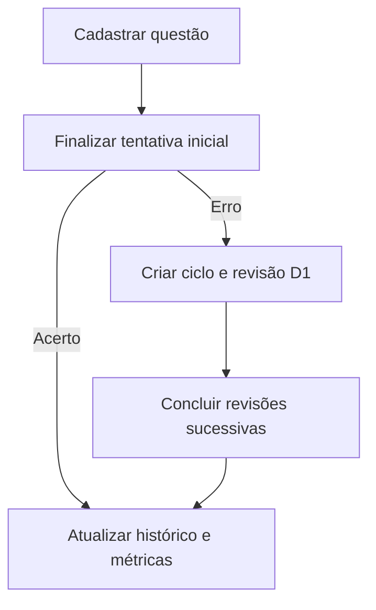
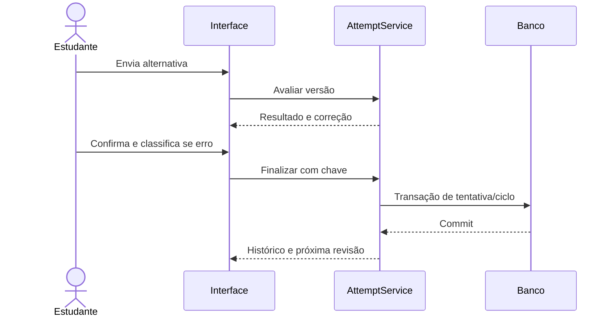
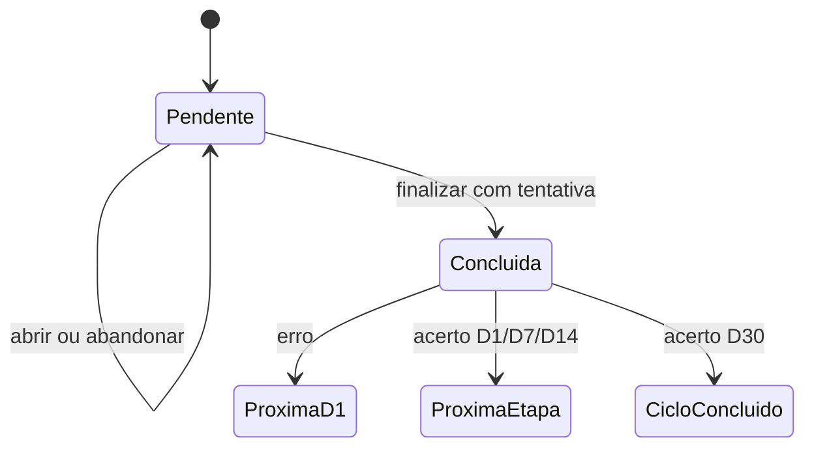

# Caderno de Erros Inteligente

## Etapa 8 — Fluxos Principais

| Campo | Valor |
|---|---|
| Documento | Especificação dos Fluxos Principais |
| Projeto | Caderno de Erros Inteligente |
| Versão | 1.0.2 — errata V0.2 |
| Data | 30 de agosto de 2026 |
| Status | Aprovada; errata documental da V0.2 incorporada em 5 de setembro de 2026 |
| Aprovação | Aprovada integralmente pelo responsável pelo produto em 30 de agosto de 2026 |
| Base congelada | Visão 1.0; Escopo 1.0; RFs 1.0; RNFs 1.0; Regras de Negócio 1.0; SDD 1.0; Modelo de Dados 1.0 |
| Próxima etapa após aprovação | Etapa 9 — Roadmap |

---

## 1. Finalidade e alcance

Este documento descreve como o estudante e o sistema percorrem as capacidades aprovadas. Cada fluxo informa ator, gatilho, pré-condições, passos, alternativas, erros e resultado, além de identificar transações, idempotência e rastreabilidade.

Os fluxos não são protótipos visuais nem código de interface. Eles definem comportamento observável e fronteiras de negócio suficientes para orientar telas, serviços, testes e roadmap.

Princípios obrigatórios:

- abrir uma tela não cria tentativa nem conclui revisão;
- resultado objetivo é calculado pelo sistema;
- fatos históricos só surgem após finalização válida;
- erro finalizado exige diagnóstico;
- conclusão crítica é atômica e idempotente;
- questão, tentativa, revisão e domínio permanecem conceitos distintos;
- o gabarito não é revelado antes do envio;
- operações V1 não bloqueiam a entrega do MVP.

---

## 2. Convenções

### 2.1 Atores

| Ator | Responsabilidade |
|---|---|
| Estudante | Cadastra, responde, classifica, revisa, consulta, arquiva e solicita operações. |
| Sistema | Valida, calcula resultado, agenda revisões, consulta métricas e protege integridade. |
| Administrador local | Papel técnico do próprio estudante para backup/restauração; não acessa outro espaço. |

Não existe ator colaborador, professor, moderador ou serviço externo no escopo atual.

### 2.2 Estados relevantes

| Objeto | Estados |
|---|---|
| Questão | `DRAFT`, `ACTIVE`, `ARCHIVED`. |
| Tentativa | `VALID`; V1 acrescenta `VOIDED`. |
| Ciclo | `ACTIVE`, `COMPLETED`, `SUSPENDED`. |
| Revisão | `PENDING`, `COMPLETED`, `SUSPENDED`, `CANCELLED`. |
| Situação temporal | Futura, devida hoje ou atrasada; sempre derivada. |

### 2.3 Erros funcionais

| Código | Significado no fluxo |
|---|---|
| `VALIDATION_ERROR` | Dados ausentes, formato inválido ou regra local violada. |
| `STATE_CONFLICT` | Objeto mudou ou não está mais no estado exigido. |
| `CONCURRENCY_CONFLICT` | `lock_version` ficou desatualizado. |
| `NOT_FOUND` | Registro inexistente no espaço atual. |
| `FORBIDDEN` | Operação fora do espaço ou da política. |
| `IDEMPOTENT_REPLAY` | Comando já concluído; retornar o resultado anterior. |
| `PERSISTENCE_FAILURE` | Falha de banco; nenhum sucesso deve ser anunciado. |
| `UNSUPPORTED_RULE_VERSION` | Política/fórmula registrada não é reconhecida. |

Mensagens ao usuário deverão explicar a correção possível sem expor detalhes internos.

### 2.4 Contexto transitório de resposta

Ao enviar uma resposta, o sistema poderá manter temporariamente, em sessão segura ou token assinado:

- questão, revisão e versão apresentadas;
- alternativa selecionada;
- resultado calculado;
- instante e fuso do envio;
- chave de idempotência;
- prazo curto de validade.

Esse contexto não é `Attempt`, não participa de métricas e não substitui o banco. Se expirar ou for abandonado, o estudante responde novamente.

### 2.5 Padrão de cada fluxo

| Campo | Conteúdo |
|---|---|
| Ator | Quem inicia e quem executa validações automáticas. |
| Gatilho | Ação ou evento que começa o fluxo. |
| Pré-condições | Estado mínimo anterior. |
| Fluxo principal | Caminho de sucesso numerado. |
| Alternativas | Variações válidas. |
| Erros | Falhas e recuperação. |
| Resultado | Pós-condição observável e dados alterados. |

---

## 3. Decisões de fluxo para pontos em aberto

### 3.1 Revisão antecipada

| Alternativa | Avaliação |
|---|---|
| Permitir sempre | Diminui o intervalo real e altera a regra aprovada. |
| Permitir com aviso | Ainda exige regra sobre como calcular o próximo intervalo. |
| Não permitir no MVP | Preserva `REV-FIXA-1.0` e evita evidência espaçada artificial. |

**Recomendação:** revisão futura pode ser consultada, mas não iniciada/concluída no MVP. Isso resolve `MD-ABR-001` sem alterar a regra de negócio.

### 3.2 Abandono de revisão

| Alternativa | Avaliação |
|---|---|
| Persistir “iniciada” | Exige estado e entidade não aprovados e cria abandono artificial. |
| Criar tentativa parcial | Contamina histórico e métricas. |
| Não persistir antes da finalização | Simples, recuperável e consistente com `RN-042`. |

**Recomendação:** abrir, selecionar ou visualizar a correção sem finalizar não altera fatos permanentes. Contexto transitório expira; ao voltar, o estudante reinicia. Resolve `RF-ABR-006` e `MD-ABR-002`.

### 3.3 Marcação de domínio

| Alternativa | Avaliação |
|---|---|
| Botão “marcar dominada” | Permite contradizer a fórmula e a confiança. |
| Estado exclusivamente automático | Preserva explicabilidade e `RN-079`. |

**Recomendação:** o sistema determina domínio automaticamente; o estudante pode reabrir, nunca forçar domínio.

### 3.4 Reabertura manual de questão dominada

**Recomendação:** exigir motivo, registrar `MANUAL_REOPENED` e criar um novo ciclo manual com primeira revisão D1 em `hoje + 1`. A questão poderá voltar a dominada após concluir D30 desse novo ciclo e satisfazer novamente `RN-079`. Isso resolve `MD-ABR-004` como proposta.

### 3.5 Reativação de questão arquivada

Retomar pendência antiga, reiniciar D1 ou permitir escolha possuem impactos distintos. A ação continuará fora do MVP e será decidida no Roadmap/fluxo V1 antes de implementação. `MD-ABR-003` permanece aberto.

---

## 4. Mapa dos fluxos

| ID | Fluxo | Fase |
|---|---|---|
| `FL-001` | Gerenciar hierarquia acadêmica | MVP |
| `FL-002` | Cadastrar ou salvar questão | MVP |
| `FL-003` | Registrar tentativa inicial e erro | MVP |
| `FL-004` | Consultar questão e linha do tempo | MVP |
| `FL-005` | Editar ou enriquecer questão | MVP |
| `FL-006` | Arquivar questão | MVP |
| `FL-007` | Excluir questão | MVP/V1 |
| `FL-008` | Corrigir diagnóstico do erro | MVP |
| `FL-009` | Iniciar revisão | MVP |
| `FL-010` | Enviar e finalizar revisão | MVP |
| `FL-011` | Abandonar revisão sem finalizar | MVP |
| `FL-012` | Reagendar revisão | V1 |
| `FL-013` | Consultar filas de revisão | MVP |
| `FL-014` | Visualizar dashboard | MVP |
| `FL-015` | Analisar disciplina | MVP/V1 |
| `FL-016` | Analisar assunto/subassunto | MVP/V1 |
| `FL-017` | Identificar conteúdo fraco/prioritário | V1 |
| `FL-018` | Determinar questão dominada | V1 |
| `FL-019` | Reabrir questão dominada | V1 |
| `FL-020` | Pesquisar e filtrar questões | MVP/V1 |
| `FL-021` | Anular e substituir tentativa | V1 |
| `FL-022` | Exportar, fazer backup e restaurar | MVP técnico/V1 |
| `FL-023` | Configurar primeiro acesso e fuso | V0.1/MVP |

### 4.1 Jornada central

### `FL-023` — Configurar primeiro acesso e fuso

| Campo | Especificação |
|---|---|
| Ator | Estudante e Sistema. |
| Gatilho | Primeiro acesso local sem `Workspace` inicializado ou abertura posterior de “Configurações”. |
| Pré-condições | Aplicação local inicializada; lista de fusos IANA disponível; nenhuma exposição remota sem os controles exigidos pelos RNFs. |

**Fluxo principal — primeiro acesso**

1. O sistema apresenta a configuração inicial em `pt-BR` sem presumir silenciosamente o fuso do servidor ou do navegador.
2. O estudante escolhe um identificador IANA válido e confirma a criação do espaço local.
3. O sistema valida o fuso e, em uma transação idempotente, cria o `User` local UUID, o `Workspace` com locale e fuso escolhidos e as dez categorias padrão.
4. Repetir a mesma inicialização retorna o espaço existente e não duplica usuário, espaço ou categorias.
5. O sistema abre a navegação mínima do espaço criado.

**Fluxo principal — alteração posterior**

1. O sistema mostra o fuso vigente e permite selecionar outro identificador IANA válido.
2. Se existirem revisões, informa que a classificação entre futura, devida hoje e atrasada poderá mudar; instantes históricos e datas previstas já calculadas não serão reescritos.
3. Sem revisões, como na V0.1, a confirmação pode ser simplificada, mas o novo valor e seu efeito sobre cálculos futuros permanecem explícitos.
4. Cancelar mantém o valor anterior; confirmar revalida `lock_version`, salva o novo fuso e registra evento operacional sanitizado.
5. Consultas dependentes de “hoje” usam o novo fuso após o commit. A reconciliação de filas será testada quando `Review` entrar na V0.3.

**Alternativas**

- Fuso inválido ou desconhecido: manter o formulário e orientar nova seleção.
- Espaço já inicializado: redirecionar ao fluxo de alteração, sem executar novo bootstrap.
- Conflito concorrente: mostrar o valor atual e exigir confirmação consciente; nunca sobrescrever silenciosamente.

**Erros**

- Falha na criação de qualquer item do bootstrap reverte usuário, espaço e categorias e não anuncia sucesso.
- Falha ao salvar alteração mantém o fuso anterior.
- A rota local não poderá ser usada para acessar ou alterar outro espaço por identificador informado pelo cliente.

**Resultado:** existe exatamente um espaço local inicializado com fuso IANA escolhido pelo estudante; alterações posteriores preservam história e são aplicadas somente após confirmação válida.

**Rastreabilidade:** `RF-001`–`003`, `RF-029`, `RF-067`; `RN-001`–`005`, `RN-029`; `RNF-013`, `027`, `030`, `067`, `074`; `MD-DEC-003`, `016`; Roadmap V0.1; `CT-001`, `002`, `129`, `135`.

---

## 5. Fluxos de cadastro, tentativa e manutenção

### `FL-001` — Gerenciar hierarquia acadêmica

| Campo | Especificação |
|---|---|
| Ator | Estudante. |
| Gatilho | Abrir gestão de disciplinas, assuntos ou subassuntos. |
| Pré-condições | Espaço acessível. Para assunto, disciplina existente; para subassunto, assunto existente. |

**Fluxo principal**

1. O sistema lista itens ativos e permite consultar arquivados separadamente.
2. O estudante escolhe o nível e informa o nome.
3. O sistema normaliza `name_key` sem remover acentos.
4. O sistema verifica duplicidade no mesmo nível e espaço.
5. O sistema valida se o pai está ativo.
6. O registro é criado e aparece nas seleções de novas questões.

**Alternativas**

- Editar nome: usa `lock_version`; vínculos permanecem.
- Arquivar: mostra descendentes e vínculos; o item deixa de aceitar novos vínculos, mas não arquiva automaticamente descendentes ou questões.
- Item sem vínculo: exclusão pode ser oferecida após confirmação.

**Erros**

- Duplicidade normalizada: `VALIDATION_ERROR` com referência ao item existente.
- Pai arquivado ou de outro espaço: `STATE_CONFLICT`/`FORBIDDEN`.
- Edição concorrente: preservar entrada e solicitar reconciliação.

**Resultado:** taxonomia válida e rastreável, sem alterar tentativas ou métricas, exceto reagrupamentos quando uma questão for reclassificada por fluxo próprio.

**Rastreabilidade:** `RF-004`–`008`; `RN-006`–`010`; entidades de taxonomia.

### `FL-002` — Cadastrar ou salvar questão

| Campo | Especificação |
|---|---|
| Ator | Estudante e Sistema. |
| Gatilho | Selecionar “Nova questão”. |
| Pré-condições | Espaço acessível; para ativação, disciplina e assunto ativos. |

**Fluxo principal — ativação**

1. O sistema abre formulário sem criar tentativa.
2. O estudante informa disciplina, assunto, subassunto opcional, enunciado, alternativas e resposta correta.
3. Pode informar dificuldade, fonte, banca/prova, explicação, pegadinha e observações; tags somente existirão na fase futura definida por `ERR-V02-001`.
4. O sistema normaliza textos curtos, preserva conteúdo longo e valida limites.
5. Valida hierarquia, ao menos duas alternativas distintas e um único gabarito.
6. Cria `Question`, `QuestionRevision` v1, alternativas e origem na mesma transação; associação de tags não integra o recorte V0.2.
7. Marca a questão `ACTIVE` e apresenta seu detalhe.

**Alternativas**

- Cadastro rápido com dados essenciais segue o mesmo caminho.
- Dados insuficientes: o estudante pode salvar `DRAFT` com enunciado parcial ou título provisório.
- Rascunho existente: completar dados e ativar cria/publica a revisão válida.
- Origem ausente, subassunto ausente e dificuldade ausente não impedem ativação.

**Erros**

- Hierarquia incoerente, alternativa vazia/duplicada, zero ou múltiplos gabaritos: `VALIDATION_ERROR` sem perda do formulário.
- Limite textual ou ano inválido: indicar campo e limite.
- Falha de persistência: rollback integral; não anunciar criação.

**Resultado:** questão ativa apta a receber tentativa, ou rascunho fora das métricas e revisões.

**Transação:** criação do agregado inteiro; edição de origem não pode deixar órfãos. Tags seguem a fase futura de `ERR-V02-001`.

**Rastreabilidade:** `RF-009`–`016`; `RN-011`–`018`; `MD-DEC-004`–`006`.

### `FL-003` — Registrar tentativa inicial e erro

| Campo | Especificação |
|---|---|
| Ator | Estudante e Sistema. |
| Gatilho | Selecionar “Responder” em questão ativa sem tentativa inicial válida. |
| Pré-condições | Questão ativa; revisão corrente válida; nenhuma inicial válida. |

**Fluxo principal**

1. O sistema apresenta enunciado e alternativas da revisão corrente, ocultando gabarito e aprendizado.
2. O estudante seleciona uma alternativa e envia.
3. O sistema registra contexto transitório, calcula o resultado e revela correção, explicação e pegadinha quando informadas.
4. Se incorreta, exige categoria principal; `OTHER` exige descrição. Explicação/pegadinha podem ser enriquecidas depois.
5. O estudante confirma a finalização; facilidade não se aplica à inicial.
6. O sistema revalida questão, versão, alternativa, estado e idempotência.
7. Se correta, cria apenas `Attempt` válida e recibo.
8. Se incorreta, cria atomicamente `Attempt`, diagnóstico e revisão histórica inicial, `ReviewCycle` e uma `Review` D1 em `local_date + 1`.
9. O sistema atualiza consultas derivadas e apresenta o resultado final.

**Alternativas**

- Acerto: não cria ciclo automático.
- Erro: classificação obrigatória, demais conteúdos enriquecíveis.
- Atualização/reenvio após sucesso: retorna a tentativa existente como `IDEMPOTENT_REPLAY`.
- Cancelar antes da confirmação: nenhum fato é criado.

**Erros**

- Sem resposta ou classificação: manter tela e indicar pendência.
- Questão arquivada ou versão mudou antes da finalização: `STATE_CONFLICT`; exigir nova apresentação.
- Segunda tentativa inicial concorrente: retornar a existente ou conflito, nunca duplicar.
- Falha parcial: rollback de tentativa, diagnóstico, ciclo e revisão.

**Resultado:** uma tentativa inicial válida; se erro, exatamente um ciclo ativo e uma revisão D1 pendente.

**Rastreabilidade:** `RF-021`–`024`, `028`–`030`, `034`–`035`; `RN-021`–`025`, `033`–`035`, `046`.

### `FL-004` — Consultar questão e linha do tempo

| Campo | Especificação |
|---|---|
| Ator | Estudante. |
| Gatilho | Abrir o detalhe de uma questão. |
| Pré-condições | Questão existente no espaço. |

**Fluxo principal**

1. O sistema mostra conteúdo e metadados atuais, estado e classificação acadêmica.
2. Mostra tentativa inicial, revisões e tentativas em ordem temporal.
3. Cada tentativa informa tipo, data real, fuso, resposta, resultado, versão da questão e diagnóstico vigente.
4. Cada revisão informa estágio, data inicialmente prevista, data operacional, data realizada e situação.
5. O sistema separa conteúdo atual de fatos históricos e informa campos ausentes como “não informado”.

**Alternativas:** questão arquivada permanece consultável; tentativa anulada V1 aparece identificada e excluída das métricas; versões antigas podem ser abertas em modo histórico.

**Erros:** item fora do espaço retorna `NOT_FOUND` sem revelar existência; inconsistência detectada gera estado seguro e orientação técnica, sem ocultar fatos.

**Resultado:** consulta sem qualquer alteração persistente.

**Rastreabilidade:** `RF-016`, `026`, `055`; `RN-085`; `RNF-028`.

### `FL-005` — Editar ou enriquecer questão

| Campo | Especificação |
|---|---|
| Ator | Estudante e Sistema. |
| Gatilho | Selecionar “Editar”. |
| Pré-condições | Questão existente; versão/lock atuais. |

**Fluxo principal**

1. O sistema carrega dados atuais e `lock_version`.
2. O estudante altera enunciado, hierarquia, origem, dificuldade, explicação, pegadinha ou observações; tags permanecem futuras conforme `ERR-V02-001`.
3. O sistema classifica a mudança como metadado, enriquecimento, não crítica ou crítica.
4. Valida limites, hierarquia e concorrência.
5. Mudança de conteúdo cria nova `QuestionRevision`; metadado atualiza `Question`/origem. Tags não integram a V0.2.
6. Registra auditoria quando sensível e atualiza projeções derivadas afetadas.
7. Exibe a versão atualizada sem criar tentativa.

**Alternativas**

- Reclassificar disciplina/assunto: confirma que métricas atuais passarão a usar o novo agrupamento.
- Corrigir alternativas/gabarito antes de qualquer tentativa: permitido em nova versão.
- Após tentativa: mudança crítica é bloqueada no MVP e orienta o fluxo V1 ainda aberto.
- Enriquecer explicação/pegadinha após erro: permitido e usado em revisões futuras.

**Erros:** concorrência, hierarquia arquivada, conteúdo inválido ou mudança crítica proibida preservam a versão existente e a entrada do usuário.

**Resultado:** questão atualizada/versionada; histórico e contagens de tentativas permanecem.

**Rastreabilidade:** `RF-015`, `017`, `018`; `RN-019`, `020`, `086`, `093`.

### `FL-006` — Arquivar questão

| Campo | Especificação |
|---|---|
| Ator | Estudante e Sistema. |
| Gatilho | Selecionar “Arquivar”. |
| Pré-condições | Questão não arquivada; nenhuma finalização concorrente. |

**Fluxo principal**

1. O sistema apresenta impacto: tentativas preservadas, ciclo e pendência afetados.
2. O estudante confirma.
3. O sistema revalida estado e lock.
4. Na mesma transação, marca questão `ARCHIVED`, ciclo `SUSPENDED` e revisão pendente `SUSPENDED`.
5. Registra evento de auditoria.
6. Retira o item da fila normal, preservando detalhe e histórico.

**Alternativas:** rascunho sem dependência pode usar exclusão simples; reativação não é oferecida no MVP.

**Erros:** revisão em finalização produz `STATE_CONFLICT`; falha transacional não deixa questão arquivada com ciclo ativo.

**Resultado:** histórico preservado e nenhuma pendência ativa.

**Rastreabilidade:** `RF-019`; `RN-055`, `087`; `MD-ABR-003`.

### `FL-007` — Excluir questão

| Campo | Especificação |
|---|---|
| Ator | Estudante e Sistema. |
| Gatilho | Solicitar exclusão. |
| Pré-condições | Questão no espaço; política correspondente à fase. |

**Fluxo MVP — rascunho**

1. O sistema prova que é rascunho sem tentativa, ciclo ou dependência histórica.
2. Mostra confirmação simples.
3. Remove o agregado do rascunho em transação.

**Fluxo V1 — questão com histórico**

1. O sistema calcula e exibe contagens de versões, alternativas, tentativas, diagnósticos, ciclos, revisões e derivados.
2. Oferece exportação quando aplicável.
3. Exige confirmação reforçada e explícita.
4. Revalida impacto e ausência de operação concorrente.
5. Exclui o agregado completo na ordem definida pelo Modelo de Dados.
6. Reconcilia busca, métricas, domínio e prioridades.
7. Registra somente auditoria compatível com a política de retenção aprovada.

**Alternativas:** para questão com histórico, o sistema recomenda arquivar; cancelamento não altera dados.

**Erros:** dependência inesperada, contagem modificada ou falha de reconciliação aborta tudo. Tentativa nunca é excluída isoladamente.

**Resultado:** rascunho removido no MVP ou agregado removido de forma explicada na V1.

**Rastreabilidade:** `RF-020`; `RN-088`–`091`; `MD-DEC-013`; `MD-ABR-005`.

### `FL-008` — Corrigir diagnóstico do erro

| Campo | Especificação |
|---|---|
| Ator | Estudante e Sistema. |
| Gatilho | Editar categoria/descrição de tentativa incorreta. |
| Pré-condições | Tentativa incorreta existente; classificação atual; lock válido. |

**Fluxo principal**

1. O sistema mostra resposta e resultado como somente leitura.
2. O estudante escolhe nova categoria e descrição, informando motivo opcional.
3. O sistema valida `OTHER`, escopo e concorrência.
4. Na mesma transação, atualiza `ErrorClassification`, insere `ErrorClassificationRevision` e auditoria.
5. Invalida/atualiza somente frequências e derivados de diagnóstico.

**Alternativas:** editar apenas descrição; cancelar sem efeito.

**Erros:** tentativa correta, categoria arquivada para novo uso ou tentativa anulada inadequada bloqueiam a ação; alterar resultado encaminha ao `FL-021` V1.

**Resultado:** diagnóstico atual corrigido, histórico anterior preservado; tentativa, ciclo e datas inalterados.

**Rastreabilidade:** `RF-031`, `032`; `RN-032`; `MD-DEC-007`.

---

## 6. Fluxos de revisão

### `FL-009` — Iniciar revisão

| Campo | Especificação |
|---|---|
| Ator | Estudante e Sistema. |
| Gatilho | Abrir revisão a partir da fila ou do detalhe. |
| Pré-condições | Revisão `PENDING`; questão e ciclo ativos; `current_due_date <= hoje`. |

**Fluxo principal**

1. O sistema resolve “hoje” no fuso do espaço.
2. Revalida revisão, questão, ciclo e elegibilidade temporal.
3. Carrega a revisão corrente da questão que será respondida.
4. Exibe enunciado e alternativas, ocultando gabarito, explicação e pegadinha.
5. Gera contexto transitório vinculado à revisão e à versão apresentada.
6. Aguarda uma resposta sem modificar banco, fila ou métricas.

**Alternativas**

- Revisão atrasada segue o mesmo fluxo e preserva a data prevista.
- Revisão futura pode abrir apenas o detalhe informativo, sem modo de resposta.
- Navegar para outra página equivale a abandono seguro (`FL-011`).

**Erros**

- Questão arquivada/ciclo suspenso: retirar da ação e apresentar estado.
- Revisão já concluída: mostrar resultado existente; não abrir nova resposta.
- Conteúdo/gabarito inválido: `STATE_CONFLICT` e encaminhar à correção da questão.
- Objeto de outro espaço: `NOT_FOUND`/`FORBIDDEN`.

**Resultado:** revisão apresentada com gabarito protegido; nenhum fato histórico criado.

**Rastreabilidade:** `RF-036`–`040`; `RN-040`–`043`; `FL-DEC-001`.

### `FL-010` — Enviar e finalizar revisão

| Campo | Especificação |
|---|---|
| Ator | Estudante e Sistema. |
| Gatilho | Enviar alternativa em revisão iniciada. |
| Pré-condições | Contexto transitório válido; revisão ainda pendente; questão/ciclo ativos. |

**Fluxo principal**

1. O estudante seleciona uma alternativa e envia.
2. O sistema valida que alternativa pertence à versão apresentada.
3. Calcula o resultado e registra no contexto transitório o instante/fuso do envio.
4. Revela gabarito, explicação e pegadinha.
5. Solicita facilidade opcional; se erro, exige categoria e descrição para `OTHER`.
6. O estudante confirma “Concluir revisão”.
7. O sistema recebe a chave idempotente e revalida revisão, ciclo, versão e contexto.
8. Abre transação curta e cria `Attempt` tipo `REVIEW`.
9. Se erro, cria classificação e sua revisão inicial.
10. Marca a revisão concluída, preservando datas prevista e realizada.
11. Aplica `REV-FIXA-1.0`:
    - erro em qualquer estágio → nova D1 em `local_date + 1`;
    - acerto D1 → D7;
    - acerto D7 → D14;
    - acerto D14 → D30;
    - acerto D30 → ciclo concluído.
12. Insere recibo e auditoria permitida; confirma a transação.
13. Exibe resultado, próximo estágio/data ou conclusão do ciclo.

**Alternativas**

- Facilidade ausente usa dado não informado; calendário não muda.
- Reenvio idêntico retorna resultado anterior.
- Erro atrasado reinicia em D1 usando data real.
- Acerto atrasado agenda a próxima etapa a partir da data real.

**Erros**

- Sem alternativa/classificação: `VALIDATION_ERROR`, sem tentativa.
- Contexto expirado: solicitar resposta novamente.
- Revisão concluída por outra aba: `IDEMPOTENT_REPLAY` se mesma chave ou `STATE_CONFLICT`.
- Política desconhecida: abortar com `UNSUPPORTED_RULE_VERSION`.
- Falha em qualquer escrita: rollback total; revisão permanece pendente.

**Resultado:** exatamente uma tentativa válida ligada à revisão, uma transição determinística e no máximo uma nova pendência.

**Rastreabilidade:** `RF-025`, `041`–`044`; `RN-026`, `036`–`050`; `RNF-025`, `026`.

### `FL-011` — Abandonar revisão sem finalizar

| Campo | Especificação |
|---|---|
| Ator | Estudante. |
| Gatilho | Fechar, voltar, navegar ou deixar o contexto expirar antes da confirmação final. |
| Pré-condições | Revisão apresentada e não finalizada. |

**Fluxo principal**

1. O sistema descarta ou expira o contexto transitório.
2. Não cria `Attempt`, diagnóstico ou auditoria de conteúdo.
3. Não altera `Review.state`, datas ou ciclo.
4. A revisão continua pendente e reaparece na fila conforme a data.

**Alternativas:** se o envio final já teve commit, tratar como conclusão e mostrar o resultado existente; a aparência da página não desfaz transação confirmada.

**Erros:** contexto local perdido não é falha de integridade; o estudante responde novamente. Não reconstruir resposta a partir de logs.

**Resultado:** nenhum evento histórico parcial; revisão intacta.

**Rastreabilidade:** `RN-042`; `RF-ABR-006`; `MD-ABR-002`.

### `FL-012` — Reagendar revisão

| Campo | Especificação |
|---|---|
| Ator | Estudante e Sistema. |
| Gatilho | Selecionar “Reagendar” em revisão pendente. |
| Pré-condições | V1; revisão `PENDING`; questão/ciclo ativos. |

**Fluxo principal**

1. O sistema mostra primeira data, data operacional e impacto nos indicadores.
2. O estudante escolhe nova data e informa motivo obrigatório.
3. O sistema valida nova data como hoje ou futura no fuso atual.
4. Revalida estado e `lock_version`.
5. Na mesma transação, insere `ReviewScheduleChange` e atualiza `current_due_date`.
6. Preserva `first_due_date`, registra auditoria e atualiza a fila.

**Alternativas:** cancelar não altera nada; múltiplos reagendamentos criam eventos sequenciais.

**Erros:** data retroativa, revisão concluída/suspensa ou conflito concorrente impedem commit. Falha não cria evento sem atualizar a data.

**Resultado:** uma única pendência operacional na nova data e histórico completo das datas anteriores.

**Rastreabilidade:** `RF-046`; `RN-052`–`054`; `MD-DEC-008`.

### `FL-013` — Consultar filas de revisão

| Campo | Especificação |
|---|---|
| Ator | Estudante e Sistema. |
| Gatilho | Abrir “Revisões”. |
| Pré-condições | Espaço acessível. |

**Fluxo principal**

1. O sistema determina a data civil atual no fuso configurado.
2. Consulta revisões `PENDING` do espaço.
3. Classifica dinamicamente:
    - atrasadas: data menor que hoje;
    - hoje: data igual;
    - próximas: data maior.
4. Ordena atrasadas/hoje da mais antiga para a mais recente e futuras por data crescente.
5. Exibe questão, hierarquia, estágio, data e atraso em dias quando aplicável.
6. Permite abrir detalhe ou iniciar somente itens elegíveis.

**Alternativas:** filtros por disciplina/assunto; paginação; estado vazio explicativo; futuras são consultáveis sem ação de resposta.

**Erros:** mudança de fuso durante consulta provoca recálculo ao recarregar; itens arquivados/suspensos não aparecem como ativos; falha de consulta mostra erro recuperável sem dados inventados.

**Resultado:** fila atual correta sem persistir “atrasada” ou executar job diário.

**Rastreabilidade:** `RF-036`–`039`, `051`; `RN-002`, `004`, `040`, `041`, `063`; índice de fila do Modelo de Dados.

---

## 7. Fluxos de análise, domínio e pesquisa

### `FL-014` — Visualizar dashboard

| Campo | Especificação |
|---|---|
| Ator | Estudante e Sistema. |
| Gatilho | Abrir página inicial/dashboard. |
| Pré-condições | Espaço acessível. |

**Fluxo principal**

1. O sistema resolve hoje e o período padrão.
2. Consulta fatos válidos, sem contar rascunhos ou tentativas anuladas.
3. Calcula separadamente questões cadastradas, realizadas, tentativas, acertos, erros e taxa.
4. Calcula atividade de hoje e carga de revisões.
5. Agrupa desempenho por disciplina/assunto e frequência de erros.
6. Na V1, inclui domínio, confiança, questões dominadas e prioridades.
7. Cada cartão informa definição, período, numerador, denominador e atualização.
8. Cartões navegáveis abrem os registros correspondentes.

**Alternativas:** sem dados mostra estado orientativo, não zero enganoso; período/filtros atualizam todos os componentes coerentemente; widgets V1 ausentes não deixam espaço fictício no MVP.

**Erros:** falha em uma consulta não deve reutilizar silenciosamente valor antigo; projeção obsoleta é recalculada ou identificada; divergência entre total e drill-down gera erro de consistência.

**Resultado:** visão explicável e somente leitura do estado atual.

**Rastreabilidade:** `RF-047`–`056`; `RN-056`–`067`; `RNF-029`.

### `FL-015` — Analisar disciplina

| Campo | Especificação |
|---|---|
| Ator | Estudante. |
| Gatilho | Abrir disciplina a partir do dashboard, filtro ou taxonomia. |
| Pré-condições | Disciplina existente no espaço. |

**Fluxo principal**

1. O sistema mostra nome/estado, questões ativas/realizadas, tentativas, acertos, erros e taxa.
2. Decompõe por assuntos atuais da disciplina.
3. Mostra erros por categoria e carga de revisão relacionada.
4. Permite detalhar os registros que formam cada número.
5. Na V1, calcula domínio/confiança com peso igual por questão e exibe componentes.

**Alternativas:** disciplina arquivada aparece em visão histórica identificada; sem evidência informa insuficiência; período altera métricas de tentativa, enquanto domínio segue sua regra própria explicitada.

**Erros:** questão classificada em assunto de outra disciplina é inconsistência bloqueante para a agregação; snapshot divergente é ignorado/recalculado.

**Resultado:** análise reproduzível da disciplina, sem alterar dados.

**Rastreabilidade:** `RF-053`, `055`, `057`–`060`; `RN-064`, `074`–`078`.

### `FL-016` — Analisar assunto ou subassunto

| Campo | Especificação |
|---|---|
| Ator | Estudante. |
| Gatilho | Abrir assunto/subassunto. |
| Pré-condições | Item existente no espaço e hierarquia coerente. |

**Fluxo principal**

1. O sistema identifica o nível e sua cadeia acadêmica.
2. Para assunto, inclui questões diretas e de seus subassuntos; para subassunto, somente suas questões.
3. Exibe contagens, taxa, recorrência de erros e pendências.
4. Ordena questões para exploração, sem alterar prioridade automaticamente.
5. Na V1, exibe domínio, confiança e contribuição de cada questão com peso igual.

**Alternativas:** item sem questão mostra ausência de dados; questão reclassificada passa ao agrupamento atual; relatório “como era na data” não integra o MVP.

**Erros:** denominador vazio não produz taxa; vínculo inválido é sinalizado para verificador de invariantes.

**Resultado:** análise explicável no nível escolhido.

**Rastreabilidade:** `RF-053`, `057`–`060`; `RN-010`, `064`, `075`–`078`.

### `FL-017` — Identificar conteúdo fraco ou prioritário

| Campo | Especificação |
|---|---|
| Ator | Estudante e Sistema. |
| Gatilho | Abrir “O que estudar agora?” ou solicitar prioridades. |
| Pré-condições | V1; fatos válidos; `PRI-HEUR-1.0` disponível. |

**Fluxo principal**

1. O sistema seleciona conteúdos elegíveis.
2. Calcula fatores de baixo domínio, recorrência, atraso e queda recente conforme regra versionada.
3. Aplica pesos 40/30/20/10 e gera pontuação sem arredondar decisões.
4. Ordena prioridades e mostra motivo, fatores, evidência/confiança e fórmula.
5. O estudante pode abrir a análise ou questões relacionadas.

**Alternativas:** conteúdo com dados insuficientes aparece como necessidade de coletar evidência, não automaticamente “fraco”; empates usam critério determinístico documentado; estudante ignora a recomendação sem efeito.

**Erros:** fórmula desconhecida, snapshot obsoleto ou dados inconsistentes impedem recomendação falsa; recálculo pode substituir snapshot.

**Resultado:** lista recomendatória explicável, sem criar revisão ou obrigar estudo.

**Rastreabilidade:** `RF-062`; `RN-081`–`084`; `PRI-HEUR-1.0`.

### `FL-018` — Determinar questão dominada

| Campo | Especificação |
|---|---|
| Ator | Sistema. |
| Gatilho | Conclusão de revisão, recálculo, mudança de confiança ou anulação V1. |
| Pré-condições | V1; `DOM-HEUR-1.0`; fatos válidos. |

**Fluxo principal**

1. Calcula `M_q` e `C_q` com componentes explicáveis.
2. Verifica cumulativamente: D30 correta desde o último erro; `M_q>=85`; `C_q>=80`; duas últimas tentativas corretas; nenhuma pendência atrasada; questão ativa.
3. Se todas verdadeiras e ainda não dominada, registra `MasteryStateEvent DOMINATED`.
4. Se condição de reabertura automática surgir, registra `AUTO_REOPENED`.
5. Atualiza consulta/projeção e apresenta estado com fórmula e confiança.

**Alternativas:** sem evidência suficiente mantém estado não dominado/provisório; envelhecimento pode reabrir por queda de confiança; arquivamento remove do domínio atual.

**Erros:** o usuário não pode forçar `DOMINATED`; divergência de fórmula ou fatos aborta evento; repetição não cria evento duplicado.

**Resultado:** transição automática e auditável, distinta de ciclo concluído.

**Rastreabilidade:** `RF-057`–`061`; `RN-068`–`080`; `FL-DEC-003`.

### `FL-019` — Reabrir questão dominada

| Campo | Especificação |
|---|---|
| Ator | Estudante e Sistema. |
| Gatilho | Selecionar “Reabrir domínio”. |
| Pré-condições | V1; questão ativa e atualmente dominada; sem ciclo ativo. |

**Fluxo principal**

1. O sistema explica que histórico e domínio anterior serão preservados.
2. O estudante informa motivo obrigatório e confirma.
3. O sistema revalida domínio, estado e ausência de ciclo ativo.
4. Em transação, registra `MANUAL_REOPENED`, cria `ReviewCycle` com `origin_kind=MANUAL`, referencia a tentativa válida mais recente como contexto histórico e cria revisão D1 para hoje + 1. A data é ancorada na ação manual, identificada por `transition_code`, e não recalculada a partir da tentativa referenciada.
5. Atualiza estado/projeções e apresenta a nova data.
6. A questão somente volta a dominada após o novo D30 correto e todos os critérios de `RN-079`.

**Alternativas:** cancelamento sem efeito; se já reaberta por novo erro ou confiança, mostrar estado atual e não criar ciclo duplicado.

**Erros:** ciclo ativo, questão arquivada, motivo vazio ou concorrência impedem commit; falha não cria evento sem ciclo.

**Resultado:** domínio anterior preservado, estado reaberto e novo ciclo manual ativo.

**Rastreabilidade:** `RF-045`, `061`; `RN-080`; `MD-ABR-004`.

### `FL-020` — Pesquisar e filtrar questões

| Campo | Especificação |
|---|---|
| Ator | Estudante. |
| Gatilho | Abrir lista/pesquisa. |
| Pré-condições | Espaço acessível. |

**Fluxo principal**

1. O sistema lista questões paginadas do espaço com ordenação estável.
2. O estudante informa texto e/ou filtros disponíveis na fase: na V0.2, estado, disciplina, assunto e subassunto; dificuldade, origem, tag, resultado, categoria e situação de revisão não são filtros obrigatórios desta versão.
3. O sistema valida critérios e combina conforme semântica explícita.
4. Executa busca somente em dados do espaço e mostra filtros ativos.
5. Exibe total, página e estado vazio; permite remover filtros e abrir detalhe.

**Alternativas:** busca simples no MVP; FTS após benchmark; V1 permite salvar filtro com nome único e schema versionado; arquivadas incluídas somente quando selecionadas.

**Erros:** filtro inválido é rejeitado sem limpar os demais; ID fora do espaço não retorna dados; página além do total volta à última/primeira válida com aviso discreto.

**Resultado:** conjunto reproduzível de questões; nenhuma alteração nos registros.

**Rastreabilidade:** `RF-063`–`066`; `SDD-ABR-005`; `MD-ABR-008`.

---

## 8. Fluxos de correção e proteção dos dados

### `FL-021` — Anular e substituir tentativa

| Campo | Especificação |
|---|---|
| Ator | Estudante e Sistema. |
| Gatilho | Solicitar correção estrutural de tentativa finalizada. |
| Pré-condições | V1; tentativa válida; motivo obrigatório; procedimento disponível. |

**Fluxo principal**

1. O sistema mostra tentativa, ciclo, revisões e métricas afetadas.
2. O estudante informa motivo e os dados corretos da substituta, quando necessária.
3. O sistema simula a reconstrução a partir do último fato válido anterior.
4. Exibe impacto e exige confirmação reforçada.
5. Revalida que nenhum fato concorrente foi criado.
6. Em transação, marca a original `VOIDED`, cria substituta ligada à original e reconstrói ciclo/revisões conforme a versão de regra aplicável.
7. Recalcula métricas; depois domínio/prioridades.
8. Registra auditoria e apresenta original e substituta na linha do tempo.

**Alternativas:** corrigir apenas diagnóstico usa `FL-008`; cancelar mantém tudo; anulação sem substituta é aceita somente quando o evento não deveria existir e a reconstrução for válida.

**Erros:** impacto alterado, política indisponível, reconstrução impossível ou falha de reconciliação abortam tudo. Não “subtrair” uma tentativa deixando datas incoerentes.

**Resultado:** original preservada como anulada, no máximo uma substituta válida e derivados coerentes.

**Rastreabilidade:** `RF-027`; `RN-027`, `091`, `092`, `096`; `MD-ABR-007` quando envolver gabarito.

### `FL-022` — Exportar, fazer backup e restaurar

| Campo | Especificação |
|---|---|
| Ator | Estudante/Administrador local e Sistema. |
| Gatilho | Solicitar exportação, backup ou restauração. |
| Pré-condições | Espaço acessível; destino seguro; formato/política compatível. |

**Exportação V1**

1. O sistema reúne fatos do espaço conforme `CEI-EXPORT-1.0`.
2. Gera arquivos UTF-8, manifesto, contagens e checksums.
3. Valida o pacote antes de oferecê-lo.
4. Registra evento sanitizado sem copiar conteúdo para logs.

**Backup MVP**

1. Coordena escrita e usa mecanismo consistente do SQLite.
2. Gera arquivo, versão, tamanho, horário e checksum.
3. Valida integridade e orienta armazenamento fora do arquivo principal.

**Restauração V1**

1. Recebe em área temporária e valida formato, versão e checksums.
2. Simula contagens/conflitos e mostra impacto.
3. Cria backup pré-restauração.
4. Importa na ordem do Modelo de Dados.
5. Verifica invariantes, reconstrói busca e métricas.
6. Troca para os dados restaurados somente após sucesso; caso contrário, reverte.

**Alternativas:** formato incompatível pode exigir migrador explícito; snapshots são reconstruídos; mesclagem parcial fica fora do MVP/V1.

**Erros:** arquivo corrompido, versão desconhecida, referência cruzada ou falta de espaço bloqueiam antes da troca; falha posterior mantém/restaura o conjunto anterior e produz relatório.

**Resultado:** pacote exportável/backup validado ou restauração integral reconciliada.

**Rastreabilidade:** `RF-067`–`071`; `RNF-034`–`043`; `MD-DEC-015`.

---

## 9. Matriz transacional

| Fluxo | Transação obrigatória | Idempotência | Derivados afetados |
|---|---|---|---|
| `FL-001` criar/editar taxonomia | Uma gravação coerente | Lock/version | Listas e agrupamentos se reclassificação. |
| `FL-002` ativar questão | Agregado completo | Chave de formulário recomendada | Busca/lista. |
| `FL-003` finalizar inicial | Tentativa + diagnóstico + ciclo + D1 + recibo | Obrigatória | Dashboard e fila. |
| `FL-005` editar questão | Versão/metadados/auditoria | Lock/version | Busca e agrupamentos. |
| `FL-006` arquivar | Questão + ciclo + pendência + auditoria | Lock/version | Fila, busca, domínio V1. |
| `FL-007` excluir | Agregado inteiro + reconciliação | Confirmação/token | Todos os derivados. |
| `FL-008` diagnóstico | Projeção + revisão + auditoria | Lock/version | Frequência de erros. |
| `FL-010` concluir revisão | Tentativa + diagnóstico + revisão + transição + recibo | Obrigatória | Fila, dashboard, domínio V1. |
| `FL-012` reagendar | Evento + data atual + auditoria | Lock/version | Fila e pontualidade. |
| `FL-019` reabrir domínio | Evento + ciclo + D1 | Chave/lock | Domínio e fila. |
| `FL-021` corrigir tentativa | Anulação + substituta + reconstrução + auditoria | Token de confirmação | Todos os afetados. |
| `FL-022` restaurar | Aplicação integral ou troca atômica | Identidade do pacote | Reconstrução completa. |

Consultas `FL-004`, `013`–`017` e `020` são somente leitura e não devem criar auditoria de conteúdo.

---

## 10. Regras comuns de interface e acessibilidade

### 10.1 Proteção contra perda

- erros de validação preservam os campos digitados;
- ações destrutivas informam impacto antes de confirmar;
- botões críticos ficam indisponíveis após envio, mas idempotência permanece no servidor;
- confirmação visual só ocorre depois do commit.

### 10.2 Gabarito e correção

- gabarito, explicação e pegadinha ficam ocultos antes da resposta;
- após o envio, resposta dada e correta são distinguíveis por texto/ícone, não apenas cor;
- facilidade da revisão e dificuldade da questão usam rótulos diferentes.

### 10.3 Teclado e leitor de tela

- alternativas usam grupo semântico com rótulos;
- foco vai para o primeiro erro de formulário ou para o resumo de resultado;
- mensagens de erro são associadas ao campo;
- tabelas e filtros possuem nomes acessíveis;
- não há limite de tempo curto para classificar/finalizar.

### 10.4 Estados vazios

Ausência de dados explica o que falta e oferece ação pertinente, sem apresentar 0% como desempenho.

---

## 11. Segurança e privacidade nos fluxos

- toda rota resolve `workspace_id` no servidor, nunca confia apenas no formulário;
- IDs fora do espaço retornam resposta que não revela o registro;
- tokens transitórios são assinados, têm validade curta e não podem alterar o resultado calculado;
- CSRF, cookies seguros e autenticação aplicam-se à implantação remota;
- logs recebem códigos, IDs técnicos, duração e correlação, nunca enunciado/resposta;
- exportação e backup exigem destino explícito e orientação de proteção;
- falha de autorização nunca produz alteração parcial.

---

## 12. Rastreabilidade dos fluxos

| Fluxos | Requisitos | Regras/arquitetura/dados |
|---|---|---|
| `FL-001` | `RF-004`–`008` | `RN-006`–`010`; Taxonomy. |
| `FL-002`, `005`–`007` | Planejamento integral `RF-009`–`020`; na V0.2, `RF-009`–`019` e somente os recortes de `FL-005`/`006` | Planejamento integral `RN-011`–`020`, `085`–`094`; recorte V0.2 em `ADR-010`; Questions. |
| `FL-003`, `004`, `021` | `RF-021`–`027` | `RN-021`–`027`, `091`–`096`; AttemptService. |
| `FL-003`, `008` | `RF-028`–`033` | `RN-028`–`032`; Errors. |
| `FL-009`–`013` | `RF-034`–`046` | `RN-033`–`055`; ReviewCycleService. |
| `FL-014`–`016` | `RF-047`–`060` | `RN-056`–`078`; Statistics/Mastery. |
| `FL-017` | `RF-062` | `RN-081`–`084`; PriorityCalculator. |
| `FL-018`, `019` | `RF-061` | `RN-079`, `080`; MasteryStateEvent. |
| `FL-020` | `RF-063`–`066` | SearchBackend/SavedFilter. |
| `FL-022` | `RF-067`–`071` | RNFs de backup/portabilidade; `CEI-EXPORT-1.0`. |
| `FL-023` | `RF-001`–`003`, `029`, `067` | `RN-001`–`005`, `029`; Accounts/Workspace, `Clock`/`Calendar`; bootstrap V0.1. |

---

## 13. Decisões propostas nesta etapa

| ID | Decisão proposta |
|---|---|
| `FL-DEC-001` | Revisão futura é consultável, mas não pode ser iniciada/concluída no MVP. |
| `FL-DEC-002` | Abrir ou abandonar revisão não cria estado persistente nem tentativa parcial. |
| `FL-DEC-003` | Resposta avaliada permanece transitória até a finalização com todos os dados obrigatórios. |
| `FL-DEC-004` | O instante da tentativa será o instante do envio da resposta preservado no contexto validado. |
| `FL-DEC-005` | Questão dominada é determinada pelo sistema; não existe marcação manual positiva. |
| `FL-DEC-006` | Reabertura manual de domínio exige motivo, referencia a tentativa válida mais recente como contexto e cria novo ciclo manual D1 ancorado na data da ação. |
| `FL-DEC-007` | Após reabertura manual, novo domínio exige novamente D30 e todos os critérios de `RN-079`. |
| `FL-DEC-008` | Alteração crítica de gabarito após tentativa continua bloqueada no MVP. |
| `FL-DEC-009` | Arquivamento suspende questão, ciclo e pendência em uma transação. |
| `FL-DEC-010` | Exclusão com histórico recomenda arquivamento, exige impacto e pertence à V1. |
| `FL-DEC-011` | Reagendamento preserva primeira data e usa uma única pendência operacional. |
| `FL-DEC-012` | Métricas e prioridades sempre oferecem detalhamento dos fatos usados. |
| `FL-DEC-013` | Atualização/reenvio após commit retorna o resultado existente, nunca duplica. |
| `FL-DEC-014` | Mesclagem parcial de restauração fica fora do MVP/V1. |
| `FL-DEC-015` | O primeiro acesso local coleta fuso IANA antes de criar o `Workspace`; usuário, espaço e categorias padrão são inicializados atomicamente e sem duplicação. |

---

## 14. Pontos ainda em aberto

| ID | Ponto | Tratamento |
|---|---|---|
| `FL-ABR-001` | Ao reativar questão arquivada, retomar pendência, reiniciar D1 ou escolher? | Roadmap e regra V1; não implementar antes. |
| `FL-ABR-002` | Procedimento completo de correção de gabarito após histórico. | Roadmap V1 e casos de teste; mantém bloqueio MVP. |
| `FL-ABR-003` | Retenção mínima da auditoria após exclusão permanente. | Análise jurídica/operacional V1. |
| `FL-ABR-004` | Consolidação de categorias pessoais e recálculo de históricos. | Roadmap/fluxo detalhado V1. |
| `FL-ABR-005` | Duração exata e implementação do contexto transitório de resposta. | Definir na implementação com teste de usabilidade/segurança. |
| `FL-ABR-006` | Paginação padrão e máximos de filtros/listas. | Roadmap e benchmark `BCR-1`. |
| `FL-ABR-007` | Renderização de Markdown/LaTeX durante resposta e correção. | Prototipar sanitização/acessibilidade; texto simples não depende disso. |
| `FL-ABR-008` | Forma de autenticação na implantação remota. | Antes de qualquer exposição externa. |
| `FL-ABR-009` | Tempo de retenção de recibos idempotentes. | Roadmap/teste de volume. |
| `FL-ABR-010` | Critério de desempate final em prioridades idênticas. | Fechar com `PRI-HEUR-1.0` antes da V1. |

---

## 15. Riscos dos fluxos

| ID | Risco | Mitigação |
|---|---|---|
| `FL-RIS-001` | Resposta avaliada se perder antes da classificação. | Contexto transitório com prazo adequado, aviso e poucos passos; nunca criar histórico parcial. |
| `FL-RIS-002` | Clique duplo concluir duas vezes. | Chave idempotente, restrições únicas e botão bloqueado após envio. |
| `FL-RIS-003` | Outra aba editar questão durante resposta. | Vincular versão/lock e revalidar antes da finalização. |
| `FL-RIS-004` | Gabarito aparecer antes da resposta. | Separar payload/tela pré e pós-envio; testes de segurança funcional. |
| `FL-RIS-005` | Arquivamento competir com conclusão. | Lock/transação e conflito explícito. |
| `FL-RIS-006` | Atraso ser contado como erro. | Campos/consultas separados e mensagens claras. |
| `FL-RIS-007` | Reagendamento apagar atraso histórico. | Primeira data imutável e evento obrigatório. |
| `FL-RIS-008` | Dashboard total não corresponder ao detalhamento. | Mesmo selector/filtros, DTO com denominador e teste de reconciliação. |
| `FL-RIS-009` | Usuário confundir ciclo concluído com domínio. | Rótulos, seções e critérios separados. |
| `FL-RIS-010` | Exclusão extensa falhar após apagar parte. | Transação, simulação de impacto e reconciliação antes do commit. |
| `FL-RIS-011` | Restauração substituir dados válidos por pacote ruim. | Área temporária, backup anterior, checksums e troca após validação. |
| `FL-RIS-012` | Fluxos V1 aumentarem o MVP. | Roadmap separa fases; V1 documentada não vira dependência do MVP. |

---

## 16. Sugestões de melhoria

### 16.1 Implementar primeiro o fluxo vertical

Construir e testar em conjunto `FL-002 → FL-003 → FL-013 → FL-009 → FL-010`. Esse caminho prova cadastro, tentativa, erro, agendamento e revisão antes do dashboard completo.

### 16.2 Usar uma página de confirmação pós-resposta

Após avaliar, apresentar em uma única tela resultado, explicação, classificação quando necessária e facilidade opcional. Isso reduz abandono entre passos sem misturar dificuldade da questão com facilidade da revisão.

### 16.3 Criar drill-down desde o primeiro dashboard

Mesmo que o gráfico fique para depois, cada total deve abrir sua lista-fonte. Isso facilita confiança do usuário e depuração.

### 16.4 Testar cenários temporais com relógio controlável

Cobrir virada do dia, revisão atrasada, fuso alterado, horário de verão, erro D30, reenvio e duas abas.

### 16.5 Manter mensagens orientadas à recuperação

“A revisão já foi concluída; veja o resultado” é melhor que erro genérico. “A questão mudou; responda novamente” é melhor que salvar contra versão inesperada.

---

## 17. Itens que precisam de aprovação

Solicita-se aprovação de:

1. 23 fluxos e suas fases;
2. proibição de revisão antecipada no MVP;
3. abandono sem tentativa parcial;
4. contexto transitório entre avaliação e finalização;
5. resultado/diagnóstico/ciclo finalizados atomicamente;
6. marcação de domínio exclusivamente automática;
7. reabertura manual com motivo e novo ciclo D1;
8. requisitos completos para voltar a dominada;
9. arquivamento transacional com suspensão;
10. exclusão simples apenas para rascunho sem dependência no MVP;
11. reagendamento como evento V1;
12. métricas com drill-down e denominadores;
13. fluxos de correção e restauração como V1;
14. decisões `FL-DEC-001` a `FL-DEC-015`;
15. manutenção dos pontos `FL-ABR-001` a `FL-ABR-010`.

---

## 18. Critério de encerramento

A Etapa 8 será concluída quando:

- todos os fluxos essenciais possuírem ator, gatilho, pré-condições, caminho principal, alternativas, erros e resultado;
- transações críticas e idempotência estiverem explícitas;
- abandono, antecipação, domínio e reabertura tiverem comportamento aprovado;
- os fluxos respeitarem entidades, estados e invariantes do Modelo de Dados;
- MVP e V1 estiverem claramente separados;
- cada fluxo puder originar histórias de implementação e casos de teste sem decisão funcional essencial implícita.

A etapa foi aprovada integralmente em 30 de agosto de 2026. A errata 1.0.1, registrada em 1º de setembro de 2026 para tratar `COR-P2-004`, acrescenta `FL-023` e `FL-DEC-015` sem alterar requisitos de produto. As decisões `FL-DEC-001` a `FL-DEC-015` passam a ser consideradas congeladas e somente poderão ser alteradas mediante registro explícito, nova versão quando aplicável e análise de impacto.

---

## 19. Errata controlada da V0.2 — recortes dos fluxos

Conforme `ADR-010`, a leitura autoritativa da V0.2 é:

| Fluxo | Recorte executável na V0.2 | Parcela futura |
|---|---|---|
| `FL-001` | Criar, consultar, editar e arquivar taxonomia; arquivar pai torna toda a cadeia indisponível para novos vínculos sem mudar automaticamente o estado dos descendentes | Exclusão física e efeitos em métricas: V1/V0.4 |
| `FL-002` | Rascunho, ativação, alternativas, gabarito, origem e revisão de conteúdo; sem tags | Aptidão prática será usada somente quando Attempts existir na V0.3 |
| `FL-004` | Conteúdo/metadados atuais, estado, classificação acadêmica, origem, dificuldade e versões de conteúdo; somente leitura | Tentativas e ciclo: V0.3; indicadores: V0.4 |
| `FL-005` | Edição/enriquecimento, nova revisão imutável, origem e metadados; sem tags e sem efeitos derivados de aprendizagem | Bloqueio após tentativa: V0.3; correção auditável e recálculo: V1 |
| `FL-006` | Confirmação, `ARCHIVED`, retirada da lista ativa e preservação das revisões de conteúdo | Suspensão de ciclo, revisão pendente e fila: V0.3; reativação: posterior |
| `FL-020` | Ativas por padrão, acesso explícito a rascunhos/arquivadas, texto, disciplina, assunto, subassunto e paginação | Filtros de aprendizagem: V0.4; `SavedFilter`/`RF-066`: V0.5-A/V1; FTS após benchmark |

Os passos gerais que citam tentativas, revisões, métricas, auditoria funcional ou
tags permanecem válidos apenas para suas fases futuras. Eles não são
pré-condição nem resultado do catálogo V0.2. Isso formaliza `ERR-V02-001`,
`ERR-V02-004` e `ERR-V02-005` sem apagar o fluxo integral planejado.
