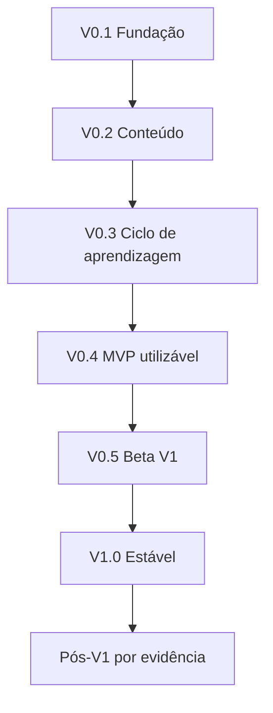

# Caderno de Erros Inteligente

## Etapa 9 — Roadmap

| Campo | Valor |
|---|---|
| Documento | Roadmap Incremental de Produto e Engenharia |
| Projeto | Caderno de Erros Inteligente |
| Versão | 1.0.2 — errata V0.2 |
| Data | 30 de agosto de 2026 |
| Status | Aprovada; errata documental da V0.2 incorporada em 5 de setembro de 2026 |
| Base congelada | Visão 1.0; Escopo 1.0; RFs 1.0; RNFs 1.0; Regras de Negócio 1.0; SDD 1.0; Modelo de Dados 1.0; Fluxos 1.0 |
| Próxima etapa após aprovação | Etapa 10 — Plano de Testes |

---

## 1. Finalidade e alcance

Este roadmap transforma a documentação aprovada em uma sequência de entregas pequenas, verificáveis e utilizáveis. Ele define para cada versão:

- objetivo;
- funcionalidades;
- dependências;
- critérios de conclusão;
- riscos;
- exclusões explícitas;
- evidências necessárias para avançar.

O roadmap não é um calendário contratual. A passagem de versão depende de critérios de qualidade, não apenas de tempo gasto ou quantidade de telas.

O primeiro objetivo de produto é fechar o ciclo:

`cadastrar questão → registrar tentativa/erro → classificar → revisar → preservar histórico → visualizar indicadores básicos`.

IA, integrações, revisão adaptativa e expansão para produtividade geral não são atalhos nem dependências do MVP.

---

## 2. Premissas de planejamento

### 2.1 Cenário de execução

O planejamento considera:

- desenvolvimento inicialmente individual;
- ambiente principal Windows;
- Python e Django como núcleo;
- templates/HTMX, sem SPA no MVP;
- SQLite local, com PostgreSQL condicionado à hospedagem/multi-espaço;
- documentação e testes acompanhando o código;
- aproximadamente 15–20 horas semanais de trabalho focado como cenário de referência;
- apoio de IA para implementação, sem dispensar revisão, testes e entendimento do código.

### 2.2 Estimativas

As faixas abaixo são previsões iniciais, não promessas. Devem ser recalibradas após V0.1, quando ambiente, ritmo, ferramentas e curva de Django estiverem medidos.

| Versão | Faixa inicial | Marco |
|---|---:|---|
| V0.1 | 1–2 semanas | Fundação executável. |
| V0.2 | 2–3 semanas | Catálogo de conteúdo. |
| V0.3 | 3–5 semanas | Ciclo de aprendizagem. |
| V0.4 | 2–4 semanas | Primeiro MVP utilizável. |
| V0.5 | 5–8 semanas | Beta das capacidades V1. |
| V1.0 | 2–4 semanas | Estabilização e liberação. |
| Total até V1.0 | 15–26 semanas | Aproximadamente 4–7 meses no cenário de referência. |

Férias, estudo paralelo, retrabalho e novos requisitos aumentam o prazo. Experiência prévia, dedicação maior e componentes reutilizáveis podem reduzi-lo.

### 2.3 Planejamento por capacidade

Datas não autorizam uma entrega incompleta. Uma versão somente termina quando:

- critérios funcionais passam;
- migrações são reproduzíveis;
- testes críticos passam;
- não existe falha conhecida de integridade;
- documentação de execução está atualizada;
- dados de versões anteriores continuam utilizáveis.

### 2.4 Política de escopo

Novo item deve ser classificado como:

1. correção necessária ao critério já aprovado;
2. dívida técnica necessária para segurança/manutenção;
3. funcionalidade de versão futura;
4. mudança de escopo que exige decisão explícita.

Uma ideia “interessante” não entra na versão em andamento sem retirar algo equivalente ou replanejar formalmente.

---

## 3. Visão geral das versões

| Versão | Resultado principal | Usuário pode usar? |
|---|---|---|
| V0.1 | Aplicação inicia, migra e testa com segurança. | Não para estudo real. |
| V0.2 | Questões e taxonomia podem ser cadastradas. | Somente catálogo experimental. |
| V0.3 | Erro gera ciclo e revisão pode ser concluída. | Piloto técnico com dados descartáveis. |
| V0.4 | Ciclo completo, histórico, fila e dashboard básico. | Sim: primeiro MVP local controlado. |
| V0.5 | Capacidades V1 em beta. | Sim, com backup e aviso de beta. |
| V1.0 | Produto individual estável e documentado. | Sim: uso pessoal regular. |
| Pós-V1 | Evolução orientada por dados reais. | Conforme cada iniciativa. |

### 3.1 O que define o primeiro MVP

| Prioridade solicitada | Versão de entrada |
|---|---|
| Cadastro de questão | V0.2 |
| Resposta correta/incorreta | V0.3 |
| Classificação de erro | V0.3 |
| Explicação/regra e pegadinha | V0.2/V0.3 |
| Revisões 1d/7d/14d/30d | V0.3 |
| Lista de revisões do dia | V0.3 |
| Histórico de tentativas | V0.3 |
| Dashboard básico | V0.4 |
| Backup recuperável, busca e qualidade de liberação | V0.4 |

O marco formal do primeiro MVP é V0.4, não V0.2 nem V0.3 isoladamente.

---

## 4. V0.1 — Fundação executável

### 4.1 Objetivo

Criar uma base que inicia no Windows, executa testes, aplica migrações e oferece fronteiras arquiteturais suficientes para desenvolver sem acumular uma estrutura descartável.

### 4.2 Funcionalidades e entregáveis

- repositório e estrutura modular aprovados no SDD;
- versões exatas de Python, Django, HTMX e ferramentas fixadas;
- ambientes de desenvolvimento e teste separados;
- configurações por perfil, sem segredos no código;
- usuário customizado UUID desde a primeira migração;
- `Workspace`, locale e configuração de fuso;
- `Clock`/`Calendar` substituíveis em testes;
- seed idempotente das categorias padrão;
- layout base e navegação mínima;
- logging estruturado sem conteúdo privado;
- comando único de qualidade: lint, formatação, análise estática, testes e migrações;
- teste de inicialização e rota de diagnóstico local;
- prova inicial de backup/restauração de banco vazio ou mínimo;
- README de instalação e execução no Windows.

### 4.3 Dependências

- documentação das Etapas 1–9 aprovada;
- Plano de Testes da Etapa 10;
- fluxo `FL-023` de primeiro acesso/configuração e casos `CT-129` a `CT-136` formalizados pela errata V0.1;
- Python e Git instalados;
- decisão de versões compatíveis;
- ambiente local sem dados reais.

### 4.4 Critérios de conclusão

1. Clonar e iniciar o projeto seguindo apenas o README.
2. Migrações aplicam do zero e podem ser verificadas.
3. Suite roda em banco isolado e não toca dados de uso real.
4. `Workspace` e fuso persistem corretamente.
5. Relógio controlável reproduz duas datas e fusos em teste.
6. Categorias padrão são semeadas sem duplicação.
7. Falha de teste/lint bloqueia o comando de liberação.
8. Nenhum segredo ou conteúdo de estudo aparece em logs.
9. Backup mínimo é criado e restaurado em ambiente descartável.
10. Casos `CT-001`, `002`, `073`, `074`, `081`, `099`, `104`, `123`, `127` e `129`–`136` passam conforme sua aplicabilidade à V0.1.

### 4.5 Riscos

| Risco | Resposta |
|---|---|
| Escolher versões incompatíveis | Spike curto e travamento de dependências. |
| Excesso de arquitetura sem valor | Criar somente módulos e abstrações já exigidos pelo SDD. |
| Testes configurados tarde | Pipeline entra antes das regras de negócio. |
| Ambiente Windows divergir do CI | Documentar comandos equivalentes e testar ambos. |

### 4.6 Não entra

- cadastro completo de questão;
- tentativas e revisões;
- dashboard;
- CSS refinado;
- autenticação remota;
- API pública;
- PostgreSQL de produção;
- tags, `Tag`/`QuestionTag` e qualquer decisão antecipada de `COR-P1-003`;
- módulos de versões futuras criados apenas como scaffolding vazio;
- IA ou integrações.

### 4.7 Evidência para avançar

Demo técnica de instalação limpa, migração, teste, criação do espaço, mudança de fuso e restauração mínima.

---

## 5. V0.2 — Catálogo de conteúdo

### 5.1 Objetivo

Permitir organizar e cadastrar o material de estudo com dados corretos, versionamento de conteúdo e histórico preparado, ainda sem fingir que existe aprendizagem ou revisão.

### 5.2 Funcionalidades

- gestão de disciplina, assunto e subassunto;
- normalização e prevenção de duplicidades;
- fonte, banca e prova, criadas/reutilizadas no contexto da questão;
- cadastro rápido de questão;
- rascunho e ativação;
- alternativas ordenadas e exatamente um gabarito;
- dificuldade da questão;
- explicação/regra, pegadinha e observações;
- `QuestionRevision` e alternativas versionadas;
- detalhe, lista e edição não crítica;
- bloqueio estrutural para versão inválida;
- arquivamento de taxonomia e questão sem ciclo;
- busca/listagem simples por texto e filtros básicos de conteúdo;
- mensagens de validação acessíveis e preservação do formulário.

### 5.3 Dependências

- V0.1 concluída;
- entidades e constraints do Modelo de Dados;
- fluxos `FL-001`, `FL-002`, `FL-004`, `FL-005` e parte do `FL-006`;
- componentes de formulário e estratégia inicial de CSS.

### 5.4 Critérios de conclusão

1. Cadastrar `Disciplina → Assunto → Subassunto` e impedir combinações inválidas.
2. Salvar rascunho incompleto sem entrar em métricas inexistentes.
3. Ativar questão com os mínimos aprovados.
4. Rejeitar alternativas vazias, indistinguíveis ou gabarito inválido.
5. Criar nova revisão ao editar conteúdo, preservando a anterior.
6. Editar origem/dificuldade sem criar tentativa.
7. Arquivar e ainda consultar a questão.
8. Operar formulários essenciais por teclado.
9. Passar testes de constraints em SQLite.
10. Exportar fixture de demonstração sem dados pessoais reais.

### 5.5 Riscos

| Risco | Resposta |
|---|---|
| Formulário de questão ficar pesado | Cadastro rápido primeiro; campos opcionais em seções. |
| Versionamento complicar edição | Serviço único para publicar nova versão e testes de invariantes. |
| Confundir rascunho com questão realizada | Nenhuma tentativa/estatística nesta versão. |
| Busca textual prematura | Busca simples; FTS apenas após benchmark. |

### 5.6 Não entra

- responder questão;
- classificação de erro;
- ciclo de revisão;
- fila do dia;
- dashboard e domínio;
- correção crítica após tentativa;
- tags e filtros salvos;
- exclusão física e reativação;
- importação em massa, OCR ou anexos.

### 5.7 Evidência para avançar

Demo com cadastro rápido, ativação, edição/versionamento, pesquisa e arquivamento, acompanhada por testes de integridade.

---

## 6. V0.3 — Ciclo de aprendizagem

### 6.1 Objetivo

Entregar o núcleo que transforma um erro em histórico e revisões sucessivas. Esta é a versão de maior risco funcional e deve priorizar correção sobre aparência.

### 6.2 Funcionalidades

- resposta inicial protegendo o gabarito;
- cálculo automático correto/incorreto;
- contexto transitório entre avaliação e finalização;
- classificação principal e descrição de `OTHER`;
- correção do diagnóstico com histórico;
- tentativa inicial correta sem ciclo automático;
- tentativa inicial incorreta criando ciclo e D1;
- política pura `REV-FIXA-1.0`;
- conclusão de D1/D7/D14/D30;
- erro reiniciando em D1;
- facilidade percebida sem efeito no calendário;
- idempotência e atomicidade;
- filas atrasadas, de hoje e futuras;
- bloqueio de revisão futura;
- abandono sem tentativa parcial;
- linha do tempo de tentativas/revisões;
- arquivamento transacional com suspensão;
- selectors básicos necessários para contagens futuras.

### 6.3 Dependências

- V0.2 concluída;
- políticas `ReviewSchedulePolicy` e `ReviewStatusPolicy`;
- `AttemptService`, `CompleteReviewService`, repositórios seletivos e relógio controlável;
- índices parciais e constraints de tentativa/ciclo/revisão;
- casos do Plano de Testes para datas, idempotência e falha parcial.

### 6.4 Critérios de conclusão

1. Erro inicial cria exatamente uma tentativa, um diagnóstico, um ciclo e uma D1.
2. Acerto inicial não cria ciclo.
3. Sequência perfeita conclui D1→D7→D14→D30 usando datas reais.
4. Erro em cada estágio reinicia em D1.
5. Atraso não é erro e próximo intervalo parte da conclusão real.
6. Atualizar/repetir envio não duplica tentativa ou pendência.
7. Falha em qualquer escrita mantém revisão pendente sem evento parcial.
8. Abrir/abandonar não altera banco.
9. Gabarito não aparece antes do envio.
10. Linha do tempo reconstrói versão, data prevista, data real, resultado e diagnóstico.
11. Arquivamento suspende fila e preserva histórico.
12. Teste de integração percorre o ciclo completo sem edição manual do banco.

### 6.5 Riscos

| Risco | Resposta |
|---|---|
| Data/fuso incorretos | Clock/Calendar injetáveis e matriz temporal ampla. |
| Duplo envio | Recibo idempotente + unicidade no banco. |
| Regra espalhada por views | Políticas puras e serviços de aplicação. |
| Outra aba alterar estado | Lock/version e revalidação transacional. |
| Fluxo pós-resposta gerar abandono | Uma tela curta, contexto seguro e teste de usabilidade. |

### 6.6 Não entra

- dashboard visual completo;
- domínio/confiança/prioridade;
- reagendamento;
- revisão manual de questão inicialmente correta;
- anulação/substituição;
- categorias pessoais;
- exportação e restauração pela interface;
- revisão adaptativa.

### 6.7 Evidência para avançar

Demo automatizada e manual do ciclo completo, incluindo erro D30, atraso, abandono, reenvio e arquivamento.

---

## 7. V0.4 — Primeiro MVP utilizável

**Status: PROMOTED em 19 de setembro de 2026.** A tag `v0.4.0` ainda não foi
criada; V0.5 permanece `NOT AUTHORIZED`.

### 7.1 Objetivo

Transformar o núcleo técnico da V0.3 em uma aplicação local que o estudante possa usar de forma controlada para seu caderno de erros real, com indicadores básicos, pesquisa, recuperação e qualidade mínima de liberação.

### 7.2 Funcionalidades

- dashboard básico com definições e drill-down;
- questões cadastradas versus realizadas;
- tentativas, acertos, erros e taxa com denominador/período;
- revisões realizadas hoje, devidas, atrasadas e futuras;
- desempenho por disciplina e assunto;
- frequência de categorias de erro;
- listagem/pesquisa/filtros básicos paginados;
- detalhe completo e histórico navegável;
- estados vazios sem métricas fictícias;
- backup SQLite consistente e restauração técnica documentada/testada;
- empacotamento/atalho de execução local escolhido;
- logs e mensagens recuperáveis;
- acessibilidade essencial por teclado, foco, rótulos, contraste e zoom;
- desempenho validado no baseline `BCR-1`;
- verificador de invariantes;
- documentação de uso, backup e atualização;
- piloto local com cópia de dados, mantendo backup anterior.

### 7.3 Dependências

- V0.3 concluída;
- `StatisticsQueryService` e DTOs explicáveis;
- estratégia de paginação e limites;
- scripts de backup/restauração;
- dados sintéticos `BCR-1`;
- revisão visual/acessível das telas principais.

### 7.4 Critérios de conclusão

1. Os nove itens prioritários do MVP estão utilizáveis em uma jornada contínua.
2. Cada total do dashboard corresponde ao seu drill-down.
3. Ausência de dados não aparece como taxa zero.
4. Fila e dashboard respeitam o fuso do espaço.
5. Busca e filtros retornam somente o espaço atual e mantêm paginação estável.
6. `BCR-1` atende aos RNFs aprovados ou possui decisão explícita de correção antes da liberação.
7. Backup de dados representativos é restaurado em ambiente separado e reconciliado.
8. Fluxo central funciona por teclado e em zoom de 200% conforme RNFs.
9. Logs não contêm enunciado, resposta, explicação ou credenciais.
10. Instalação/atualização local é documentada e reproduzível no Windows.
11. Nenhuma condição bloqueante da seção de liberação dos RNFs está presente.
12. Suite crítica, análise estática e migrações passam pelo gate único.

### 7.5 Riscos

| Risco | Resposta |
|---|---|
| Dashboard atrasar o MVP | Começar por cartões/listas e drill-down; gráficos não são obrigatórios. |
| Métricas divergirem | Um selector por definição, DTO com denominador e testes de reconciliação. |
| Empacotamento Windows consumir tempo | Spike limitado; manter execução documentada via ambiente virtual como fallback. |
| Dados reais serem perdidos | Uso controlado somente após backup/restauração comprovados. |
| Polimento visual substituir qualidade | Priorizar clareza, acessibilidade e fluxo central. |

### 7.6 Não entra

- Índice de Domínio e prioridade;
- questão dominada/reabertura;
- reagendamento;
- correção de tentativa/gabarito com histórico;
- categorias pessoais e filtros salvos;
- exclusão permanente com histórico;
- exportação `CEI-EXPORT-1.0` pela interface;
- autenticação remota, API ou integrações;
- IA, OCR, anexos, notificações ou gamificação.

### 7.7 Marco de MVP

V0.4 é o primeiro MVP formal. A partir daqui o usuário pode usar o sistema localmente, mas toda migração deve manter backup e caminho de retorno.

### 7.8 Evidência para avançar

Piloto controlado cobrindo ao menos cadastro, erro inicial, uma revisão, pesquisa, dashboard, backup e restauração; relatório de falhas e decisão sobre correções.

---

## 8. V0.5 — Beta das capacidades V1

### 8.1 Objetivo

Implementar as capacidades explicitamente reservadas para V1 sem misturá-las ao MVP nem torná-las dependências retroativas. Como o conjunto é grande, V0.5 terá checkpoints internos e poderá produzir builds de teste, mas somente será considerada concluída quando seus critérios integrais passarem.

### 8.2 Checkpoint A — Integridade e gestão avançada

- reagendamento com primeira data preservada e motivo;
- inclusão manual de questão inicialmente correta em ciclo;
- categorias pessoais: criar, renomear, arquivar e consolidar após regra final;
- filtros salvos;
- anulação e substituição de tentativa com reconstrução;
- correção auditável de gabarito após histórico;
- exclusão permanente de questão com impacto/exportação/confirmação;
- auditoria funcional das alterações sensíveis;
- definição de retenção de recibos e auditoria.

### 8.3 Checkpoint B — Domínio e prioridade

- `DOM-HEUR-1.0` em Python puro;
- componentes `Aq`, `Pq`, `Fq`, `Eq` e tetos;
- confiança da questão e hierárquica;
- domínio por questão, disciplina, assunto e subassunto;
- rótulos acompanhados de confiança/suficiência;
- estado dominado automático;
- reabertura automática e manual;
- novo ciclo D1 após reabertura manual;
- `PRI-HEUR-1.0` com fatores, motivos e desempate aprovado;
- “O que estudar agora?” como recomendação, não ordem;
- snapshots somente se benchmark justificar.

### 8.4 Checkpoint C — Portabilidade e operação V1

- exportação `CEI-EXPORT-1.0` com manifesto/checksums;
- backup e restauração pela interface;
- validação em área temporária e backup pré-restauração;
- relatórios de sucesso/falha;
- testes de migração e constraints críticas em PostgreSQL, sem obrigar migração de produção;
- observabilidade/health restritos quando aplicável;
- paginação, filtros e busca recalibrados pelo `BCR-1`;
- FTS apenas se a busca simples falhar no benchmark.

### 8.5 Dependências

- V0.4 estável e com dados de piloto;
- decisões finais de `FL-ABR-001`–`004`, `009` e `010`;
- política jurídica/operacional de retenção;
- Plano de Testes para domínio, reconstrução, exportação e restauração;
- dataset sintético com ciclos variados e evidência insuficiente;
- backup obrigatório antes de qualquer migração beta.

### 8.6 Critérios de conclusão

1. Reagendamento não apaga atraso histórico nem cria duas pendências.
2. Correção de tentativa reconstrói ciclo e métricas sem reescrever o original.
3. Correção de gabarito preserva a versão usada por tentativas anteriores.
4. Exclusão remove agregado autorizado e não deixa órfãos.
5. Cada componente de domínio reproduz exemplos normativos e fronteiras.
6. Estado dominado só ocorre com todos os critérios; reabertura preserva evento anterior.
7. Prioridades exibem fatores e nunca classificam dado insuficiente como fraqueza certa.
8. Exportação valida UUIDs, códigos, contagens e checksums.
9. Restauração falha com segurança em pacote corrompido e recupera pacote válido.
10. Snapshots, se existirem, reconciliam com cálculo autoritativo.
11. Migrações preservam dados V0.4 em cópia representativa.
12. Recursos beta possuem testes positivos, negativos e de fronteira.

### 8.7 Riscos

| Risco | Resposta |
|---|---|
| V0.5 ficar grande demais | Checkpoints A/B/C; um não mascara falha do outro; congelar novas ideias. |
| Fórmulas parecerem ciência exata | Exibir confiança, componentes, versão e limitações. |
| Reconstrução corromper histórico | Simulação, transação, fixtures e backup antes de correção. |
| Exclusão conflitar com auditoria | Fechar política antes de implementar. |
| Snapshots gerarem inconsistência | Não criar sem evidência de lentidão e reconciliador. |
| Exportação virar API informal | Schema versionado e escopo de portabilidade, sem prometer integração geral. |

### 8.8 Não entra

- revisão adaptativa;
- IA para classificar, explicar ou recomendar;
- API pública;
- agentes externos;
- multiusuário, turmas ou compartilhamento;
- banco público de questões;
- aplicativos nativos;
- OCR/anexos;
- notificações externas;
- gamificação.

### 8.9 Evidência para avançar

Build beta usando cópia de dados do piloto, relatório de migração, casos explicáveis de domínio/prioridade e exercício completo exportar→restaurar→reconciliar.

---

## 9. V1.0 — Produto individual estável

### 9.1 Objetivo

Converter a beta V0.5 em uma versão estável para uso pessoal regular. V1.0 é uma fase de estabilização, compatibilidade e documentação; não é o momento de adicionar outra camada de funcionalidades.

### 9.2 Trabalho previsto

- corrigir falhas do piloto/beta por severidade;
- congelar esquema `CEI-EXPORT-1.0` e regras `REV-FIXA-1.0`, `DOM-HEUR-1.0`, `PRI-HEUR-1.0`;
- completar testes funcionais, de regressão, banco, segurança, desempenho, acessibilidade e usabilidade;
- validar atualização V0.4→V0.5→V1.0 com backup e rollback documentados;
- verificar restauração periódica;
- revisar mensagens de erro e recuperação;
- otimizar apenas gargalos medidos;
- limpar feature flags temporárias e dívida bloqueante;
- finalizar guia do usuário, instalação, atualização, backup, restauração e solução de problemas;
- gerar changelog e notas de versão;
- executar piloto final em ambiente local real controlado.

### 9.3 Dependências

- V0.5 concluída;
- Etapa 10 transformada em suite e checklist de liberação;
- nenhuma questão aberta classificada como bloqueante para V1;
- backup de todos os dados de piloto;
- critérios de suporte do ambiente Windows definidos.

### 9.4 Critérios de conclusão

1. Todas as capacidades MVP e V1 aprovadas funcionam em jornada integrada.
2. Nenhuma regressão crítica ou alta permanece sem decisão explícita.
3. Gate único de qualidade passa em instalação limpa e atualização.
4. Migrações preservam uma base representativa e suportam rollback/recuperação planejada.
5. Backup/restauração pela interface e exportação passam em exercício independente.
6. `BCR-1` e testes V1 de estresse atendem metas aplicáveis.
7. Fluxos centrais atendem acessibilidade aprovada.
8. Dependências não possuem vulnerabilidade crítica conhecida sem mitigação.
9. Logs e exports respeitam privacidade.
10. Documentação permite instalar, usar, atualizar e recuperar o sistema.
11. Versão e esquema são identificáveis na interface/manifesto.
12. Usuário responsável aprova o piloto final.

### 9.5 Riscos

| Risco | Resposta |
|---|---|
| Tratar estabilização como “só polimento” | Bloquear release por qualidade, migração, backup e acessibilidade. |
| Adicionar recursos antes de fechar bugs | Congelamento de funcionalidades após V0.5. |
| Otimização tardia revelar mudança estrutural | Benchmarks desde V0.4 e teste PostgreSQL na V0.5. |
| Documentação divergir do produto | Atualizar docs no mesmo PR/commit da mudança. |

### 9.6 Não entra

Qualquer funcionalidade nova não presente em V0.5, especialmente IA, revisão adaptativa, integrações, hospedagem multiusuário, PWA, OCR, anexos e gamificação.

### 9.7 Evidência de liberação

Relatório de release contendo versão, migrações, testes, cobertura crítica, vulnerabilidades, desempenho, acessibilidade, backup/restauração, problemas conhecidos e aprovação.

---

## 10. Pós-V1 — Evolução por evidência

Pós-V1 não é uma única versão. Cada iniciativa exige problema comprovado, benefício, riscos, documento de mudança e roadmap próprio.

### 10.1 Ordem recomendada de investigação

| Ordem | Iniciativa | Gatilho mínimo |
|---:|---|---|
| 1 | Calibração de domínio/prioridade | Volume real suficiente e divergências observáveis nas recomendações. |
| 2 | Markdown/LaTeX seguro e acessível | Necessidade frequente de fórmulas/texto estruturado. |
| 3 | Busca FTS | Busca simples falhar no benchmark ou uso real. |
| 4 | API interna formal/exportadores | Caso de integração real e consumidor identificado. |
| 5 | Revisão adaptativa versionada | Dados históricos suficientes e hipótese testável contra ciclo fixo. |
| 6 | Hospedagem/PostgreSQL | Necessidade de acesso remoto ou múltiplos processos/espaços. |
| 7 | IA assistiva | Tarefa específica com revisão humana, privacidade e métrica de qualidade. |

### 10.2 Revisão adaptativa

Antes de implementar:

- manter `REV-FIXA-1.0` disponível para comparação;
- definir nova política e versão;
- simular sobre histórico sem reescrever eventos;
- explicar cada intervalo;
- validar que facilidade e erro não geram comportamento instável;
- oferecer migração/opt-in controlado.

### 10.3 IA assistiva

Candidatos somente após V1:

- sugerir categoria de erro para confirmação;
- resumir explicação fornecida pelo usuário;
- sugerir tags;
- apoiar priorização com justificativa complementar.

IA nunca deverá:

- finalizar classificação sem confirmação;
- alterar gabarito, tentativa ou ciclo diretamente;
- substituir a fórmula explicável por pontuação opaca;
- enviar conteúdo privado a terceiro sem consentimento e política clara.

### 10.4 Integrações e API

Exigem consumidor concreto. A API reutiliza casos de uso, autenticação e regras existentes; não escreve diretamente no ORM. Agente de revisão, painel central ou segundo cérebro permanecem projetos consumidores, não parte automática do núcleo.

### 10.5 Hospedagem e múltiplos usuários

Antes de exposição remota:

- PostgreSQL e migração testada;
- autenticação, HTTPS, cookies seguros e CSRF;
- backups centralizados;
- monitoramento e alertas;
- isolamento por espaço testado;
- política de disponibilidade e suporte;
- avaliação de custo.

### 10.6 Itens que continuam fora do produto até mudança formal

- cursos, calendário geral, tarefas e produtividade ampla;
- turmas, professores e compartilhamento;
- rede social ou banco público de questões;
- gamificação sem hipótese de aprendizagem;
- OCR/importação massiva sem necessidade comprovada;
- aplicativo nativo apenas por preferência estética.

---

## 11. Gates de qualidade por versão

| Gate | V0.1 | V0.2 | V0.3 | V0.4 | V0.5 | V1.0 |
|---|:---:|:---:|:---:|:---:|:---:|:---:|
| Migração limpa | ✓ | ✓ | ✓ | ✓ | ✓ | ✓ |
| Testes unitários do domínio | Base | Conteúdo | Críticos | Críticos | Todos aplicáveis | Regressão completa |
| Integração do ciclo | — | — | ✓ | ✓ | ✓ | ✓ |
| Idempotência/falha parcial | — | — | ✓ | ✓ | ✓ | ✓ |
| Acessibilidade central | Base | Formulários | Resposta/revisão | Jornada MVP | Jornada V1 | Auditoria final |
| Desempenho `BCR-1` | — | Smoke | Smoke | Gate | Gate ampliado | Gate final |
| Backup/restauração | Prova mínima | Prova | Prova | Gate técnico | Gate de interface | Exercício final |
| Segurança/privacidade | Config/logs | Escopo | Gabarito/escopo | Gate MVP | Gate V1 | Revisão final |
| Documentação | Instalação | Uso do catálogo | Ciclo | Guia MVP | Guia beta/migração | Guia completo |

### 11.1 Regra de bloqueio

Falha crítica de integridade, perda de dados, acesso cruzado, duplicação de tentativa, gabarito exposto, backup irrecuperável ou migração destrutiva impede promover a versão.

### 11.2 Dívida técnica

Cada dívida possui:

- descrição e causa;
- impacto;
- risco de adiar;
- versão limite;
- teste ou evidência que comprova resolução.

Dívida que ameaça integridade, segurança, migração ou teste crítico não pode ser empurrada para depois da liberação correspondente.

---

## 12. Gestão do backlog e releases

### 12.1 Unidade de trabalho

Cada item implementável deverá conter:

- objetivo observável;
- requisitos, regras, entidades e fluxos relacionados;
- critérios de aceitação;
- testes esperados;
- impacto em migração, segurança, acessibilidade e documentação;
- versão-alvo;
- definição explícita do que não faz.

### 12.2 Ordem dentro de uma versão

1. fechar decisões bloqueantes;
2. escrever/ajustar testes de regra;
3. criar migração/serviço de domínio;
4. implementar caso de uso;
5. implementar interface;
6. testar integração e falhas;
7. revisar acessibilidade/segurança;
8. atualizar documentação;
9. executar gate e demo.

### 12.3 Branches e marcos

- uma branch curta por item coerente;
- revisão antes de integrar;
- tag Git para cada versão promovida;
- changelog com migrações e comportamento;
- backup antes de usar uma nova versão com dados reais;
- feature flag somente quando possuir remoção planejada.

### 12.4 Bug versus funcionalidade

| Situação | Tratamento |
|---|---|
| Contraria documento aprovado | Bug. |
| Documento é ambíguo | Pausar e registrar decisão. |
| Melhoria sem requisito | Backlog futuro. |
| Necessária para segurança/integridade | Dívida bloqueante ou correção da versão. |
| Muda escopo/regra congelada | Controle de mudança e análise de impacto. |

### 12.5 Critério de corte

Se uma versão exceder sua capacidade, retirar primeiro:

1. polimento visual não essencial;
2. gráfico substituível por tabela/lista;
3. filtro não essencial;
4. conveniência sem impacto no ciclo.

Nunca cortar integridade, backup, acessibilidade central, idempotência, teste temporal ou explicabilidade da métrica.

---

## 13. Dependências e caminho crítico

### 13.1 Caminho crítico

`Clock/Calendar → Modelo/migrações → Questão versionada → AttemptService → ReviewPolicy → CompleteReviewService → Fila → Estatísticas → MVP`.

Qualquer atraso nesses componentes adia V0.4. CSS avançado, gráficos e integrações não pertencem ao caminho crítico.

### 13.2 Dependências que não podem ser invertidas

- dashboard depende de definições e fatos corretos;
- domínio depende de tentativa/revisão e confiança;
- prioridade depende de domínio, recorrência e atraso;
- correção de tentativa depende de reconstrução testada;
- restauração pela interface depende de formato e invariantes;
- revisão adaptativa depende de histórico V1 e nova regra;
- hospedagem depende de segurança e PostgreSQL.

### 13.3 Spikes permitidos

Spikes são investigações curtas, com prazo e pergunta definida. Candidatos:

- versões Python/Django/HTMX;
- estratégia CSS;
- empacotamento Windows;
- FTS versus busca simples;
- desempenho das consultas `BCR-1`;
- backup consistente SQLite;
- migração para PostgreSQL.

Resultado do spike é decisão, protótipo descartável ou teste; não vira arquitetura paralela sem aprovação.

---

## 14. Rastreabilidade por versão

| Versão | Requisitos/fluxos principais | Regras/arquitetura |
|---|---|---|
| V0.1 | `RF-001`–`003`; base de `RF-067`–`068` | RNFs de configuração, segurança, testabilidade; SDD módulos/configuração. |
| V0.2 | `RF-004`–`019`, `063`, `064` e recorte de `065`; `FL-001`, `002` e recortes de `004`–`006`, `020` | `RN-006`–`020`, `086` e recorte de `087`; modelo de questão/versionamento; `ADR-010`. |
| V0.3 | `RF-021`–`046`; `FL-003`, `008`–`013` | `RN-021`–`055`; `REV-FIXA-1.0`; idempotência. |
| V0.4 | `RF-047`–`056`, `063`–`068`; `FL-014`–`016`, `020`, backup técnico `022` | `RN-056`–`067`; RNFs de liberação do MVP. |
| V0.5 | `RF-027`, `033`, `045`, `046`, `057`–`062`, `066`, `069`–`071`; `FL-007`, `012`, `017`–`019`, `021`, `022` | `RN-068`–`100`; `DOM-HEUR-1.0`; `PRI-HEUR-1.0`; exportação. |
| V1.0 | Todos os anteriores, sem novo escopo | Gates de RNFs, regressão, migração e operação. |
| Pós-V1 | Requisitos novos após mudança formal | Novas versões de regra/ADR/API quando aplicável. |

---

## 15. Métricas de acompanhamento do desenvolvimento

Métricas não devem premiar volume de código. Acompanhar:

| Métrica | Uso correto |
|---|---|
| Critérios de aceitação concluídos | Progresso funcional verificável. |
| Casos críticos automatizados | Redução de risco. |
| Falhas reabertas | Sinal de qualidade/entendimento. |
| Tempo de ciclo do item | Planejamento e tamanho de tarefas. |
| Defeitos por severidade | Decisão de promoção. |
| Migrações/restaurações bem-sucedidas | Segurança dos dados. |
| Tempo no `BCR-1` | Tendência de desempenho. |
| Pendências bloqueantes | Prontidão da versão. |

Não usar quantidade de commits, linhas de código ou telas como prova de valor.

### 15.1 Revisão de roadmap

Revisar ao final de cada versão:

- estimado versus realizado;
- dificuldades técnicas;
- bugs e retrabalho;
- feedback do piloto;
- dívida técnica;
- alterações de risco;
- necessidade de reordenar itens futuros sem romper escopo congelado.

---

## 16. Decisões propostas nesta etapa

| ID | Decisão proposta |
|---|---|
| `RD-DEC-001` | Planejamento será orientado por capacidade e gates, não por data isolada. |
| `RD-DEC-002` | V0.1 entrega fundação executável e não tenta implementar o produto. |
| `RD-DEC-003` | V0.2 entrega catálogo de questões, ainda sem aprendizagem fictícia. |
| `RD-DEC-004` | V0.3 entrega o ciclo de aprendizagem e concentra o maior risco funcional. |
| `RD-DEC-005` | V0.4 é o primeiro MVP formal e utilizável. |
| `RD-DEC-006` | Dashboard básico prioriza cartões, listas e drill-down; gráficos não bloqueiam o MVP. |
| `RD-DEC-007` | V0.5 reúne capacidades V1 em checkpoints A/B/C. |
| `RD-DEC-008` | V1.0 congela funcionalidades e prioriza estabilização, migração, testes e documentação. |
| `RD-DEC-009` | Estimativa inicial até V1.0 é 15–26 semanas no cenário de 15–20 horas semanais. |
| `RD-DEC-010` | Estimativas serão recalibradas após V0.1. |
| `RD-DEC-011` | Nenhuma versão avança com falha crítica de integridade, segurança, backup ou migração. |
| `RD-DEC-012` | FTS, snapshots e PostgreSQL só entram por gatilho medido/aprovado. |
| `RD-DEC-013` | IA, revisão adaptativa, API e integrações permanecem Pós-V1. |
| `RD-DEC-014` | Mudança de escopo exige registro e análise de impacto, não inclusão silenciosa. |
| `RD-DEC-015` | Após Etapa 10 aprovada, a implementação começa pela V0.1. |

---

## 17. Pontos ainda em aberto

| ID | Ponto | Momento de decisão |
|---|---|---|
| `RD-ABR-001` | Versões exatas de Python, Django e HTMX. | Spike inicial da V0.1. |
| `RD-ABR-002` | Estratégia CSS. | V0.1/V0.2, após protótipo acessível. |
| `RD-ABR-003` | Forma de empacotamento/atalho no Windows. | Spike V0.4; execução por ambiente virtual é fallback. |
| `RD-ABR-004` | Duração do contexto transitório de resposta. | V0.3, teste de segurança/usabilidade. |
| `RD-ABR-005` | Reativação de questão arquivada. | Antes do checkpoint V0.5-A. |
| `RD-ABR-006` | Correção completa de gabarito e retenção de auditoria. | Antes do checkpoint V0.5-A. |
| `RD-ABR-007` | Critério de desempate de prioridade. | Antes do checkpoint V0.5-B. |
| `RD-ABR-008` | Necessidade real de FTS e snapshots. | Benchmarks V0.4/V0.5. |
| `RD-ABR-009` | Método de piloto e tamanho do conjunto real copiado. | Planejamento de V0.4, sempre com backup. |
| `RD-ABR-010` | Forma de distribuição/suporte da V1.0. | Durante V0.5, antes do congelamento V1.0. |

---

## 18. Riscos do roadmap

| ID | Risco | Mitigação |
|---|---|---|
| `RD-RIS-001` | Tentar construir todo o V1 antes de usar o ciclo básico. | Marco V0.4 obrigatório e piloto antes da V0.5. |
| `RD-RIS-002` | Curva de Django consumir mais tempo. | V0.1 curta, spikes e reestimativa. |
| `RD-RIS-003` | Polimento visual atrasar o núcleo. | Interface clara primeiro; gráficos e estética avançada não bloqueiam. |
| `RD-RIS-004` | Testes ficarem para o final. | Gate em toda versão e testes de regra antes da interface crítica. |
| `RD-RIS-005` | V0.5 sobrecarregar o projeto. | Checkpoints A/B/C e congelamento de ideias novas. |
| `RD-RIS-006` | Dados reais entrarem antes do backup confiável. | Dados descartáveis até V0.4; restauração provada antes do piloto. |
| `RD-RIS-007` | Métricas/domínio serem implementados antes dos fatos corretos. | Dependência explícita V0.3→V0.4→V0.5. |
| `RD-RIS-008` | Migração quebrar base do usuário. | Cópia representativa, backup, testes e rollback documentado. |
| `RD-RIS-009` | SQLite ser abandonado cedo ou mantido tarde demais. | Gatilhos do SDD e benchmark; PostgreSQL antes de hospedagem. |
| `RD-RIS-010` | Documentação congelada divergir do código. | Atualização versionada e rastreabilidade no mesmo item. |
| `RD-RIS-011` | IA acrescentar complexidade antes de haver dados. | Manter Pós-V1 e exigir caso de uso/privacidade/métrica. |
| `RD-RIS-012` | Estimativa virar compromisso rígido. | Faixas, revisão por versão e comunicação de incerteza. |

---

## 19. Sugestões de melhoria

### 19.1 Criar um quadro por versão

Colunas recomendadas: `Backlog → Pronto → Em desenvolvimento → Em revisão → Validado`. Cada cartão referencia RF, RN, entidade, fluxo e teste.

### 19.2 Demonstrar uma jornada ao final de cada versão

Mesmo versões técnicas devem possuir roteiro curto de demonstração. Isso revela integração ausente antes que o backlog avance.

### 19.3 Manter dados de demonstração separados

Fixtures sintéticas e banco descartável para desenvolvimento. Dados pessoais reais entram somente no piloto controlado da V0.4.

### 19.4 Registrar decisões pequenas

Versão de biblioteca, escolha de CSS, empacotamento e adoção de FTS devem virar notas/ADRs curtos, evitando rediscussão sem evidência.

### 19.5 Comemorar o marco V0.4 sem antecipar V1

V0.4 já valida o produto central. Usá-la por algumas semanas fornecerá informação melhor para domínio, prioridade e conveniências do que tentar prevê-las apenas em código.

---

## 20. Itens que precisam de aprovação

**Aprovação registrada:** aprovada integralmente pelo responsável do projeto em 30 de agosto de 2026.

Solicita-se aprovação de:

1. sequência V0.1 → V0.2 → V0.3 → V0.4 → V0.5 → V1.0 → Pós-V1;
2. V0.4 como primeiro MVP utilizável;
3. escopo de cada versão e exclusões explícitas;
4. faixa inicial de 15–26 semanas no cenário de referência;
5. recalibração após V0.1;
6. checkpoints A/B/C da V0.5;
7. V1.0 sem novas funcionalidades;
8. gates de integridade, testes, backup, segurança, acessibilidade e documentação;
9. ordem do caminho crítico;
10. política de corte que preserva qualidade e elimina conveniências primeiro;
11. iniciativas Pós-V1 somente mediante gatilho/evidência;
12. decisões `RD-DEC-001` a `RD-DEC-015`;
13. manutenção de `RD-ABR-001` a `RD-ABR-010`.

---

## 21. Critério de encerramento

A Etapa 9 será concluída quando:

- cada versão possuir objetivo, funcionalidades, dependências, critérios, riscos e exclusões;
- o primeiro MVP estiver inequivocamente definido;
- capacidades de V1 não bloquearem o MVP;
- iniciativas Pós-V1 estiverem condicionadas a evidência;
- gates de promoção impedirem perda de dados e regressões críticas;
- o caminho crítico permitir transformar o roadmap em backlog;
- as estimativas forem tratadas como faixas revisáveis;
- o Plano de Testes puder distribuir casos e gates pelas versões.

Após a aprovação desta etapa, será produzida a **Etapa 10 — Plano de Testes**. Depois da aprovação das dez etapas, a implementação poderá começar pela **V0.1 — Fundação executável**.

A etapa foi aprovada integralmente em 30 de agosto de 2026. A errata 1.0.1, registrada em 1º de setembro de 2026, acrescenta a rastreabilidade técnica da V0.1 e explicita tags e scaffolding futuro como exclusões dessa versão, sem decidir a fase definitiva das tags nem alterar requisitos de produto. As decisões `RD-DEC-001` a `RD-DEC-015` permanecem congeladas e somente poderão ser alteradas mediante registro explícito e análise de impacto.

---

## 22. Errata controlada da V0.2

Em 5 de setembro de 2026, `ADR-010` tornou autoritativa a fronteira do Catálogo
de Conteúdo:

- `ERR-V02-001`: tags foram retiradas da V0.2 e adiadas para V0.5-A/V1;
- `ERR-V02-002`: a faixa V0.2 é `RF-004`–`019`, `RF-063`, `RF-064` e o
  recorte taxonômico de `RF-065`; `RF-020` permanece V1 e `RF-066` não entra;
- `ERR-V02-004`: `FL-004`–`006` são executados somente em seus recortes de
  catálogo, sem aprendizagem;
- `ERR-V02-005`: estados pertencem a `RF-063`, texto a `RF-064` e os filtros
  obrigatórios de `RF-065` são disciplina, assunto e subassunto;
- `ERR-V02-006` e `ERR-V02-007`: origem mínima e revisões imutáveis seguem o
  contrato de `ADR-010`;
- `ERR-V02-009`: a evolução de migrations e gate preserva integralmente a
  baseline `v0.1.0`.

Esta errata substitui apenas a leitura de fase da seção 5 e da matriz da seção
14. O objetivo histórico da V0.2 — catálogo sem aprendizagem ou revisão — não
foi alterado.

---

## 23. Errata controlada da V0.3

Em 8 de setembro de 2026, `ADR-011` saneou a fronteira da V0.3. A versão inclui
resposta inicial, diagnóstico, histórico, `REV-FIXA-1.0`, D1/D7/D14/D30, filas,
timeline e arquivamento com suspensão; a restrição histórica proíbe antecipá-los
antes de suas etapas V0.3, não os exclui da versão. O plano incremental fica:
Etapa 0 saneamento; Etapa 1 schema; Etapa 2 resposta inicial; Etapa 3 política e
conclusão; Etapa 4 fila/timeline/diagnóstico/arquivamento; Etapa 5 integração,
regressão e promoção. A matriz e os limites autoritativos estão em `ADR-011`
§§2–9. A Etapa 1 só pode iniciar sob nova autorização formal.
